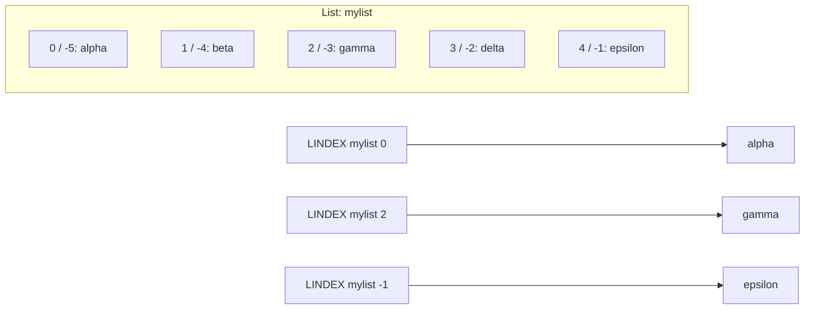

# How to Use LINDEX in Redis to Access List Elements by Position

Author: [nawazdhandala](https://www.github.com/nawazdhandala)

Tags: Redis, LINDEX, List, Index, Command, Access

Description: Learn how to use the Redis LINDEX command to retrieve a single element from a list by its zero-based position index, including negative index access from the tail.

---

## How LINDEX Works

`LINDEX` returns the element at a specific index position in a list. Indexes are zero-based starting from the head (left side): index 0 is the first element, index 1 is the second, and so on. Negative indexes count from the tail: -1 is the last element, -2 is the second-to-last.

If the index is out of range (beyond the list length), `LINDEX` returns nil without an error. If the key does not exist, it also returns nil.



## Syntax

```redis
LINDEX key index
```

- `index` - zero-based integer; negative counts from the tail
- Returns the element as a bulk string, or nil if out of range or key missing

## Examples

### Access by positive index

```redis
RPUSH mylist "alpha" "beta" "gamma" "delta" "epsilon"
LINDEX mylist 0
LINDEX mylist 2
LINDEX mylist 4
```

```text
(integer) 5
"alpha"
"gamma"
"epsilon"
```

### Access by negative index

```redis
LINDEX mylist -1
LINDEX mylist -2
LINDEX mylist -5
```

```text
"epsilon"
"delta"
"alpha"
```

- -1 is the last element
- -5 is the first element (for a 5-element list)

### Out-of-range index

Returns nil without an error.

```redis
LINDEX mylist 99
LINDEX mylist -99
```

```text
(nil)
(nil)
```

### Non-existent key

Returns nil.

```redis
LINDEX nonexistent_key 0
```

```text
(nil)
```

### Check the first and last elements

Peek at the head and tail without modifying the list.

```redis
RPUSH queue:jobs "job:1" "job:2" "job:3"
LINDEX queue:jobs 0
LINDEX queue:jobs -1
```

```text
(integer) 3
"job:1"
"job:3"
```

This is a non-destructive peek at head and tail (unlike `LPOP`/`RPOP` which remove elements).

### Round-robin selection

Rotate through a list of servers by keeping a counter and using LINDEX.

```redis
RPUSH servers "server:1" "server:2" "server:3"
LLEN servers
LINDEX servers 0
LINDEX servers 1
LINDEX servers 2
```

```text
(integer) 3
(integer) 3
"server:1"
"server:2"
"server:3"
```

In application code, use `counter % LLEN` to cycle through positions.

### Accessing specific positions in a fixed-size list

Use LINDEX as a stack peek without popping.

```redis
LPUSH undo_stack "action:3" "action:2" "action:1"
LINDEX undo_stack 0
```

```text
(integer) 3
"action:1"
```

The top of the stack without removing it.

## Performance note

`LINDEX` is O(N) where N is the distance of the requested index from the nearest end of the list. Accessing the head (index 0) or tail (index -1) is effectively O(1). Accessing the middle of a very long list requires traversal.

For frequent random-access reads across a large list, consider using Redis Sorted Sets (which provide O(log N) index access) instead.

## LINDEX vs LRANGE

| Command | Use case | Complexity |
|---------|----------|------------|
| `LINDEX key 0` | Single element (head) | O(1) |
| `LINDEX key -1` | Single element (tail) | O(1) |
| `LINDEX key N` | Single element (middle) | O(N) |
| `LRANGE key 0 -1` | All elements | O(N) |
| `LRANGE key s e` | Range of elements | O(S+N) |

## Use Cases

- Peeking at the head or tail of a queue without consuming the element
- Top-of-stack inspection without popping
- Round-robin selection from a static list of endpoints
- Accessing a specific position in a small fixed-size configuration list
- Debugging: inspect specific positions in a list during development

## Summary

`LINDEX` returns a single element from a list by zero-based index position, supporting negative indexes to access from the tail. It is O(1) for head and tail access and O(N) for middle elements. It returns nil for out-of-range indexes and non-existent keys. Use it for non-destructive peeking at specific positions, round-robin selection, and stack inspection.
