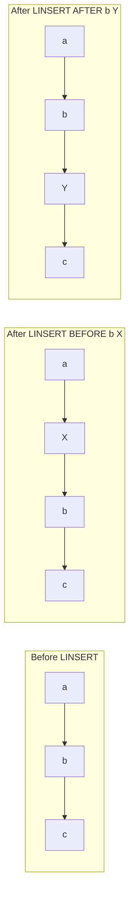

# How to Use LINSERT in Redis to Insert Before or After an Element

Author: [nawazdhandala](https://www.github.com/nawazdhandala)

Tags: Redis, LINSERT, List, Insert, Command, Before, After

Description: Learn how to use the Redis LINSERT command to insert a new element before or after a specific existing element in a list, for ordered list manipulation.

---

## How LINSERT Works

`LINSERT` inserts a new element either immediately before or immediately after the first occurrence of a specified pivot element in a list. Redis scans the list from the head to find the pivot, then inserts the new element at the correct position.

If the pivot is not found, `LINSERT` returns -1 and makes no change. If the key does not exist, it returns 0. If the insertion succeeds, it returns the new length of the list.



## Syntax

```redis
LINSERT key BEFORE|AFTER pivot element
```

- `BEFORE` - insert `element` immediately before the first occurrence of `pivot`
- `AFTER` - insert `element` immediately after the first occurrence of `pivot`
- Returns the new list length on success, -1 if pivot not found, 0 if key does not exist

## Examples

### LINSERT BEFORE

Insert "X" before "b".

```redis
RPUSH mylist "a" "b" "c"
LINSERT mylist BEFORE "b" "X"
LRANGE mylist 0 -1
```

```text
(integer) 3
(integer) 4
1) "a"
2) "X"
3) "b"
4) "c"
```

### LINSERT AFTER

Insert "Y" after "b".

```redis
RPUSH mylist2 "a" "b" "c"
LINSERT mylist2 AFTER "b" "Y"
LRANGE mylist2 0 -1
```

```text
(integer) 3
(integer) 4
1) "a"
2) "b"
3) "Y"
4) "c"
```

### Pivot not found

Returns -1 and makes no change.

```redis
RPUSH mylist "a" "b" "c"
LINSERT mylist BEFORE "z" "new"
LRANGE mylist 0 -1
```

```text
(integer) 3
(integer) -1
1) "a"
2) "b"
3) "c"
```

### Non-existent key

Returns 0 (no operation performed).

```redis
DEL emptylist
LINSERT emptylist BEFORE "pivot" "element"
```

```text
(integer) 0
(integer) 0
```

### First occurrence only

When there are duplicate pivot values, `LINSERT` only uses the first one it finds from the head.

```redis
RPUSH dupes "a" "b" "b" "c"
LINSERT dupes BEFORE "b" "X"
LRANGE dupes 0 -1
```

```text
(integer) 4
(integer) 5
1) "a"
2) "X"
3) "b"
4) "b"
5) "c"
```

"X" was inserted before the first "b" only.

### Building an ordered task list

Insert a high-priority task before the current first task.

```redis
RPUSH tasks "task:database-backup" "task:send-reports" "task:cleanup-temp"
LINSERT tasks BEFORE "task:database-backup" "task:security-patch"
LRANGE tasks 0 -1
```

```text
(integer) 3
(integer) 4
1) "task:security-patch"
2) "task:database-backup"
3) "task:send-reports"
4) "task:cleanup-temp"
```

### Priority queue simulation

Insert a critical job immediately after the current high-priority item.

```redis
RPUSH pqueue "priority:high:job1" "priority:low:job2" "priority:low:job3"
LINSERT pqueue AFTER "priority:high:job1" "priority:high:job99"
LRANGE pqueue 0 -1
```

```text
(integer) 3
(integer) 4
1) "priority:high:job1"
2) "priority:high:job99"
3) "priority:low:job2"
4) "priority:low:job3"
```

## Performance

`LINSERT` is O(N) where N is the number of elements traversed to find the pivot. In the worst case (pivot is near the tail), it scans the entire list. For frequently modified long lists, consider using a Sorted Set with scores for O(log N) ordered insertion.

## Return value reference

| Return value | Meaning |
|-------------|---------|
| N (positive) | New list length after insertion |
| `-1` | Pivot element not found |
| `0` | Key does not exist |

## Use Cases

- Ordered task lists where priority items must be inserted at specific positions
- Maintaining a sorted-by-name list where new entries need precise placement
- Inserting chapter or section markers into a list of content items
- Workflow pipelines where a new step needs to be added between existing steps
- Building playlists where a song must be inserted at a specific position

## Summary

`LINSERT` inserts an element immediately before or after the first occurrence of a pivot element in a Redis list. It returns the new list length, -1 if the pivot is not found, or 0 if the key does not exist. Because it searches linearly for the pivot, it is O(N) and best suited for small to medium lists. For large ordered collections with frequent insertions, Redis Sorted Sets offer better performance.
