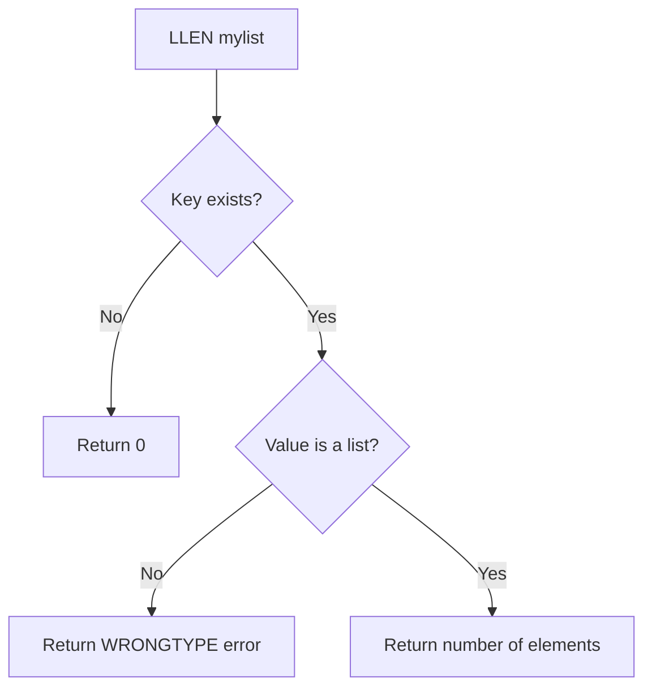

# How to Use LLEN in Redis to Get the Length of a List

Author: [nawazdhandala](https://www.github.com/nawazdhandala)

Tags: Redis, LLEN, List, Length, Count, Command

Description: Learn how to use the Redis LLEN command to get the number of elements in a list, with examples for queue depth monitoring, capacity management, and conditional processing.

---

## How LLEN Works

`LLEN` returns the number of elements in a list stored at a given key. If the key does not exist, it returns 0 (treating it as an empty list). If the key holds a non-list value, Redis returns a WRONGTYPE error.

`LLEN` is an O(1) operation - Redis maintains the list length as metadata and does not scan the list to count elements.



## Syntax

```redis
LLEN key
```

Returns an integer: the number of elements in the list, or 0 if the key does not exist.

## Examples

### Basic LLEN

```redis
RPUSH mylist "a" "b" "c" "d" "e"
LLEN mylist
```

```text
(integer) 5
(integer) 5
```

### LLEN on a non-existent key

Returns 0 without an error.

```redis
LLEN nonexistent_key
```

```text
(integer) 0
```

### Track queue depth

Monitor how many jobs are waiting in a work queue.

```redis
RPUSH jobs:queue "job:1" "job:2" "job:3"
LLEN jobs:queue
```

```text
(integer) 3
(integer) 3
```

### Check if a list is empty

```redis
DEL mylist
LLEN mylist
```

```text
(integer) 0
(integer) 0
```

After adding an element:

```redis
RPUSH mylist "first"
LLEN mylist
```

```text
(integer) 1
(integer) 1
```

### Monitor a feed size

Track how many items are in an activity feed before trimming.

```redis
LPUSH feed:user:42 "event:1" "event:2" "event:3" "event:4" "event:5"
LLEN feed:user:42
LTRIM feed:user:42 0 2
LLEN feed:user:42
```

```text
(integer) 5
(integer) 5
OK
(integer) 3
```

### Conditional processing based on queue depth

Only process items when the queue has accumulated enough.

```bash
DEPTH=$(redis-cli LLEN batch:queue)
if [ "$DEPTH" -ge 100 ]; then
  redis-cli LPOP batch:queue 100 | process_batch
fi
```

### LLEN as a capacity check

Prevent a queue from growing too large by checking before pushing.

```redis
LLEN upload:queue
```

```text
(integer) 4999
```

If the count is at the limit (e.g., 5000), reject the new item instead of pushing.

### Counting after push

The return value of `LPUSH`/`RPUSH` is also the new length, so you can skip `LLEN` after a push:

```redis
RPUSH myqueue "newtask"
```

```text
(integer) 6
```

The return value 6 tells you the queue now has 6 items, equivalent to calling `LLEN` after the push.

## LLEN vs related list commands

| Command | Description | Complexity |
|---------|-------------|------------|
| `LLEN key` | Count elements | O(1) |
| `LRANGE key 0 -1` | Read all elements | O(N) |
| `LINDEX key 0` | Read first element | O(1) |
| `LINDEX key -1` | Read last element | O(1) |

## Use Cases

- Queue depth monitoring: alert when a job queue exceeds a threshold
- Capacity limits: reject pushes when a list is too long
- Feed management: check feed length before or after LTRIM
- Conditional batch processing: wait until a batch queue reaches a minimum size
- Dashboard metrics: display queue lengths in a monitoring UI
- Load shedding: drop new work items when queue depth indicates overload

## Summary

`LLEN` is an O(1) command that returns the number of elements in a Redis list. It returns 0 for non-existent keys and errors on non-list types. Use it to monitor queue depth, enforce capacity limits, decide when to process a batch, or display list sizes in dashboards. Remember that `RPUSH` and `LPUSH` also return the new list length after each push, so you often get the length "for free" without an extra `LLEN` call.
