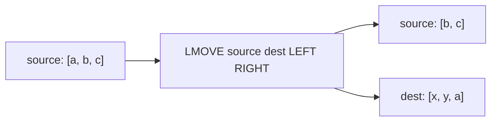

# How to Use LMOVE in Redis to Move Elements Between Lists

Author: [nawazdhandala](https://www.github.com/nawazdhandala)

Tags: Redis, List, LMOVE, Command

Description: Learn how to use the Redis LMOVE command to atomically move an element from one list to another, with full syntax and practical patterns.

---

## How LMOVE Works

`LMOVE` atomically pops an element from a source list and pushes it to a destination list in a single operation. You choose whether to pop from the LEFT or RIGHT of the source, and whether to push to the LEFT or RIGHT of the destination.

Because LMOVE is atomic, it is safe to use in concurrent environments without additional locking. It replaces the older `RPOPLPUSH` command (available since Redis 1.2) and extends it with directional control.

LMOVE was introduced in Redis 6.2.



## Syntax

```redis
LMOVE source destination LEFT|RIGHT LEFT|RIGHT
```

- `source` - key of the source list
- `destination` - key of the destination list (can be the same as source)
- First `LEFT|RIGHT` - direction to pop from the source
- Second `LEFT|RIGHT` - direction to push onto the destination

Returns the value of the moved element, or nil if source is empty.

## Examples

### Move from Source Tail to Destination Head

```redis
RPUSH source "a" "b" "c"
RPUSH dest "x" "y"
LMOVE source dest RIGHT LEFT
LRANGE source 0 -1
LRANGE dest 0 -1
```

```text
"c"
1) "a"
2) "b"
---
1) "c"
2) "x"
3) "y"
```

### Move from Source Head to Destination Tail

```redis
DEL source dest
RPUSH source "a" "b" "c"
RPUSH dest "x" "y"
LMOVE source dest LEFT RIGHT
LRANGE source 0 -1
LRANGE dest 0 -1
```

```text
"a"
1) "b"
2) "c"
---
1) "x"
2) "y"
3) "a"
```

### Rotate a List (Source and Destination Are the Same)

When source and destination are the same key, LMOVE rotates the list.

```redis
DEL mylist
RPUSH mylist "a" "b" "c" "d"
LMOVE mylist mylist LEFT RIGHT
LRANGE mylist 0 -1
```

```text
"a"
1) "b"
2) "c"
3) "d"
4) "a"
```

### Empty Source Returns Nil

```redis
DEL empty
LMOVE empty dest LEFT RIGHT
```

```text
(nil)
```

## Use Cases

### Reliable Queue with Processing Acknowledgment

LMOVE enables a reliable queue pattern where a task is moved to a "processing" list before being worked on. If the worker crashes, the task remains in the processing list and can be recovered.

```redis
RPUSH queue "task:1" "task:2" "task:3"

-- Worker picks up a task
LMOVE queue processing LEFT LEFT

-- After successful processing, remove from processing list
LREM processing 1 "task:1"
```

### Pipeline Stage Handoff

Move work items from one stage to the next in a multi-stage processing pipeline.

```redis
RPUSH stage1 "job:A" "job:B"
LMOVE stage1 stage2 LEFT RIGHT
LMOVE stage2 stage3 LEFT RIGHT
```

### Round-Robin Task Distribution

Rotate tasks through a circular list to distribute work evenly.

```redis
RPUSH tasks "worker1" "worker2" "worker3"
LMOVE tasks tasks LEFT RIGHT
LRANGE tasks 0 -1
```

```text
1) "worker2"
2) "worker3"
3) "worker1"
```

### Backup-and-Process Pattern

Move items to a backup list before destructive processing so you can replay on failure.

```redis
LMOVE inbox backup LEFT LEFT
-- Process the item in backup
-- On success:
LPOP backup
-- On failure:
LMOVE backup inbox LEFT LEFT
```

## Comparison with RPOPLPUSH

`RPOPLPUSH` (deprecated since Redis 6.2) is equivalent to `LMOVE source destination RIGHT LEFT`. LMOVE is strictly more flexible because it exposes all four direction combinations.

```redis
-- These are equivalent:
RPOPLPUSH source dest
LMOVE source dest RIGHT LEFT
```

## Performance Considerations

- LMOVE is O(1) - it pops from one end and pushes to another end, both constant-time operations.
- The atomicity guarantee means no element can be lost between the pop and push even under concurrent access.

## Summary

`LMOVE` is a versatile atomic command that pops an element from one list and pushes it to another, with full control over which end to use for each operation. It is the preferred replacement for `RPOPLPUSH` and is the building block for reliable queues, processing pipelines, and circular list rotation patterns in Redis.
