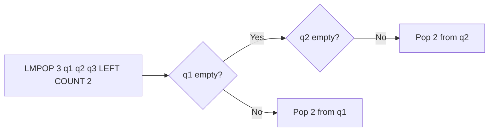

# How to Use LMPOP in Redis to Pop from Multiple Lists

Author: [nawazdhandala](https://www.github.com/nawazdhandala)

Tags: Redis, List, LMPOP, Command

Description: Learn how to use the Redis LMPOP command to pop one or more elements from the first non-empty list among multiple keys in a single call.

---

## How LMPOP Works

`LMPOP` scans a list of keys from left to right and pops elements from the first non-empty list it encounters. Unlike LPOP or RPOP which operate on a single key, LMPOP lets you check multiple lists at once and retrieve a batch of elements in a single round trip.

LMPOP was introduced in Redis 7.0 and is particularly useful for multi-queue consumers that need to drain multiple sources efficiently.



## Syntax

```redis
LMPOP numkeys key [key ...] LEFT|RIGHT [COUNT count]
```

- `numkeys` - the number of keys that follow
- `key [key ...]` - list of keys to check, in order
- `LEFT|RIGHT` - direction to pop from
- `COUNT count` - optional; number of elements to pop (default 1)

Returns a two-element array: `[key, [elements]]` where key is the list from which elements were popped, or nil if all lists are empty.

## Examples

### Setup

```redis
DEL q1 q2 q3
RPUSH q2 "task:A" "task:B" "task:C"
RPUSH q3 "task:D"
```

### Pop from First Non-Empty List

q1 is empty, so LMPOP moves to q2.

```redis
LMPOP 3 q1 q2 q3 LEFT
```

```text
1) "q2"
2) 1) "task:A"
```

### Pop Multiple Elements with COUNT

```redis
LMPOP 3 q1 q2 q3 LEFT COUNT 2
```

```text
1) "q2"
2) 1) "task:B"
   2) "task:C"
```

q2 is now empty, next call finds q3.

```redis
LMPOP 3 q1 q2 q3 LEFT
```

```text
1) "q3"
2) 1) "task:D"
```

### All Lists Empty Returns Nil

```redis
LMPOP 3 q1 q2 q3 LEFT
```

```text
(nil)
```

### Pop from the Right with COUNT

```redis
RPUSH list1 "a" "b" "c" "d"
LMPOP 1 list1 RIGHT COUNT 3
```

```text
1) "list1"
2) 1) "d"
   2) "c"
   3) "b"
```

### COUNT Greater Than List Size

If COUNT exceeds the available elements, all elements are returned without error.

```redis
RPUSH small "x" "y"
LMPOP 1 small LEFT COUNT 100
```

```text
1) "small"
2) 1) "x"
   2) "y"
```

## Use Cases

### Multi-Tenant Queue Consumer

Process tasks from multiple tenant queues, prioritizing the first non-empty one.

```redis
RPUSH queue:tenant1 "job:1"
LMPOP 3 queue:tenant1 queue:tenant2 queue:tenant3 LEFT COUNT 5
```

### Batch Draining Multiple Sources

Pull a batch of items across multiple queues with a single command.

```redis
RPUSH feed:sports "story:1" "story:2"
RPUSH feed:tech "story:3"
LMPOP 2 feed:sports feed:tech LEFT COUNT 10
```

```text
1) "feed:sports"
2) 1) "story:1"
   2) "story:2"
```

### Priority Queue with Fallback

Check queues in priority order - higher-priority queues listed first.

```redis
RPUSH priority:low "task:normal"
LMPOP 3 priority:critical priority:high priority:low LEFT COUNT 1
```

```text
1) "priority:low"
2) 1) "task:normal"
```

### Event Aggregator

Aggregate events from multiple sources into a central processor.

```redis
RPUSH source:sensor1 "reading:1" "reading:2"
RPUSH source:sensor2 "reading:3"
LMPOP 2 source:sensor1 source:sensor2 LEFT COUNT 5
```

## Differences from BLMPOP

LMPOP returns nil immediately when all lists are empty. BLMPOP (the blocking variant) would wait until an element becomes available. Use LMPOP for non-blocking batch drains and BLMPOP for event-driven consumers.

## Performance Considerations

- LMPOP is O(N + M) where N is the number of keys provided and M is the number of elements popped.
- Providing a large COUNT can pop many elements in a single operation, reducing round trips.
- Keys are checked in order; put higher-priority or more frequently populated queues first.

## Summary

`LMPOP` enables efficient multi-queue consumption by scanning multiple list keys in order and popping a batch of elements from the first non-empty one. It eliminates the need for multiple LPOP calls across queues, reduces round trips, and naturally supports priority ordering by key position. Use the `COUNT` option to control batch size.
