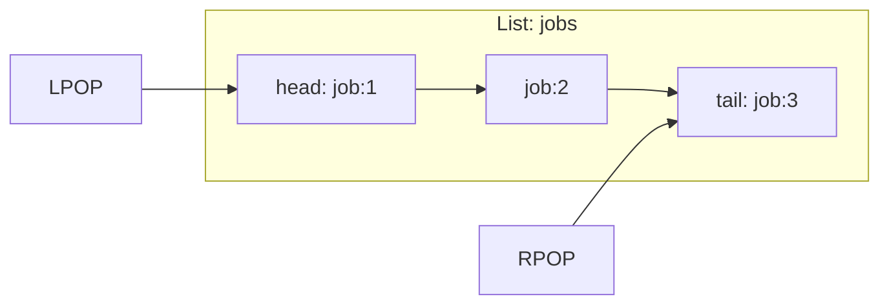

# How to Use LPOP and RPOP in Redis to Remove Items from Lists

Author: [nawazdhandala](https://www.github.com/nawazdhandala)

Tags: Redis, LPOP, RPOP, List, Queue, Stack, Command, Pop

Description: Learn how to use Redis LPOP and RPOP to remove and return elements from the head or tail of a list, enabling queue dequeuing, stack popping, and batch processing.

---

## How LPOP and RPOP Work

`LPOP` removes and returns one or more elements from the head (left side) of a list. `RPOP` removes and returns from the tail (right side). If the list becomes empty after the pop, the key is automatically deleted. When the key does not exist, both commands return nil.

Redis 6.2+ added an optional `count` argument to both commands, allowing you to pop multiple elements in one call.



## Syntax

```redis
LPOP key [count]
RPOP key [count]
```

- Without count: returns a single element (bulk string) or nil
- With count: returns an array of up to `count` elements, or nil if the list is empty

## Examples

### Basic LPOP

Remove the first element from a list.

```redis
RPUSH mylist "a" "b" "c" "d"
LPOP mylist
LPOP mylist
LRANGE mylist 0 -1
```

```text
(integer) 4
"a"
"b"
1) "c"
2) "d"
```

### Basic RPOP

Remove the last element from a list.

```redis
RPUSH mylist "a" "b" "c" "d"
RPOP mylist
RPOP mylist
LRANGE mylist 0 -1
```

```text
(integer) 4
"d"
"c"
1) "a"
2) "b"
```

### LPOP/RPOP on a non-existent key

Returns nil, not an error.

```redis
LPOP nonexistent_key
```

```text
(nil)
```

### Queue (FIFO) pattern

Enqueue with RPUSH, dequeue with LPOP.

```redis
RPUSH queue:emails "msg:1001" "msg:1002" "msg:1003"
LPOP queue:emails
LPOP queue:emails
LRANGE queue:emails 0 -1
```

```text
(integer) 3
"msg:1001"
"msg:1002"
1) "msg:1003"
```

### Stack (LIFO) pattern

Push with LPUSH, pop with LPOP.

```redis
LPUSH stack:ops "op:1" "op:2" "op:3"
LPOP stack:ops
LPOP stack:ops
```

```text
(integer) 3
"op:3"
"op:2"
```

### LPOP with count (Redis 6.2+)

Pop multiple elements at once.

```redis
RPUSH batch "item:1" "item:2" "item:3" "item:4" "item:5"
LPOP batch 3
LRANGE batch 0 -1
```

```text
(integer) 5
1) "item:1"
2) "item:2"
3) "item:3"
1) "item:4"
2) "item:5"
```

### RPOP with count

Pop from the tail in bulk.

```redis
RPUSH mylist "a" "b" "c" "d" "e"
RPOP mylist 2
```

```text
(integer) 5
1) "e"
2) "d"
```

### Auto-deletion of empty list

When the last element is popped, the key is removed.

```redis
RPUSH temp "only"
LPOP temp
EXISTS temp
```

```text
(integer) 1
"only"
(integer) 0
```

### Batch job processing

Pop a batch of work items to process together.

```redis
RPUSH work:queue "task:1" "task:2" "task:3" "task:4" "task:5" "task:6"
LPOP work:queue 3
```

```text
(integer) 6
1) "task:1"
2) "task:2"
3) "task:3"
```

Process the batch, then pop the next 3.

## LPOP vs RPOP vs BLPOP

| Command | Blocks? | Returns |
|---------|---------|---------|
| `LPOP key` | No | Element or nil immediately |
| `RPOP key` | No | Element or nil immediately |
| `BLPOP key timeout` | Yes | Waits up to timeout seconds for an element |
| `BRPOP key timeout` | Yes | Waits up to timeout seconds for an element |

For reliable job queues where workers should wait for work, use `BLPOP`/`BRPOP`.

## Use Cases

- Job queue dequeuing (LPOP from a RPUSH queue)
- Undo/redo stack popping
- Batch processing (pop N items at a time with count argument)
- Event consumption from an in-memory list
- Rolling buffer: pop old items after pushing new ones
- Worker task distribution (each worker pops one task)

## Summary

`LPOP` and `RPOP` remove and return elements from the head and tail of a Redis list. Use `LPOP` with `RPUSH` for FIFO queues, and `LPOP` with `LPUSH` for LIFO stacks. The optional `count` argument (Redis 6.2+) enables batch popping in a single round-trip. Both commands return nil for empty or non-existent lists and auto-delete the key when the list becomes empty.
