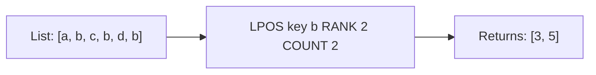

# How to Use LPOS in Redis to Find the Position of an Element

Author: [nawazdhandala](https://www.github.com/nawazdhandala)

Tags: Redis, List, LPOS, Command

Description: Learn how to use the Redis LPOS command to find the index position of an element in a list, with options for multiple occurrences and search limits.

---

## How LPOS Works

`LPOS` searches a Redis list for a specified element and returns its zero-based index position. Unlike LINDEX (which retrieves an element by index), LPOS does the reverse - it finds the index of a known value.

LPOS supports finding multiple occurrences of a value and limiting the search scope, making it flexible for both exact lookups and bounded scans. It was introduced in Redis 6.0.6.



## Syntax

```redis
LPOS key element [RANK rank] [COUNT num-matches] [MAXLEN len]
```

- `key` - the list key
- `element` - the value to search for
- `RANK rank` - which occurrence to start from; 1 is the first (head), 2 is the second, -1 is the last (tail scan)
- `COUNT num-matches` - return up to this many matching indexes; 0 means return all matches
- `MAXLEN len` - limit the scan to the first `len` elements; 0 means scan the whole list

Returns:
- A single integer when `COUNT` is not specified
- An array of integers when `COUNT` is specified
- nil if the element is not found

## Examples

### Basic Lookup

```redis
RPUSH mylist "apple" "banana" "cherry" "banana" "date" "banana"
LPOS mylist "banana"
```

```text
(integer) 1
```

Returns the index of the first occurrence.

### Find a Non-Existent Element

```redis
LPOS mylist "grape"
```

```text
(nil)
```

### Find All Occurrences with COUNT 0

```redis
LPOS mylist "banana" COUNT 0
```

```text
1) (integer) 1
2) (integer) 3
3) (integer) 5
```

### Find a Specific Occurrence with RANK

RANK 2 skips the first match and returns the second.

```redis
LPOS mylist "banana" RANK 2
```

```text
(integer) 3
```

RANK 3 returns the third occurrence.

```redis
LPOS mylist "banana" RANK 3
```

```text
(integer) 5
```

### Scan from the Tail with Negative RANK

Negative RANK scans from the tail. RANK -1 finds the last occurrence.

```redis
LPOS mylist "banana" RANK -1
```

```text
(integer) 5
```

RANK -2 finds the second-to-last occurrence.

```redis
LPOS mylist "banana" RANK -2
```

```text
(integer) 3
```

### Limit the Search Scope with MAXLEN

MAXLEN restricts how many elements are scanned from the head. Useful for large lists.

```redis
LPOS mylist "banana" COUNT 0 MAXLEN 3
```

```text
1) (integer) 1
```

Only the first 3 elements were scanned; only one match was found within that range.

### Combine RANK, COUNT, and MAXLEN

Find up to 2 occurrences starting from the 2nd match, scanning at most 6 elements.

```redis
LPOS mylist "banana" RANK 2 COUNT 2 MAXLEN 6
```

```text
1) (integer) 3
2) (integer) 5
```

## Use Cases

### Check Whether an Item Is in a List and Where

```redis
RPUSH playlist "song:1" "song:2" "song:3" "song:2"
LPOS playlist "song:2"
```

```text
(integer) 1
```

### Deduplication Check Before Insert

```redis
SET result [LPOS mylist "newitem"]
-- If nil, it is safe to append without creating a duplicate
```

### Find the Most Recent Occurrence

Use negative RANK to find the last time a value appeared.

```redis
RPUSH history "page:home" "page:shop" "page:home" "page:cart"
LPOS history "page:home" RANK -1
```

```text
(integer) 2
```

### Bounded Search in a Large List

Searching a million-element list for a recent entry - scan only the last 1000 elements with negative RANK and MAXLEN.

```redis
LPOS biglist "recent:event" RANK -1 MAXLEN 1000
```

This avoids a full O(N) scan.

## Performance Considerations

- Without MAXLEN, LPOS is O(N) in the worst case (element not found or at the end).
- Use MAXLEN to bound the scan when you know the element is near the head or tail.
- Combine negative RANK with MAXLEN to efficiently search the recent end of a large list.
- COUNT 0 returns all matches in a single call, avoiding multiple LPOS round trips.

## Summary

`LPOS` is the counterpart to LINDEX - it finds the index of a known value rather than the value at a known index. With RANK, COUNT, and MAXLEN options it supports use cases ranging from simple first-occurrence lookup to full deduplication scanning with bounded cost. It is the right tool when you need to locate elements in a list by their content.
