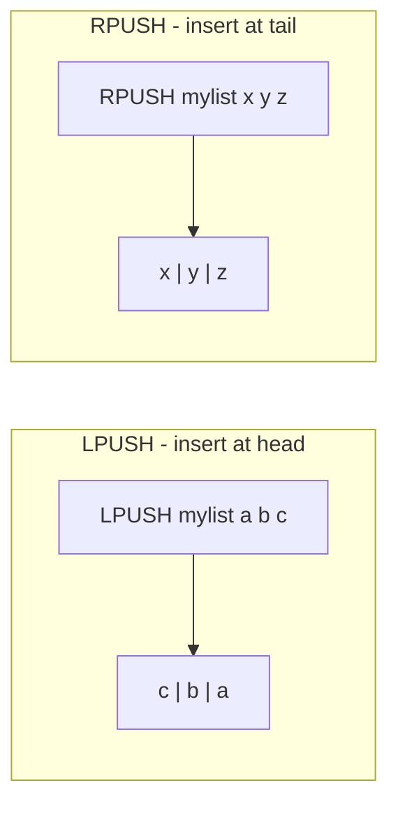

# How to Use LPUSH and RPUSH in Redis to Add Items to Lists

Author: [nawazdhandala](https://www.github.com/nawazdhandala)

Tags: Redis, LPUSH, RPUSH, List, Queue, Stack, Command

Description: Learn how to use Redis LPUSH and RPUSH to add elements to the head or tail of a list, enabling queue, stack, and timeline data structures.

---

## How LPUSH and RPUSH Work

Redis Lists are ordered sequences of string elements. `LPUSH` inserts one or more elements at the head (left side) of a list. `RPUSH` inserts at the tail (right side). If the key does not exist, it is created automatically. Both commands return the length of the list after the insertion.

When multiple elements are pushed in a single call, they are inserted one by one from left to right - so for `LPUSH key a b c`, the resulting list order is `c, b, a` (c was pushed last and ends up at the head).



## Syntax

```redis
LPUSH key element [element ...]
RPUSH key element [element ...]
```

Both commands return the length of the list after the push.

## Examples

### Basic LPUSH

Push elements to the left (head) of a list.

```redis
DEL mylist
LPUSH mylist "first"
LPUSH mylist "second"
LPUSH mylist "third"
LRANGE mylist 0 -1
```

```text
(integer) 1
(integer) 2
(integer) 3
1) "third"
2) "second"
3) "first"
```

Each new element becomes the new head.

### Basic RPUSH

Push elements to the right (tail) of a list.

```redis
DEL mylist
RPUSH mylist "first"
RPUSH mylist "second"
RPUSH mylist "third"
LRANGE mylist 0 -1
```

```text
(integer) 1
(integer) 2
(integer) 3
1) "first"
2) "second"
3) "third"
```

Elements are appended to the tail, preserving insertion order.

### Push multiple elements at once

```redis
DEL mylist
LPUSH mylist a b c
LRANGE mylist 0 -1
```

```text
(integer) 3
1) "c"
2) "b"
3) "a"
```

With `LPUSH key a b c`, the elements are pushed left one at a time: first `a` (length 1), then `b` (length 2), then `c` (length 3). So `c` ends up at the head.

```redis
DEL mylist
RPUSH mylist a b c
LRANGE mylist 0 -1
```

```text
(integer) 3
1) "a"
2) "b"
3) "c"
```

With `RPUSH`, the order is preserved as entered.

### Building a queue (FIFO)

Use `RPUSH` to enqueue and `LPOP` to dequeue.

```redis
RPUSH queue:jobs "job:1"
RPUSH queue:jobs "job:2"
RPUSH queue:jobs "job:3"
LPOP queue:jobs
LPOP queue:jobs
```

```text
(integer) 1
(integer) 2
(integer) 3
"job:1"
"job:2"
```

Jobs are processed in the order they were submitted.

### Building a stack (LIFO)

Use `LPUSH` to push and `LPOP` to pop.

```redis
LPUSH stack:undo "action:1"
LPUSH stack:undo "action:2"
LPUSH stack:undo "action:3"
LPOP stack:undo
```

```text
(integer) 1
(integer) 2
(integer) 3
"action:3"
```

The most recently pushed item is returned first.

### Activity feed (recent items first)

Use `LPUSH` to prepend new events. Trim the list to keep only the last N items.

```redis
LPUSH feed:user:42 "liked post 99"
LPUSH feed:user:42 "followed user 7"
LPUSH feed:user:42 "commented on post 55"
LTRIM feed:user:42 0 9
LRANGE feed:user:42 0 -1
```

```text
(integer) 1
(integer) 2
(integer) 3
OK
1) "commented on post 55"
2) "followed user 7"
3) "liked post 99"
```

### Auto-creation of list key

LPUSH and RPUSH create the key if it does not exist.

```redis
DEL newlist
EXISTS newlist
RPUSH newlist "hello"
EXISTS newlist
```

```text
(integer) 0
(integer) 0
(integer) 1
(integer) 1
```

## LPUSH vs RPUSH

| Command | Inserts at | Use for |
|---------|------------|---------|
| `LPUSH` | Head (left) | Stack (LIFO), reverse-chronological feeds |
| `RPUSH` | Tail (right) | Queue (FIFO), chronological logs |

## Use Cases

- Job queues (RPUSH to enqueue, LPOP to dequeue)
- Task scheduling (push task IDs to a list)
- Activity feeds (LPUSH recent events, trim to N)
- Undo/redo stacks (LPUSH actions, LPOP to undo)
- Log collection (RPUSH log lines, process with LRANGE)
- Real-time notifications (LPUSH for most-recent-first display)

## Summary

`LPUSH` and `RPUSH` add elements to the head and tail of a Redis list respectively. `RPUSH` is the natural choice for queues (FIFO), while `LPUSH` suits stacks (LIFO) and most-recent-first feeds. Both auto-create the key, accept multiple elements in one call, and return the new list length. Combine them with `LPOP`, `RPOP`, `LRANGE`, and `LTRIM` to build complete queue, stack, and feed patterns.
