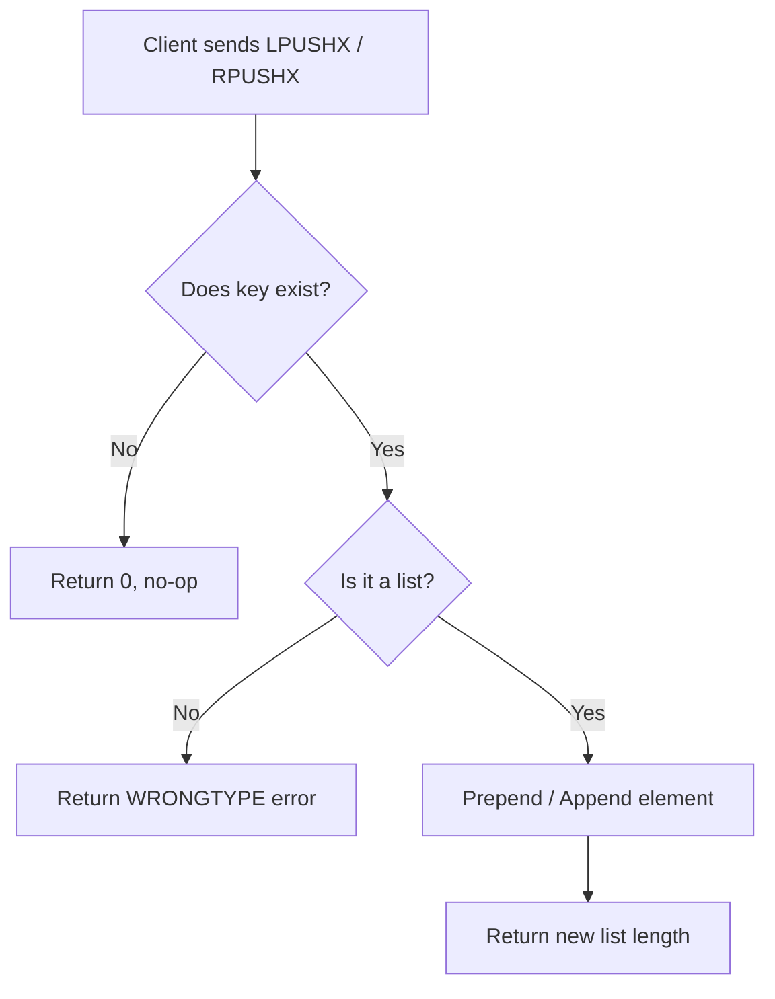

# How to Use LPUSHX and RPUSHX in Redis for Conditional Push

Author: [nawazdhandala](https://www.github.com/nawazdhandala)

Tags: Redis, List, LPUSHX, RPUSHX, Command

Description: Learn how to use LPUSHX and RPUSHX in Redis to push values onto a list only when the key already exists, preventing accidental list creation.

---

## Introduction

`LPUSHX` and `RPUSHX` are conditional push commands in Redis. Unlike `LPUSH` and `RPUSH`, they only insert elements when the target key already exists as a list. This behavior is useful when you want to append to an active list without accidentally initializing one.

## Syntax

```redis
LPUSHX key element [element ...]
RPUSHX key element [element ...]
```

- `LPUSHX` inserts elements at the **head** (left) of the list.
- `RPUSHX` inserts elements at the **tail** (right) of the list.
- Both return the new length of the list, or `0` if the key does not exist.

## How It Works



## Basic Examples

Create a list first, then use LPUSHX and RPUSHX:

```redis
-- Create an initial list
RPUSH tasks "task:1"
-- (integer) 1

-- Prepend only if list exists
LPUSHX tasks "task:0"
-- (integer) 2

-- Append only if list exists
RPUSHX tasks "task:2"
-- (integer) 3

LRANGE tasks 0 -1
-- 1) "task:0"
-- 2) "task:1"
-- 3) "task:2"
```

When the key does not exist:

```redis
DEL tasks

LPUSHX tasks "task:0"
-- (integer) 0

RPUSHX tasks "task:0"
-- (integer) 0

EXISTS tasks
-- (integer) 0
```

Neither command created a new key.

## Push Multiple Elements at Once

Both commands accept multiple elements in a single call:

```redis
RPUSH queue "job:1"
-- (integer) 1

RPUSHX queue "job:2" "job:3" "job:4"
-- (integer) 4

LRANGE queue 0 -1
-- 1) "job:1"
-- 2) "job:2"
-- 3) "job:3"
-- 4) "job:4"
```

Elements are pushed left-to-right for `RPUSHX` and right-to-left for `LPUSHX`:

```redis
RPUSH log "entry:1"

LPUSHX log "entry:3" "entry:2"
-- Elements pushed: entry:3 first, then entry:2
-- Result head: entry:2, entry:3, entry:1

LRANGE log 0 -1
-- 1) "entry:2"
-- 2) "entry:3"
-- 3) "entry:1"
```

## Real-World Use Cases

### Active Session Queue

Only buffer messages for sessions that are still alive:

```redis
-- On session start
RPUSH session:user:42 "connected"

-- Buffer incoming messages only for active sessions
RPUSHX session:user:42 "msg:hello"
-- (integer) 2

-- For a session that ended
RPUSHX session:user:99 "msg:hello"
-- (integer) 0  -- session:user:99 does not exist, message dropped
```

### Append-Only Log Guard

Ensure log entries are added only to pre-initialized log keys:

```redis
RPUSH audit:2026-03-31 "init"

RPUSHX audit:2026-03-31 "user:login:42"
-- (integer) 2

RPUSHX audit:2026-04-01 "user:login:42"
-- (integer) 0  -- no log initialized for that date yet
```

### Pipeline Batch Append

```redis
-- Initialize once
RPUSH batch:pipeline "item:start"

-- Workers append items only if pipeline is open
RPUSHX batch:pipeline "item:a"
RPUSHX batch:pipeline "item:b"
RPUSHX batch:pipeline "item:c"
-- Returns: 2, 3, 4

LRANGE batch:pipeline 0 -1
-- 1) "item:start"
-- 2) "item:a"
-- 3) "item:b"
-- 4) "item:c"
```

## Difference from LPUSH and RPUSH

| Command   | Key exists  | Key absent         |
|-----------|-------------|--------------------|
| `LPUSH`   | Prepends    | Creates list       |
| `RPUSH`   | Appends     | Creates list       |
| `LPUSHX`  | Prepends    | No-op, returns 0   |
| `RPUSHX`  | Appends     | No-op, returns 0   |

## Error Handling

If the key exists but holds a non-list type:

```redis
SET mystring "hello"
RPUSHX mystring "world"
-- (error) WRONGTYPE Operation against a key holding the wrong kind of value
```

## Time Complexity

Both `LPUSHX` and `RPUSHX` run in **O(1)** per element inserted, making them safe for high-throughput workloads.

## Summary

`LPUSHX` and `RPUSHX` let you push elements onto an existing list without creating a new key if the list is absent. They are ideal for guarding append operations in session buffers, audit logs, and pipeline queues where a list should only receive data after explicit initialization. Both commands are O(1) and support inserting multiple elements in a single call.
