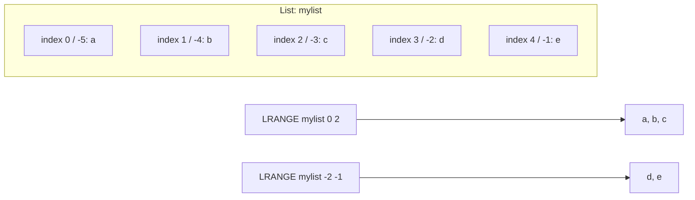

# How to Use LRANGE in Redis to Retrieve a Range of List Elements

Author: [nawazdhandala](https://www.github.com/nawazdhandala)

Tags: Redis, LRANGE, List, Range, Command, Pagination

Description: Learn how to use the Redis LRANGE command to retrieve a contiguous range of elements from a list using zero-based and negative offsets, for feeds, queues, and pagination.

---

## How LRANGE Works

`LRANGE` returns a subset of a list between two index positions (inclusive). Indexes are zero-based: 0 is the first element (head), 1 is the second, and so on. Negative indexes count from the tail: -1 is the last element, -2 is the second to last. Using `LRANGE key 0 -1` returns the entire list.

`LRANGE` does not modify the list. It is a read-only operation.



## Syntax

```redis
LRANGE key start stop
```

- `start` and `stop` are zero-based inclusive indexes (negative values count from the tail)
- If `start` > `stop`, or `start` is beyond the list length, returns an empty array
- Returns an empty array for non-existent keys (not an error)

## Examples

### Retrieve the full list

```redis
RPUSH mylist a b c d e
LRANGE mylist 0 -1
```

```text
(integer) 5
1) "a"
2) "b"
3) "c"
4) "d"
5) "e"
```

### Retrieve a specific range

Get elements at index 1 through 3 (second, third, fourth).

```redis
LRANGE mylist 1 3
```

```text
1) "b"
2) "c"
3) "d"
```

### Retrieve with negative indexes

Get the last two elements.

```redis
LRANGE mylist -2 -1
```

```text
1) "d"
2) "e"
```

### Retrieve the first N elements (pagination page 1)

```redis
LRANGE mylist 0 4
```

```text
1) "a"
2) "b"
3) "c"
4) "d"
5) "e"
```

### Pagination with LRANGE

Page through a list 2 items at a time.

```redis
RPUSH pagelist "item:1" "item:2" "item:3" "item:4" "item:5" "item:6"
LRANGE pagelist 0 1
LRANGE pagelist 2 3
LRANGE pagelist 4 5
```

```text
(integer) 6
1) "item:1"
2) "item:2"
1) "item:3"
2) "item:4"
1) "item:5"
2) "item:6"
```

### Activity feed - recent 10 items

Retrieve the 10 most recent events from a feed stored with LPUSH.

```redis
LPUSH feed:user:42 "event:5" "event:4" "event:3" "event:2" "event:1"
LRANGE feed:user:42 0 9
```

```text
(integer) 5
1) "event:1"
2) "event:2"
3) "event:3"
4) "event:4"
5) "event:5"
```

### Out-of-range indexes

Redis handles out-of-range indexes gracefully by clamping to the list boundaries.

```redis
LRANGE mylist 0 999
LRANGE mylist -999 -1
```

Both return the full list without error.

### Empty range

If start > stop, an empty array is returned.

```redis
LRANGE mylist 3 1
```

```text
(empty array)
```

### Non-existent key

Returns an empty array, not an error.

```redis
LRANGE nonexistent_key 0 -1
```

```text
(empty array)
```

## LRANGE performance

`LRANGE` is O(S + N) where S is the distance from the head to the start index, and N is the number of elements returned. For small lists or ranges near the head, it is very fast. For large lists where you need elements near the tail, the traversal cost can be significant. Consider using Redis Sorted Sets for random-access pagination on very large datasets.

## LRANGE vs LINDEX

| Command | Use case | Returns |
|---------|----------|---------|
| `LRANGE key 0 -1` | Full list retrieval | All elements |
| `LRANGE key start stop` | Paginated range | Multiple elements |
| `LINDEX key index` | Single element by position | One element |

## Use Cases

- Activity feeds: show the most recent N items
- Job queue inspection: view pending jobs without consuming them
- Leaderboard snapshots: retrieve a page of ranked items
- Log viewing: display recent log entries
- Chat history: load the last N messages in a conversation

## Summary

`LRANGE` retrieves a contiguous subrange of a Redis list by zero-based or negative indexes. It is non-destructive, handles out-of-range indexes gracefully, and returns an empty array for non-existent keys. Use `LRANGE key 0 -1` to fetch the entire list, or specify a start/stop range for pagination. Combine with `LPUSH` + `LTRIM` for a capped feed that always returns only the most recent N items.
