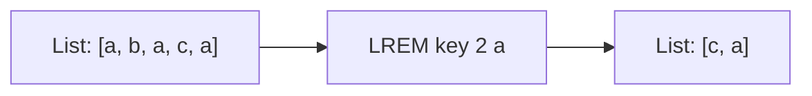

# How to Use LREM in Redis to Remove List Elements by Value

Author: [nawazdhandala](https://www.github.com/nawazdhandala)

Tags: Redis, List, LREM, Command

Description: Learn how to use the Redis LREM command to remove elements from a list by value, controlling count and direction of removal.

---

## How LREM Works

`LREM` removes elements from a Redis list that match a specified value. Unlike index-based removal, LREM targets elements by their content. You can control how many occurrences to remove and from which direction (head or tail) the scan begins.

This makes LREM ideal for deduplication, cleaning up stale entries, or removing specific items from a list without knowing their positions.



## Syntax

```redis
LREM key count element
```

- `key` - the list key
- `count` - controls how many and from which direction:
  - `count > 0` - remove up to `count` occurrences scanning from head to tail
  - `count < 0` - remove up to `|count|` occurrences scanning from tail to head
  - `count = 0` - remove all occurrences
- `element` - the value to remove

Returns the number of elements removed.

## Examples

### Setup

```redis
RPUSH mylist "apple" "banana" "apple" "cherry" "apple" "banana"
LRANGE mylist 0 -1
```

```text
1) "apple"
2) "banana"
3) "apple"
4) "cherry"
5) "apple"
6) "banana"
```

### Remove from Head (count > 0)

Remove the first 2 occurrences of "apple" scanning from head to tail.

```redis
LREM mylist 2 "apple"
LRANGE mylist 0 -1
```

```text
1) "banana"
2) "cherry"
3) "apple"
4) "banana"
```

The third "apple" (originally at index 4) remains because only 2 were requested.

### Remove from Tail (count < 0)

Start a fresh list and remove occurrences from the tail end.

```redis
DEL mylist
RPUSH mylist "apple" "banana" "apple" "cherry" "apple" "banana"
LREM mylist -2 "apple"
LRANGE mylist 0 -1
```

```text
1) "apple"
2) "banana"
3) "cherry"
4) "banana"
```

The last 2 "apple" occurrences were removed; the first one at index 0 remains.

### Remove All Occurrences (count = 0)

```redis
DEL mylist
RPUSH mylist "apple" "banana" "apple" "cherry" "apple"
LREM mylist 0 "apple"
LRANGE mylist 0 -1
```

```text
1) "banana"
2) "cherry"
```

All three "apple" entries are gone.

### No Matching Elements

If the value is not found, LREM returns 0 without error.

```redis
LREM mylist 1 "grape"
```

```text
(integer) 0
```

### Non-Existent Key

```redis
DEL ghost
LREM ghost 1 "value"
```

```text
(integer) 0
```

## Use Cases

### Removing Duplicate Entries from a Feed

If a message ID was accidentally inserted multiple times into a user feed list, LREM cleans it up.

```redis
RPUSH feed:user1 "msg:101" "msg:102" "msg:101" "msg:103" "msg:101"
LREM feed:user1 0 "msg:101"
LRANGE feed:user1 0 -1
```

```text
1) "msg:102"
2) "msg:103"
```

### Implementing a Set-Like Uniqueness Check Before Insert

```redis
LREM notifications:user1 0 "alert:disk_full"
RPUSH notifications:user1 "alert:disk_full"
```

This pattern removes any stale copy first, then re-inserts to ensure only one copy exists.

### Removing Completed Tasks from a Queue

```redis
RPUSH taskqueue "task:A" "task:B" "task:C" "task:B"
LREM taskqueue 0 "task:B"
LRANGE taskqueue 0 -1
```

```text
1) "task:A"
2) "task:C"
```

### Priority-Aware Removal from Tail

When elements are appended over time and older entries are at the head, removing from the tail (negative count) removes the most recent occurrences first.

```redis
RPUSH log "INFO" "ERROR" "INFO" "WARN" "INFO"
LREM log -1 "INFO"
LRANGE log 0 -1
```

```text
1) "INFO"
2) "ERROR"
3) "INFO"
4) "WARN"
```

## Performance Considerations

- LREM is O(N + M) where N is the list length and M is the number of removed elements.
- For large lists with many occurrences, this can be slow. Consider using a different data structure (e.g., sets) if frequent removal by value is needed.
- If `count` limits the scan early enough, the operation terminates before traversing the full list.

## Summary

`LREM` removes elements from a Redis list by matching their value rather than their position. The `count` parameter gives you fine-grained control: scan from the head with a positive count, from the tail with a negative count, or remove all occurrences with zero. It is well suited for deduplication, cleanup of stale data, and maintaining list integrity without needing to know exact element indexes.
