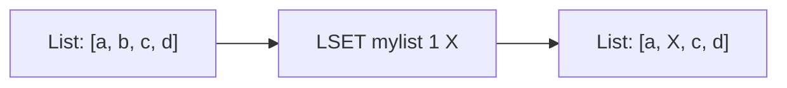

# How to Use LSET in Redis to Update a List Element by Index

Author: [nawazdhandala](https://www.github.com/nawazdhandala)

Tags: Redis, List, LSET, Command

Description: Learn how to use the Redis LSET command to update a list element at a specific index, with syntax, examples, and practical use cases.

---

## How LSET Works

Redis lists are ordered collections of strings accessible by index. While you can push and pop elements from either end, sometimes you need to update an element at a specific position without removing it. The `LSET` command lets you do exactly that - it replaces the element at a given index with a new value.

LSET is an O(N) operation where N is the length of the list (due to index traversal), making it less efficient on very large lists compared to head/tail operations. If the index is out of range, Redis returns an error.



## Syntax

```redis
LSET key index element
```

- `key` - the name of the list
- `index` - zero-based index; negative values count from the tail (-1 is the last element)
- `element` - the new value to set at that index

Returns `OK` on success, or an error if the index is out of range or the key does not exist.

## Examples

### Basic Update

Create a list and update an element in the middle.

```redis
RPUSH mylist "apple" "banana" "cherry" "date"
LRANGE mylist 0 -1
```

```text
1) "apple"
2) "banana"
3) "cherry"
4) "date"
```

Now update the element at index 1 (banana) with a new value.

```redis
LSET mylist 1 "blueberry"
LRANGE mylist 0 -1
```

```text
1) "apple"
2) "blueberry"
3) "cherry"
4) "date"
```

### Using Negative Indexes

Negative indexes count from the end of the list. Index -1 refers to the last element.

```redis
LSET mylist -1 "fig"
LRANGE mylist 0 -1
```

```text
1) "apple"
2) "blueberry"
3) "cherry"
4) "fig"
```

### Out-of-Range Error

Attempting to set an index beyond the list length returns an error.

```redis
LSET mylist 100 "grape"
```

```text
(error) ERR index out of range
```

### Key Does Not Exist

LSET returns an error if the key does not exist.

```redis
DEL nolist
LSET nolist 0 "value"
```

```text
(error) ERR no such key
```

## Checking the Current Value Before Updating

Use `LINDEX` to read the current value at an index before overwriting it.

```redis
LINDEX mylist 0
```

```text
"apple"
```

```redis
LSET mylist 0 "apricot"
LINDEX mylist 0
```

```text
"apricot"
```

## Use Cases

### Updating a Task in a Task Queue

When you store task records in a Redis list and a task status changes, LSET lets you update the record in place without rebuilding the list.

```redis
RPUSH tasks "task:1:pending" "task:2:pending" "task:3:pending"
LSET tasks 1 "task:2:processing"
LRANGE tasks 0 -1
```

```text
1) "task:1:pending"
2) "task:2:processing"
3) "task:3:pending"
```

### Correcting Data in a Fixed-Size Buffer

If you maintain a circular buffer of the last N events, LSET allows you to patch individual entries.

```redis
RPUSH eventlog "event:A" "event:B" "event:ERR" "event:D"
LSET eventlog 2 "event:C"
LRANGE eventlog 0 -1
```

```text
1) "event:A"
2) "event:B"
3) "event:C"
4) "event:D"
```

### Updating Configuration Snapshots

If you store serialized configuration strings in a list, you can update a specific snapshot by index.

```redis
RPUSH configs '{"version":1}' '{"version":2}' '{"version":3}'
LSET configs 1 '{"version":2,"patched":true}'
```

## Performance Considerations

- LSET has O(N) time complexity due to list traversal to reach the index.
- For head (index 0) and tail (index -1) updates, traversal is minimal and effectively O(1).
- On very large lists, prefer data structures that support O(1) random access (e.g., hashes) if frequent mid-list updates are needed.
- LSET does not change the list length; it only replaces the value at the given position.

## Summary

`LSET` is a precise update command that replaces a single element in a Redis list at a specified index. It supports both positive (from head) and negative (from tail) index notation, returns an error for out-of-range indexes or non-existent keys, and is most efficient when operating near the ends of the list. Use it when you need to patch a known position in a list without removing and reinserting elements.
