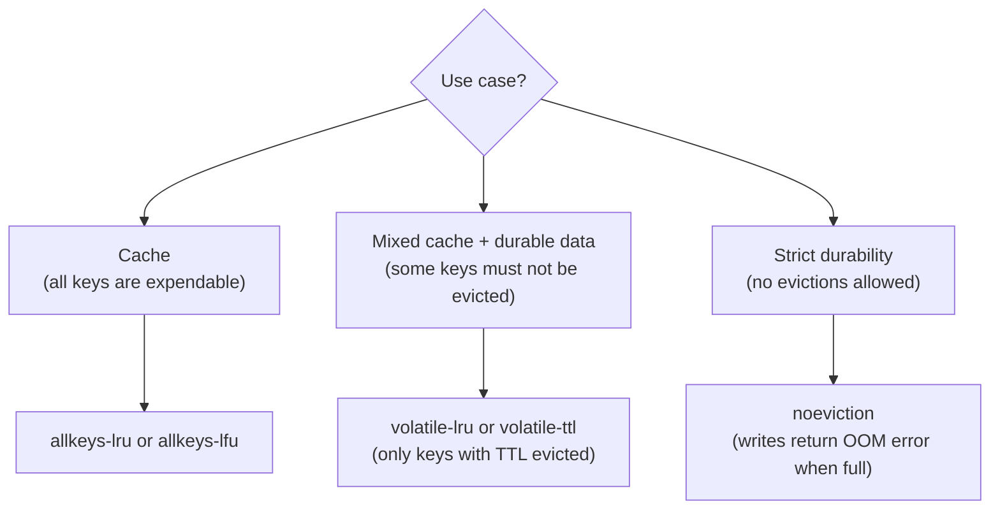

# How to Configure Redis maxmemory and Eviction Policy

Author: [nawazdhandala](https://www.github.com/nawazdhandala)

Tags: Redis, maxmemory, Eviction, Memory, Configuration

Description: Learn how to configure Redis maxmemory limits and eviction policies to control memory usage, prevent OOM errors, and tune cache behavior for your workload.

---

## Introduction

Redis is an in-memory store. Without a memory limit, it will consume all available RAM and potentially cause the OS to kill the process. The `maxmemory` directive sets an upper bound on memory usage, and `maxmemory-policy` controls what Redis does when that limit is reached.

## Setting maxmemory

In `redis.conf`:

```redis
maxmemory 512mb
```

Or at runtime:

```redis
CONFIG SET maxmemory 512mb
CONFIG GET maxmemory
# 1) "maxmemory"
# 2) "536870912"   (bytes)
```

Valid units: `b`, `kb`, `mb`, `gb`. Setting to `0` means no limit (default).

## Eviction Policies

When Redis reaches `maxmemory`, it applies the configured eviction policy to free space:

```redis
CONFIG SET maxmemory-policy allkeys-lru
```

### Available Policies

| Policy | Description |
|---|---|
| `noeviction` | Return errors on write commands. Never evict. (default) |
| `allkeys-lru` | Evict least recently used keys across all keys |
| `volatile-lru` | Evict LRU keys only among keys with a TTL set |
| `allkeys-random` | Evict random keys across all keys |
| `volatile-random` | Evict random keys only among keys with a TTL |
| `volatile-ttl` | Evict keys with the shortest remaining TTL first |
| `allkeys-lfu` | Evict least frequently used keys across all keys (Redis 4.0+) |
| `volatile-lfu` | Evict LFU keys only among keys with a TTL (Redis 4.0+) |

## Choosing the Right Policy



### Recommendations

- **Pure cache**: Use `allkeys-lru` to evict the least recently used keys. Simple and effective.
- **Cache with hot-spot awareness**: Use `allkeys-lfu` for better hit rates when access patterns are skewed.
- **Mixed workload** (some keys are permanent, some are cached): Set TTLs only on cached keys and use `volatile-lru`.
- **Strict persistence**: Use `noeviction` and monitor memory usage closely.

## Examples

### Configure for a cache workload

```redis
CONFIG SET maxmemory 1gb
CONFIG SET maxmemory-policy allkeys-lru
```

### Configure for mixed workload

```redis
# Permanent keys have no TTL
SET config:app "production"

# Cached keys have TTL - only these will be evicted
SET cache:page:home "<html>..." EX 3600

CONFIG SET maxmemory 512mb
CONFIG SET maxmemory-policy volatile-lru
```

### View current settings

```redis
CONFIG GET maxmemory
CONFIG GET maxmemory-policy
```

### Check memory usage against limit

```redis
INFO memory
# used_memory_human:450.00M
# maxmemory_human:512.00M
# maxmemory_policy:allkeys-lru
# mem_fragmentation_ratio:1.12
```

## LFU Tuning Parameters

When using `allkeys-lfu` or `volatile-lfu`, tune the LFU decay rate:

```redis
# Higher value = faster decay (more recent = more weight)
CONFIG SET lfu-decay-time 1

# Logarithmic counter saturation value
CONFIG SET lfu-log-factor 10
```

## maxmemory-samples

LRU and LFU in Redis are approximations. Redis samples a subset of keys to decide which to evict:

```redis
# Higher = more accurate LRU/LFU, slightly more CPU
CONFIG SET maxmemory-samples 10
```

Default is 5. A value of 10 approaches true LRU accuracy.

## Monitoring Evictions

```redis
INFO stats
# evicted_keys:12500
# keyspace_hits:980000
# keyspace_misses:20000
```

A high `evicted_keys` count with a low `keyspace_hits` ratio signals the cache is undersized.

## Summary

Configure `maxmemory` to prevent Redis from consuming all system RAM, and choose `maxmemory-policy` based on your workload. For pure caches, `allkeys-lru` or `allkeys-lfu` are the best choices. For mixed workloads, use `volatile-lru` combined with TTLs on cached keys. Monitor eviction rates with `INFO stats` to validate that your memory budget is sufficient.
