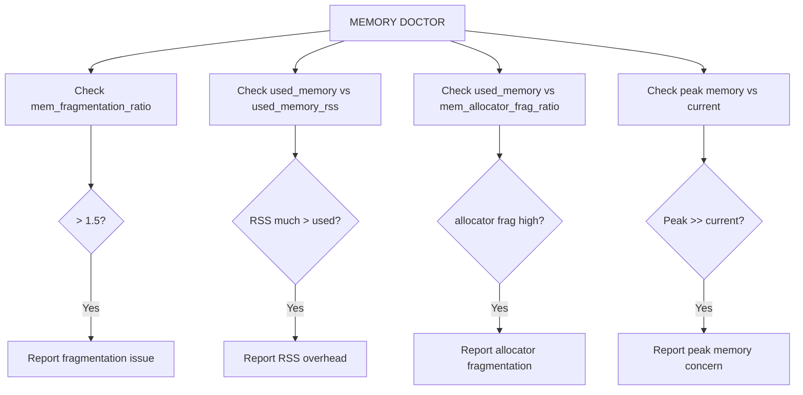

# How to Use MEMORY DOCTOR in Redis for Memory Diagnostics

Author: [nawazdhandala](https://www.github.com/nawazdhandala)

Tags: Redis, Memory, MEMORY DOCTOR, Diagnostic, Monitoring

Description: Learn how to use MEMORY DOCTOR to get a plain-English diagnosis of Redis memory health issues, including fragmentation, RSS overhead, and peak memory consumption.

---

## Introduction

`MEMORY DOCTOR` analyzes the current memory state of Redis and returns a human-readable diagnostic report. It surfaces common memory issues such as high fragmentation, large RSS-to-used-memory ratios, and peak memory accumulation, making it useful for quick health checks.

## Basic Syntax

```redis
MEMORY DOCTOR
```

Returns a plain-text string describing detected memory issues or confirming that memory is healthy.

## Example Outputs

### Healthy instance

```redis
MEMORY DOCTOR
# "Sam, I detected no issues with your memory configuration. But remember: every 42nd time you run this command, Redis will try to steal your soul. Be careful."
```

(The joke message is actual Redis behavior -- it's a random Easter egg in the response.)

### High fragmentation

```redis
MEMORY DOCTOR
# "Sam, I detected a few issues with your memory configuration:
# * High RSS memory overhead (rss/used: 1.8) means that Redis uses memory much more than needed. Possible causes: active memory defragmentation is disabled, data was stored and deleted many times, or memory was freed by the OS."
```

### Peak memory is much higher than current usage

```redis
MEMORY DOCTOR
# "Sam, I detected a few issues with your memory configuration:
# * Peak memory: 512MB, currently using only 100MB. Consider clearing the peak with MEMORY RESET-STAT to get a more accurate reading."
```

## What MEMORY DOCTOR Checks



## Correlating with INFO memory

`MEMORY DOCTOR` summarizes findings from `INFO memory`. Look at these fields for context:

```redis
INFO memory
# used_memory:104857600          (100MB - data)
# used_memory_rss:188743680      (180MB - OS-level)
# mem_fragmentation_ratio:1.80   (high - 80% fragmentation)
# used_memory_peak:536870912     (512MB peak)
# used_memory_peak_perc:19.53%   (currently only 20% of peak)
# allocator_frag_ratio:1.40
# rss_overhead_ratio:1.15
```

## Responding to MEMORY DOCTOR Findings

### High fragmentation

```redis
# Enable active defragmentation
CONFIG SET activedefrag yes
CONFIG SET active-defrag-threshold-lower 10
CONFIG SET active-defrag-cycle-max 25
```

### RSS much higher than used_memory

This typically indicates:
- Memory was allocated and freed many times (fragmentation)
- Active defrag is disabled
- jemalloc is holding released pages

Check:

```redis
INFO memory
# mem_allocator:jemalloc-5.3.0
# allocator_allocated:100MB
# allocator_active:150MB
# allocator_resident:180MB
```

### Peak memory concerns

Reset peak tracking after a bulk import or spike:

```redis
MEMORY RESET-STAT
```

This resets `used_memory_peak` to the current `used_memory`.

## MEMORY DOCTOR in a Health Check Script

```bash
#!/bin/bash
DIAGNOSIS=$(redis-cli MEMORY DOCTOR)

if echo "$DIAGNOSIS" | grep -qi "issue\|problem\|warning\|high"; then
  echo "WARN: Redis memory issues detected:"
  echo "$DIAGNOSIS"
  exit 1
else
  echo "OK: Redis memory is healthy"
fi
```

## Related MEMORY Subcommands

| Command | Purpose |
|---|---|
| `MEMORY USAGE key` | Bytes used by a specific key |
| `MEMORY STATS` | Detailed memory statistics |
| `MEMORY MALLOC-STATS` | Raw jemalloc allocator statistics |
| `MEMORY PURGE` | Return cached memory to OS |
| `MEMORY RESET-STAT` | Reset peak memory and other stats |
| `MEMORY DOCTOR` | Plain-English diagnostic summary |

## Summary

`MEMORY DOCTOR` provides an easy-to-read summary of memory health issues in Redis. It detects high fragmentation, RSS overhead, and peak memory anomalies. Use it as a quick first-pass diagnostic, then follow up with `INFO memory` and `MEMORY STATS` for detailed metrics. Respond to fragmentation warnings by enabling `activedefrag` and use `MEMORY PURGE` to return idle memory to the OS.
