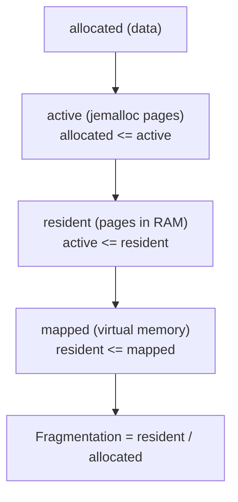
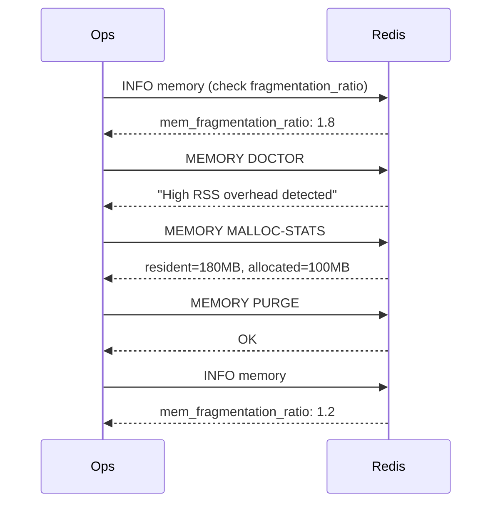

# How to Use MEMORY MALLOC-STATS in Redis

Author: [nawazdhandala](https://www.github.com/nawazdhandala)

Tags: Redis, Memory, Malloc, Jemalloc, Diagnostic

Description: Learn how to use MEMORY MALLOC-STATS to retrieve raw jemalloc allocator statistics from Redis for deep memory fragmentation analysis and debugging.

---

## Introduction

`MEMORY MALLOC-STATS` returns the internal statistics from the memory allocator used by Redis (typically jemalloc). This raw output is intended for advanced memory debugging and deep fragmentation analysis. It exposes information about arena counts, chunk sizes, bin utilization, and total allocation activity that is not available through `INFO memory`.

## Basic Syntax

```redis
MEMORY MALLOC-STATS
```

Returns a multi-line string containing jemalloc's internal stats.

## Example Output

```redis
MEMORY MALLOC-STATS
# ___ Begin jemalloc statistics ___
# Version: "5.3.0-0-..."
# Assertions enabled: false
# Run-time option settings:
#   opt.abort: false
#   opt.abort_conf: false
#   opt.xmalloc: false
#   opt.zero: false
#   opt.tcache: true
#   opt.lg_tcache_max: 15
#   opt.background_thread: false
#   opt.dirty_decay_ms: 10000
#   opt.muzzy_decay_ms: 10000
#   opt.narenas: 1
#   opt.lg_extent_max_active_fit: 6
# Arenas: 1
# Quantum size: 16
# Page size: 4096
# Maximum thread-cached size class: 32768
# Source: malloc
# Number of bins: 40
# Number of thread-local allocation fastpath arenas: 1
# Allocated: 104857600, active: 125829120, metadata: 2097152
# resident: 180355072, mapped: 188743680, retained: 0
# ...
# ___ End jemalloc statistics ___
```

## Key Fields Explained

| Field | Meaning |
|---|---|
| `Allocated` | Bytes of active allocations (data Redis is using) |
| `active` | Bytes in active jemalloc pages (>= allocated) |
| `metadata` | Bytes used by jemalloc's internal bookkeeping |
| `resident` | Bytes of resident memory (pages in RAM) |
| `mapped` | Total bytes of mapped memory (virtual address space) |
| `retained` | Bytes of retained memory not returned to OS |
| `dirty_decay_ms` | Time (ms) before dirty pages are returned to OS |
| `muzzy_decay_ms` | Time (ms) before muzzy pages are returned to OS |

## Understanding Fragmentation via malloc-stats



A high `resident / allocated` ratio indicates that jemalloc is holding pages that contain freed allocations.

## Comparing malloc-stats to INFO memory

```redis
INFO memory
# used_memory:104857600          (= allocated in malloc-stats)
# used_memory_rss:180355072      (= resident in malloc-stats)
# mem_fragmentation_ratio:1.72   (= resident / allocated)
```

`MEMORY MALLOC-STATS` provides the raw numbers behind these derived metrics.

## Parsing for Specific Values

Use the CLI to extract specific numbers from the verbose output:

```bash
redis-cli MEMORY MALLOC-STATS | grep -E "^Allocated:|^# resident:"
```

Or use a script:

```bash
redis-cli MEMORY MALLOC-STATS | grep "Allocated:" | awk '{print "Allocated:", $2}'
```

## Decay Time Tuning

jemalloc holds dirty (recently freed) pages before returning them to the OS. Reducing the decay time causes more aggressive memory release:

```redis
# Check current decay settings
MEMORY MALLOC-STATS | grep decay
# opt.dirty_decay_ms: 10000   (10 seconds)
# opt.muzzy_decay_ms: 10000

# Trigger immediate purge of idle pages
MEMORY PURGE
```

Note: `dirty_decay_ms` and `muzzy_decay_ms` are set at jemalloc compile time or via environment variable, not via Redis config. Use `MEMORY PURGE` to reclaim pages manually.

## When to Use MEMORY MALLOC-STATS

- Deep investigation of fragmentation that `INFO memory` does not fully explain
- Confirming whether jemalloc is returning memory to the OS after `MEMORY PURGE`
- Benchmarking allocator behavior under different workload patterns
- Working with Redis core developers on memory-related bug reports

## Practical Workflow



## Summary

`MEMORY MALLOC-STATS` exposes raw jemalloc allocator statistics including allocated, active, resident, and mapped memory. Use it for deep fragmentation analysis when `INFO memory` ratios are high and you need to understand the allocator's behavior. Follow up with `MEMORY PURGE` to request that jemalloc release idle pages back to the OS.
