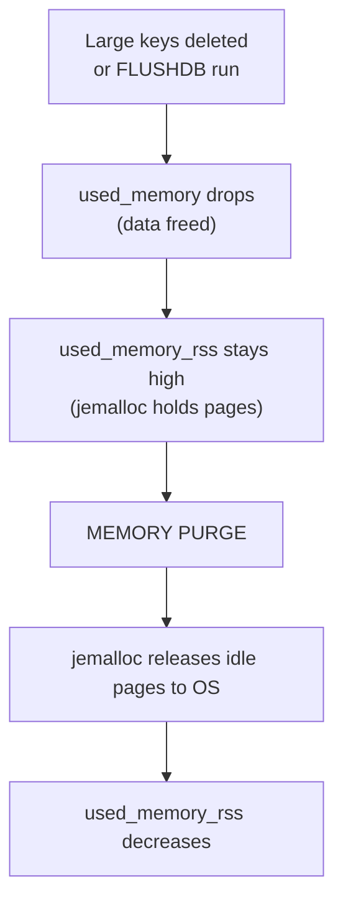
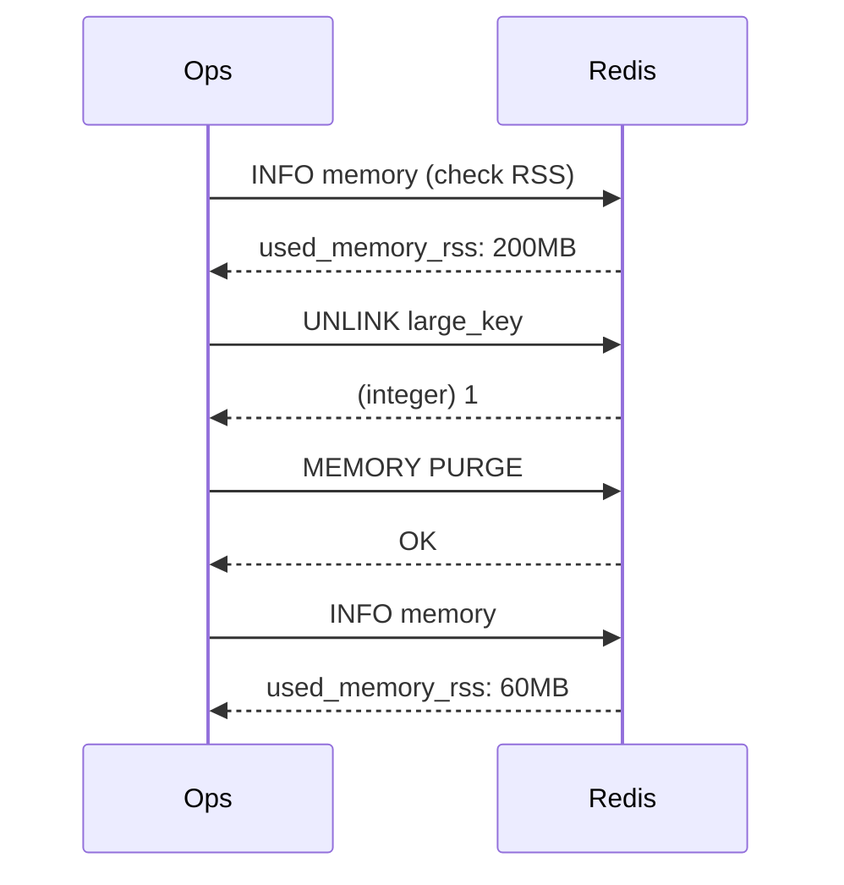

# How to Use MEMORY PURGE in Redis to Return Memory to OS

Author: [nawazdhandala](https://www.github.com/nawazdhandala)

Tags: Redis, Memory, Memory purge, Jemalloc, Administration

Description: Learn how to use MEMORY PURGE to instruct Redis to return cached but unused memory pages to the operating system, reducing RSS without restarting.

---

## Introduction

When Redis frees memory (after deleting keys, TTL expiry, or eviction), the allocator (jemalloc) holds onto the freed pages for potential reuse rather than immediately returning them to the OS. This causes `used_memory_rss` to remain elevated even after the data is gone. `MEMORY PURGE` tells jemalloc to release these idle pages back to the OS immediately.

## Basic Syntax

```redis
MEMORY PURGE
```

Returns `OK`. The operation can take a brief moment as jemalloc traverses and releases idle pages.

## When MEMORY PURGE Helps



## Examples

### Before purge: RSS is much higher than used_memory

```redis
INFO memory
# used_memory:104857600          (100MB)
# used_memory_rss:209715200      (200MB)
# mem_fragmentation_ratio:2.00
```

### Delete a large key

```redis
UNLINK big_sorted_set
# (integer) 1

INFO memory
# used_memory:52428800           (50MB - freed 50MB)
# used_memory_rss:209715200      (still 200MB - OS not notified yet)
# mem_fragmentation_ratio:4.00
```

### Run MEMORY PURGE

```redis
MEMORY PURGE
# OK

INFO memory
# used_memory:52428800           (50MB - unchanged)
# used_memory_rss:62914560       (~60MB - OS reclaimed pages)
# mem_fragmentation_ratio:1.20
```

## How jemalloc Page Decay Works

jemalloc normally returns idle pages to the OS after a configurable decay period:

- `dirty_decay_ms` - time before dirty (recently freed) pages are returned
- `muzzy_decay_ms` - time before muzzy (MADV_FREE) pages are returned

Default for both is 10,000 ms (10 seconds). `MEMORY PURGE` bypasses the decay timer and forces immediate release.

## Checking Purge Eligibility

```redis
MEMORY MALLOC-STATS
# Allocated: 52428800    (50MB - actual data)
# active:    75497472    (72MB - jemalloc active pages)
# resident:  209715200   (200MB - OS-level footprint)
# retained:  5242880     (5MB - never-returned pages)
```

The gap between `resident` and `allocated` is what `MEMORY PURGE` reduces.

## Active Defragmentation vs MEMORY PURGE

| Feature | Active Defragmentation | MEMORY PURGE |
|---|---|---|
| What it does | Compacts live objects to reduce fragmentation | Returns idle pages to OS |
| When to use | High `mem_fragmentation_ratio` | High RSS after data deletion |
| Continuous? | Yes (background thread) | No (one-shot command) |
| Impact on data | None | None |
| CPU overhead | Configurable | Brief spike |

## Automation: Purge After Bulk Deletes

If your application performs bulk deletions (e.g., clearing a cache namespace), schedule a purge after the operation:

```bash
#!/bin/bash
# Delete all cache keys
redis-cli --scan --pattern "cache:*" | xargs redis-cli DEL

# Return freed memory to OS
redis-cli MEMORY PURGE

# Verify result
redis-cli INFO memory | grep -E "used_memory_human|mem_fragmentation_ratio"
```

## Monitoring RSS Before and After



## Limitations

- `MEMORY PURGE` cannot recover memory that is still fragmented between live objects. For that, use `activedefrag`.
- In containerized environments with memory cgroups, RSS reduction via `MEMORY PURGE` will lower the container's reported memory usage, which may help avoid OOM-kill scenarios.
- The effect is not instant on all systems; the OS may not immediately reclaim the pages.

## Summary

`MEMORY PURGE` instructs jemalloc to immediately release idle memory pages back to the OS, reducing `used_memory_rss` after large deletions or cache flushes. It complements active defragmentation: use `MEMORY PURGE` to reduce RSS after data is removed, and `activedefrag` to compact fragmented live data. Monitor the before and after state with `INFO memory`.
