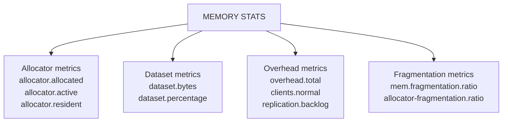

# How to Use MEMORY STATS in Redis for Memory Breakdown

Author: [nawazdhandala](https://www.github.com/nawazdhandala)

Tags: Redis, Memory, Monitoring, Performance, Diagnostics

Description: Learn how to use MEMORY STATS in Redis to get a detailed breakdown of memory usage across allocators, dataset, overhead, and replication buffers.

---

## Introduction

`MEMORY STATS` returns a flat map of memory metrics broken down into categories: allocator usage, dataset size, overhead for data structures, replication buffers, Lua engine memory, and more. It is more granular than the `INFO memory` section and exposes allocator-level details that help diagnose fragmentation and unexpected memory growth.

## Basic Syntax

```redis
MEMORY STATS
```

No arguments. Returns a flat list of alternating field-name / value pairs.

## Example Output

```redis
127.0.0.1:6379> MEMORY STATS
 1) "peak.allocated"
 2) (integer) 2985984
 3) "total.allocated"
 4) (integer) 2512904
 5) "startup.allocated"
 6) (integer) 802984
 7) "replication.backlog"
 8) (integer) 0
 9) "clients.slaves"
10) (integer) 0
11) "clients.normal"
12) (integer) 20512
13) "cluster.links"
14) (integer) 0
15) "aof.buffer"
16) (integer) 0
17) "modules.total"
18) (integer) 0
19) "overhead.total"
20) (integer) 823496
21) "dataset.bytes"
22) (integer) 1689408
23) "dataset.percentage"
24) "67.22%"
25) "peak.percentage"
26) "84.18%"
27) "allocator.allocated"
28) (integer) 2539704
29) "allocator.active"
30) (integer) 2871296
31) "allocator.resident"
32) (integer) 7397376
33) "allocator-fragmentation.ratio"
34) "1.13"
35) "allocator-fragmentation.bytes"
36) (integer) 331592
37) "allocator-rss.ratio"
38) "2.58"
39) "allocator-rss.bytes"
40) (integer) 4526080
41) "rss-overhead.ratio"
42) "1.01"
43) "rss-overhead.bytes"
44) (integer) 73728
45) "mem.fragmentation.ratio"
46) "2.97"
47) "mem.fragmentation.bytes"
48) (integer) 4931464
49) "mem.not-counted-for-evict"
50) (integer) 0
51) "mem.replication.backlog"
52) (integer) 0
53) "mem.clients.slaves"
54) (integer) 0
55) "mem.clients.normal"
56) (integer) 20512
57) "mem.cluster.links"
58) (integer) 0
59) "mem.aof-buffer"
60) (integer) 0
```

## Key Fields Explained



| Field | Description |
|---|---|
| `total.allocated` | Bytes allocated by the Redis allocator |
| `peak.allocated` | Peak allocation since startup |
| `startup.allocated` | Memory used by Redis internals at boot |
| `dataset.bytes` | Memory used by actual key-value data |
| `dataset.percentage` | Dataset as percent of `total.allocated` |
| `overhead.total` | Sum of all non-dataset memory |
| `mem.fragmentation.ratio` | RSS / allocated (>1.5 indicates fragmentation) |
| `allocator-fragmentation.ratio` | Active / allocated inside the allocator |
| `allocator-rss.ratio` | Resident / active (OS-level fragmentation) |
| `clients.normal` | Memory held by client output buffers |
| `replication.backlog` | Memory for the replication backlog |

## Checking Fragmentation

```redis
127.0.0.1:6379> MEMORY STATS
# Look for:
# "mem.fragmentation.ratio" > 1.5  -> consider MEMORY PURGE or active defrag
# "allocator-fragmentation.ratio" > 1.3 -> allocator holding free pages
```

High fragmentation (ratio > 1.5) means Redis is using more RSS than actual data requires. Enable active defragmentation to reclaim it:

```redis
CONFIG SET activedefrag yes
CONFIG SET active-defrag-ignore-bytes 100mb
CONFIG SET active-defrag-threshold-lower 10
```

## Comparing dataset.bytes vs overhead.total

```redis
# Parse via redis-cli and awk
redis-cli MEMORY STATS | awk '
/dataset.bytes/ {getline; dataset=$1}
/overhead.total/ {getline; overhead=$1}
END {
  printf "Dataset: %d bytes\nOverhead: %d bytes\nRatio: %.2f\n",
    dataset, overhead, dataset/overhead
}'
```

## Parsing in Python

```python
import redis

r = redis.Redis()
stats = r.memory_stats()

print(f"Dataset:        {stats['dataset.bytes'] / 1024 / 1024:.2f} MB")
print(f"Overhead:       {stats['overhead.total'] / 1024 / 1024:.2f} MB")
print(f"Fragmentation:  {stats['mem_fragmentation_ratio']:.2f}")
print(f"Peak allocated: {stats['peak.allocated'] / 1024 / 1024:.2f} MB")
```

## MEMORY STATS vs INFO memory

| Source | Coverage | Fragmentation detail | Allocator detail |
|---|---|---|---|
| `INFO memory` | Good overview | Basic ratio | None |
| `MEMORY STATS` | Full breakdown | Allocator + RSS + overhead | Yes |

Use `INFO memory` for quick checks and `MEMORY STATS` for deep diagnostics.

## Summary

`MEMORY STATS` returns a detailed flat map of Redis memory usage covering dataset size, allocator behavior, client buffers, replication overhead, and fragmentation ratios. Monitor `mem.fragmentation.ratio` (alert when above 1.5) and `dataset.percentage` (low values mean overhead is dominant) to catch memory inefficiencies. Use it alongside `MEMORY DOCTOR` for automated recommendations.
