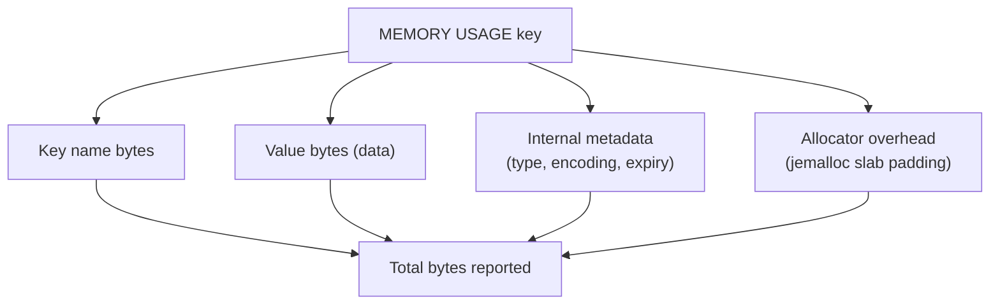

# How to Use MEMORY USAGE in Redis to Check Key Memory

Author: [nawazdhandala](https://www.github.com/nawazdhandala)

Tags: Redis, Memory, MEMORY USAGE, Key, Monitoring

Description: Learn how to use MEMORY USAGE to measure the RAM consumed by individual Redis keys, including their value, overhead, and nested structures.

---

## Introduction

`MEMORY USAGE` returns the number of bytes a key and its value consume in Redis memory. It accounts for the key name, value encoding, internal metadata, and allocator overhead. This makes it the most accurate way to understand the memory cost of individual keys.

## Basic Syntax

```redis
MEMORY USAGE key [SAMPLES count]
```

- `key` - the key to inspect
- `SAMPLES count` - for collections (hashes, lists, sets, sorted sets), how many nested elements to sample. Default is 5. Use 0 to sample all elements for exact measurement.

Returns the size in bytes, or nil if the key does not exist.

## Examples

### String key

```redis
SET greeting "Hello, Redis!"
MEMORY USAGE greeting
# (integer) 56
```

### Long string

```redis
SET big_string "aaaaaaaaaaaaaaaaaaaaaaaaaaaaaaaaaaaaaaaaaaaaaaaaaaaaaaaaaaaaaaaaaaaaaaaaaaaaaaaaaaaaaaaaaaaaaaaaaaaa"
MEMORY USAGE big_string
# (integer) 152
```

### Hash

```redis
HSET user:1 name "Alice" email "alice@example.com" age "30" city "London"
MEMORY USAGE user:1
# (integer) 163
```

### List

```redis
RPUSH tasks "send-email" "generate-report" "cleanup-logs" "notify-user"
MEMORY USAGE tasks
# (integer) 112
```

### Sorted set

```redis
ZADD leaderboard 1000 "player1" 800 "player2" 600 "player3"
MEMORY USAGE leaderboard
# (integer) 146
```

### Large hash with exact sampling

```redis
HSET big_hash f1 v1 f2 v2 f3 v3 f4 v4 f5 v5 f6 v6 f7 v7 f8 v8 f9 v9 f10 v10
MEMORY USAGE big_hash SAMPLES 0
# (integer) 480   (exact - all elements counted)

MEMORY USAGE big_hash SAMPLES 5
# (integer) ~480  (estimated from 5 samples)
```

## Understanding What's Included



## Comparing Encodings

```redis
# Small hash - listpack encoding (compact)
HSET small:hash f1 v1 f2 v2
OBJECT ENCODING small:hash
# "listpack"
MEMORY USAGE small:hash
# (integer) 72

# Large hash - hashtable encoding (more overhead)
HSET large:hash f1 v1 f2 v2 f3 v3 f4 v4 f5 v5 f6 v6 f7 v7 f8 v8 f9 v9
OBJECT ENCODING large:hash
# "hashtable"
MEMORY USAGE large:hash
# (integer) 520
```

## Finding the Largest Keys

Combine `SCAN` with `MEMORY USAGE` to find memory-heavy keys:

```bash
#!/bin/bash
# Report top 10 keys by memory usage
redis-cli --scan | while read key; do
  BYTES=$(redis-cli MEMORY USAGE "$key" SAMPLES 0 2>/dev/null)
  echo "$BYTES $key"
done | sort -rn | head -10
```

## Estimating Total Memory of a Key Pattern

```bash
#!/bin/bash
TOTAL=0
for KEY in $(redis-cli --scan --pattern "user:*"); do
  BYTES=$(redis-cli MEMORY USAGE "$KEY" 2>/dev/null || echo 0)
  TOTAL=$((TOTAL + BYTES))
done
echo "Total memory for user:* keys: $TOTAL bytes"
```

## Use Cases

- Identifying memory hogs before hitting `maxmemory`
- Comparing encoding efficiency of different data structures
- Planning capacity for a key namespace
- Debugging unexpected memory growth

## Summary

`MEMORY USAGE key [SAMPLES count]` returns the total bytes consumed by a key including its value, metadata, and allocator overhead. Use `SAMPLES 0` for exact counts on collections, or the default `SAMPLES 5` for fast estimates. Combine with `SCAN` to audit large keyspaces and identify the most memory-intensive keys in your dataset.
