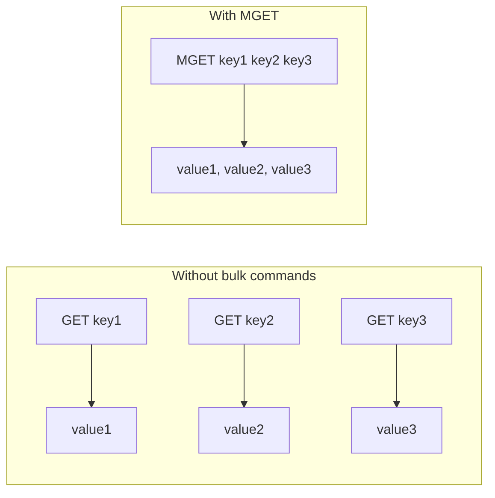

# How to Use MGET and MSET in Redis for Bulk Operations

Author: [nawazdhandala](https://www.github.com/nawazdhandala)

Tags: Redis, MGET, MSET, Bulk, String, Performance, Command

Description: Learn how to use Redis MGET and MSET to read and write multiple keys in a single round-trip, reducing latency and improving throughput in bulk operations.

---

## How MGET and MSET Work

`MSET` sets multiple key-value pairs in a single atomic operation. `MGET` retrieves the values for multiple keys in a single round-trip. Both commands reduce network overhead compared to issuing individual `GET` and `SET` calls in a loop, making them essential for bulk read/write patterns.



## Syntax

```redis
MSET key value [key value ...]
MGET key [key ...]
```

- `MSET` accepts an even number of arguments: alternating keys and values
- `MGET` accepts one or more keys and returns an array of values (nil for missing keys)
- `MSET` always returns OK
- `MGET` returns an array in the same order as the input keys

## Examples

### MSET - set multiple keys at once

Set three user fields in one command.

```redis
MSET user:1:name "Alice" user:1:email "alice@example.com" user:1:role "admin"
```

```text
OK
```

### MGET - retrieve multiple keys at once

Read all three back in a single round-trip.

```redis
MGET user:1:name user:1:email user:1:role
```

```text
1) "Alice"
2) "alice@example.com"
3) "admin"
```

### MGET with missing keys

Missing keys return nil at the corresponding position. The array length always matches the number of requested keys.

```redis
MGET user:1:name user:99:name user:1:email
```

```text
1) "Alice"
2) (nil)
3) "alice@example.com"
```

### Populating a cache in bulk

Use MSET to warm a cache with multiple entries at once.

```redis
MSET cache:product:101 '{"name":"Widget","price":9.99}' cache:product:102 '{"name":"Gadget","price":24.99}' cache:product:103 '{"name":"Doohickey","price":4.99}'
MGET cache:product:101 cache:product:102 cache:product:103
```

```text
OK
1) "{\"name\":\"Widget\",\"price\":9.99}"
2) "{\"name\":\"Gadget\",\"price\":24.99}"
3) "{\"name\":\"Doohickey\",\"price\":4.99}"
```

### Config map loading

Load an application config map in a single `MSET`.

```redis
MSET config:max_retries 3 config:timeout_ms 5000 config:debug false config:version "2.1.0"
MGET config:max_retries config:timeout_ms config:debug config:version
```

```text
OK
1) "3"
2) "5000"
3) "false"
4) "2.1.0"
```

## MSET vs MSETNX

`MSET` always overwrites existing keys. `MSETNX` is atomic and only sets all keys if none of them exist - if even one key exists, the entire operation is aborted.

```redis
SET user:1:name "Alice"
MSETNX user:1:name "Bob" user:1:age "30"
GET user:1:name
```

```text
OK
(integer) 0
"Alice"
```

## Performance comparison

| Approach | Round trips | Latency |
|----------|------------|---------|
| N individual `GET` calls | N | High |
| 1 `MGET` for N keys | 1 | Low |
| N individual `SET` calls | N | High |
| 1 `MSET` for N keys | 1 | Low |
| Pipeline of N `GET` calls | 1 (pipelined) | Low |

For very large batches, Redis Pipelines or `MGET`/`MSET` produce similar latency, but pipelines offer more flexibility (mixing command types).

## Atomicity note

`MSET` is atomic in that all keys are set together - no other client can read a partially updated set of keys. However, `MSET` does NOT use a transaction; it simply applies all writes sequentially within a single command execution. `MGET` is a read-only scan and not transactional.

## Use Cases

- Cache warming: pre-populate many cache keys before traffic hits
- Session hydration: load all session fields for a batch of user IDs
- Config loading: read multiple config values at startup
- Leaderboard snapshots: fetch scores for a list of user IDs
- Shopping cart: set or read multiple product prices at once

## Summary

`MSET` and `MGET` are bulk equivalents of `SET` and `GET` that reduce network round-trips from N to 1 when working with multiple keys. They are key tools for cache warming, batch reads, and config hydration. Remember that `MSET` always overwrites - use `MSETNX` when you need all-or-nothing conditional creation.
