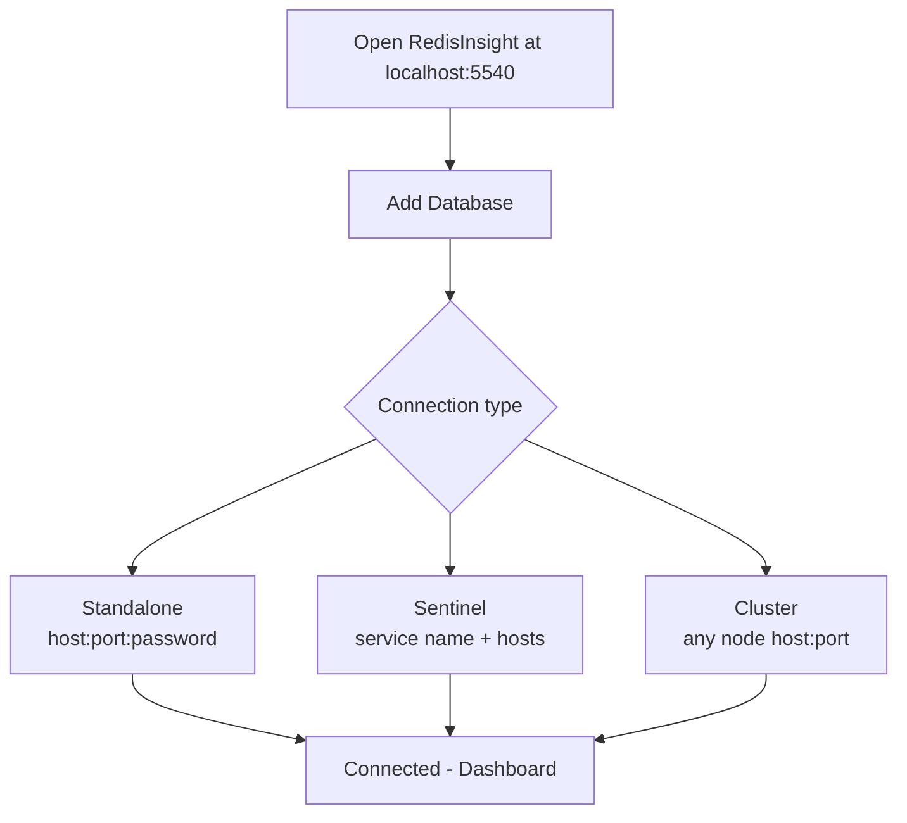
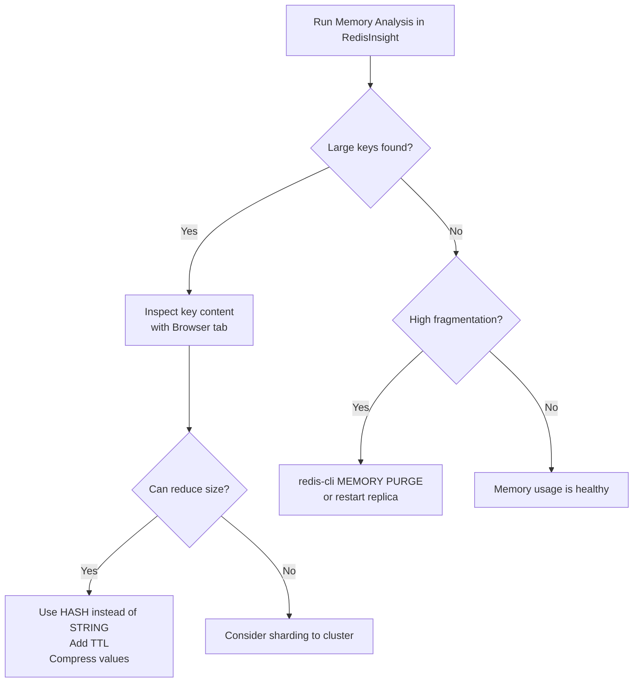

# How to Monitor Redis Memory with RedisInsight

Author: [nawazdhandala](https://github.com/nawazdhandala)

Tags: Redis, Monitoring, Performance, Operations, Memory

Description: Learn how to use RedisInsight to monitor Redis memory usage, analyze key distribution, find memory hogs, and optimize memory consumption with built-in profiling tools.

---

## Introduction

RedisInsight is the official free GUI for Redis developed by Redis Ltd. Among its most powerful features is the memory analysis toolset, which lets you visualize memory usage, identify large keys, inspect data structure distributions, and run memory profilers without writing any code. This guide covers installing RedisInsight, connecting it to your Redis instance, and using the memory monitoring features.

## Installation Options

### Docker (Recommended)

```bash
docker run -d \
  --name redisinsight \
  -p 5540:5540 \
  redis/redisinsight:latest
```

Then open http://localhost:5540 in your browser.

### macOS

```bash
brew install --cask redis-insight
```

Or download the installer from https://redis.io/insight/.

### Linux (AppImage)

```bash
wget https://downloads.redis.io/redisinsight/redisinsight-linux-amd64.AppImage
chmod +x redisinsight-linux-amd64.AppImage
./redisinsight-linux-amd64.AppImage
```

## Connecting to Redis



In the Add Database dialog, enter:
- **Host**: `localhost` (or your Redis host)
- **Port**: `6379`
- **Password**: your Redis password (if set)
- **Name**: a label for the connection

## Memory Overview Dashboard

After connecting, the **Overview** tab shows real-time metrics:

- **Used Memory** - actual memory used by Redis
- **Memory Fragmentation Ratio** - a ratio > 1.5 indicates fragmentation
- **Peak Memory** - the maximum memory ever used
- **Memory Used by Scripts** - memory occupied by cached Lua scripts
- **Connected Clients** - number of active client connections

## Memory Analysis Tool

Navigate to **Analysis Tools > Memory Analysis** to run a deep scan:

1. Click **Analyze Memory**
2. Wait for the scan to complete (may take seconds to minutes on large instances)
3. Review the results

The analysis provides:
- **Top Keys by Memory** - the largest individual keys
- **Key Summary by Type** - memory breakdown by data structure (strings, hashes, lists, sets, sorted sets)
- **Key Summary by Prefix** - memory grouped by key namespace prefix (e.g. `user:*`, `session:*`)
- **Expiry Analysis** - percentage of keys with and without TTLs

## Checking Memory via Redis CLI

While RedisInsight provides a GUI, you can also query memory metrics directly:

```redis
INFO memory
```

Key fields in the output:

```yaml
used_memory:1073741824
used_memory_human:1024.00M
used_memory_rss:1207959552
used_memory_rss_human:1.12G
mem_fragmentation_ratio:1.12
maxmemory:2147483648
maxmemory_human:2.00G
maxmemory_policy:allkeys-lru
```

## Finding Large Keys

```redis
# Check memory used by a specific key
MEMORY USAGE mykey

# Sample output
(integer) 8256
```

RedisInsight automates this across all keys and ranks them by size.

## Key Space Analysis from CLI

```redis
# Count all keys
DBSIZE

# Scan for keys matching a pattern (use SCAN in production, not KEYS)
SCAN 0 MATCH "session:*" COUNT 1000
```

## Memory Optimization Workflow



## Setting Memory Limits

```redis
CONFIG SET maxmemory 2gb
CONFIG SET maxmemory-policy allkeys-lru
```

Verify in RedisInsight Overview or with:

```redis
CONFIG GET maxmemory
CONFIG GET maxmemory-policy
```

## Monitoring Key Expiry

RedisInsight shows expiry statistics in the Memory Analysis tab. To check TTL for individual keys:

```redis
TTL session:abc       # Remaining seconds
PTTL session:abc      # Remaining milliseconds
OBJECT ENCODING mykey # Internal encoding (ziplist, hashtable, etc.)
```

## Profiler Tab

The **Profiler** in RedisInsight captures all commands sent to Redis in real time -- similar to `MONITOR` but with a GUI. Use it to:
- Identify hotspot keys being read/written frequently
- Catch unexpected commands from misconfigured clients
- Measure command frequency and latency

**Warning**: Profiler has overhead similar to `MONITOR`. Use it briefly in production, not continuously.

## Slow Log Analysis

The **Slow Log** tab shows commands that exceeded the `slowlog-log-slower-than` threshold:

```redis
CONFIG SET slowlog-log-slower-than 1000  # Log commands > 1ms
SLOWLOG GET 25                           # Last 25 slow commands
SLOWLOG RESET
```

RedisInsight presents slow log entries in a sortable table with timestamps and execution time.

## Memory Efficiency Tips Found via RedisInsight

| Finding | Action |
|---|---|
| Many small hashes | Enable `hash-max-listpack-entries 128` to use ziplist encoding |
| Many small sets | Enable `set-max-intset-entries 512` |
| Strings with JSON blobs | Switch to `HASH` fields or use MessagePack compression |
| Keys with no TTL | Audit and add expiry policies |
| Fragmentation ratio > 1.5 | Run `MEMORY PURGE` or use `activedefrag yes` |

```redis
# Enable active defragmentation
CONFIG SET activedefrag yes
CONFIG SET active-defrag-ignore-bytes 100mb
CONFIG SET active-defrag-threshold-lower 10
```

## Summary

RedisInsight provides a comprehensive view of Redis memory usage through its Memory Analysis tool, Browser, Profiler, and Slow Log tabs. Run the Memory Analysis to identify top keys by size and find namespace-level memory distribution. Use the CLI tab or `MEMORY USAGE` command to inspect individual keys, set `maxmemory` and `maxmemory-policy` to control consumption, and enable `activedefrag` to reduce fragmentation. The Profiler and Slow Log tabs help identify which commands are contributing to memory pressure and latency.
