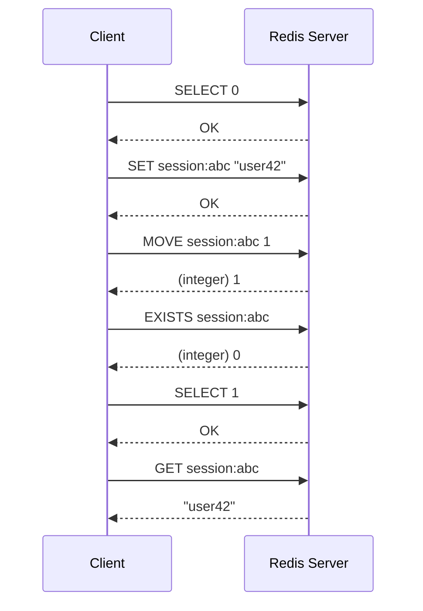
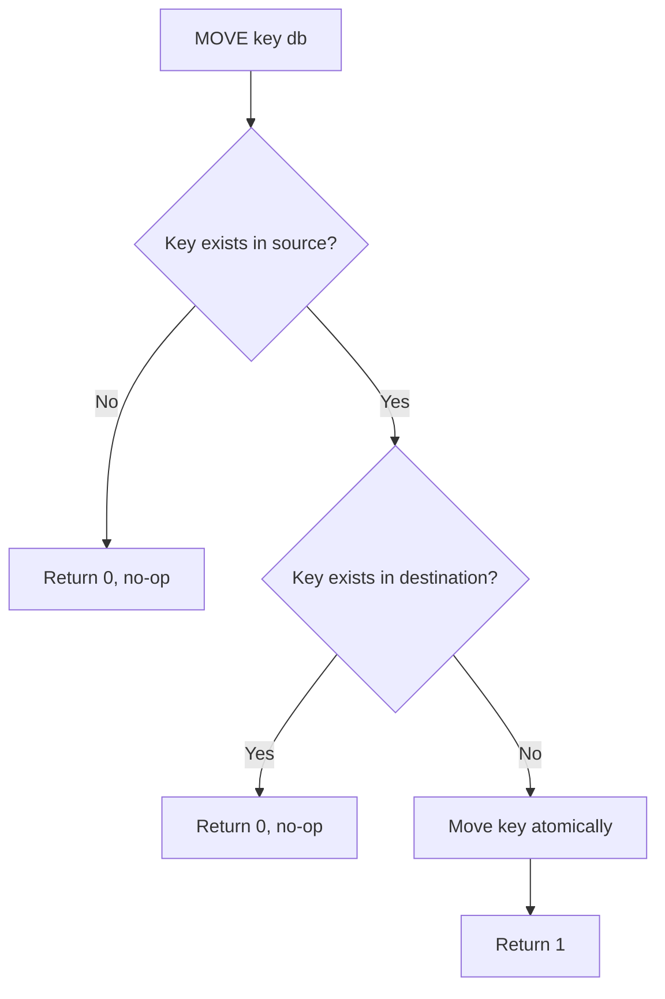

# How to Use MOVE in Redis to Move a Key Between Databases

Author: [nawazdhandala](https://www.github.com/nawazdhandala)

Tags: Redis, MOVE, Database, Key, Administration

Description: Learn how to atomically move a Redis key from the current database to another logical database using the MOVE command, with examples and edge cases.

---

## Introduction

Redis supports multiple logical databases within a single instance, numbered from 0 to 15 by default. The `MOVE` command lets you atomically transfer a key from the currently selected database to a different database. This is useful for reorganizing data or migrating keys without downtime.

## How MOVE Works

`MOVE` performs an atomic check-and-move: it only succeeds if the key exists in the source database and does not already exist in the destination database. If the destination already contains the key, the command returns 0 and the key stays in the source.



## Basic Syntax

```redis
MOVE key db
```

- `key` - the key to move
- `db` - the destination database index (integer, 0-15 by default)

Returns `1` if the key was moved, `0` if not.

## Examples

### Move a string key

```redis
SELECT 0
SET counter 100
MOVE counter 2
```

Verify in the source database:

```redis
SELECT 0
EXISTS counter
# (integer) 0
```

Verify in the destination database:

```redis
SELECT 2
GET counter
# "100"
```

### Move a list key

```redis
SELECT 0
RPUSH tasks "job1" "job2" "job3"
MOVE tasks 3
```

```redis
SELECT 3
LRANGE tasks 0 -1
# 1) "job1"
# 2) "job2"
# 3) "job3"
```

### Conflict: key already exists in destination

```redis
SELECT 0
SET foo "source"

SELECT 1
SET foo "destination"

SELECT 0
MOVE foo 1
# (integer) 0
# foo remains in db 0, db 1 is unchanged
```

### Moving a key with a TTL

The TTL is preserved when a key is moved.

```redis
SELECT 0
SET token "xyz" EX 3600
TTL token
# (integer) 3600

MOVE token 1

SELECT 1
TTL token
# (integer) ~3600
```

## Decision Flow



## Common Use Cases

- Isolating session data from application data across logical databases
- Migrating keys to a dedicated cache database during schema changes
- Moving expired or archived keys to a lower-priority database

## Limitations

- `MOVE` only works within the same Redis instance; it cannot move keys to a different server
- Not available in Redis Cluster mode, where multiple databases are not supported
- Use `COPY` if you want to duplicate rather than move a key

## Summary

`MOVE key db` is a simple, atomic command to relocate a key from one Redis logical database to another. It succeeds only when the key exists in the source and is absent from the destination. Remember that Redis Cluster does not support multiple databases, so `MOVE` is limited to standalone or Sentinel setups.
