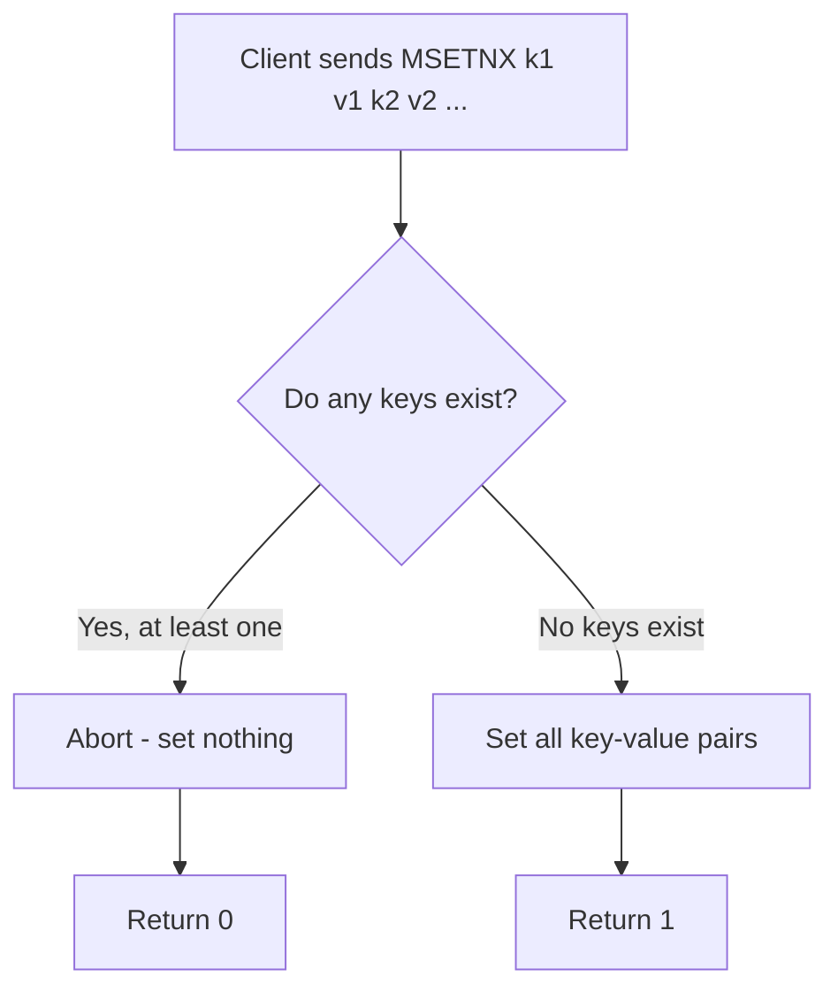

# How to Use MSETNX in Redis for Atomic Multi-Key Setting

Author: [nawazdhandala](https://www.github.com/nawazdhandala)

Tags: Redis, MSETNX, Atomic, Conditional, String, Bulk, Command

Description: Learn how to use the Redis MSETNX command to atomically set multiple keys only when none of them already exist, ensuring all-or-nothing bulk creation.

---

## How MSETNX Works

`MSETNX` (MSET if Not eXists) sets multiple key-value pairs in a single atomic operation, but only if none of the specified keys already exist. If any key in the list already exists, the entire operation is aborted and no keys are set. It returns 1 if all keys were set, or 0 if the operation was aborted.

The atomicity guarantee means you can use `MSETNX` to safely initialize a set of related keys without risk of partial updates.



## Syntax

```redis
MSETNX key value [key value ...]
```

Returns:
- `1` - all keys were set (none existed)
- `0` - no keys were set (at least one key already existed)

## Examples

### Basic MSETNX

Set three keys atomically when none exist.

```redis
DEL user:1:name user:1:email user:1:role
MSETNX user:1:name "Alice" user:1:email "alice@example.com" user:1:role "admin"
MGET user:1:name user:1:email user:1:role
```

```text
(integer) 0
(integer) 1
1) "Alice"
2) "alice@example.com"
3) "admin"
```

### MSETNX aborts if any key exists

If any key is already set, the entire operation fails.

```redis
SET user:2:name "Bob"
MSETNX user:2:name "Charlie" user:2:email "charlie@example.com" user:2:role "editor"
MGET user:2:name user:2:email user:2:role
```

```text
OK
(integer) 0
1) "Bob"
2) (nil)
3) (nil)
```

Because `user:2:name` already existed, no keys were written. `user:2:email` and `user:2:role` remain unset.

### Atomic object initialization

Use `MSETNX` to safely initialize a new object only when it has not been created before.

```redis
DEL config:app
MSETNX config:app:timeout 30 config:app:retries 3 config:app:debug "false"
```

```text
(integer) 0
(integer) 1
```

A second initialization attempt on an existing object fails cleanly.

```redis
MSETNX config:app:timeout 60 config:app:retries 5 config:app:debug "true"
MGET config:app:timeout config:app:retries config:app:debug
```

```text
(integer) 0
1) "30"
2) "3"
3) "false"
```

### Reservation system

Claim multiple seats at once. Only succeeds if all seats are free.

```redis
MSETNX seat:A1 "user:42" seat:A2 "user:42" seat:A3 "user:42"
```

```text
(integer) 1
```

Another user tries to claim overlapping seats - fails atomically.

```redis
MSETNX seat:A2 "user:99" seat:A4 "user:99"
```

```text
(integer) 0
```

Seat A4 remains unset because A2 was already taken.

### MSETNX vs MSET

| Feature | MSET | MSETNX |
|---------|------|--------|
| Overwrites existing keys | Yes | No |
| Atomic | Yes (all-or-nothing) | Yes (all-or-nothing) |
| Return value | OK | 1 (success) / 0 (aborted) |
| Partial writes | Never | Never |

## Limitations

- `MSETNX` has no equivalent to the `EX`/`PX` options - you cannot set a TTL with `MSETNX` in one command. After a successful `MSETNX`, use a pipeline with separate `EXPIRE` calls, or use a Lua script.
- Because the semantics require all keys to be absent, `MSETNX` is not suitable for partial updates - use `SET ... NX` per key or a Lua script instead.

## Use Cases

- Atomic initialization of multi-field objects when represented as separate keys
- Reservation systems (claim multiple resources together)
- First-time configuration initialization (set defaults only if none are configured)
- Preventing duplicate record creation in multi-key schemas
- Atomic "create if not exists" for simple data models

## Summary

`MSETNX` provides all-or-nothing creation semantics for multiple keys: it either sets all of them (when none exist) or sets none of them (when any already exists). This makes it ideal for atomic object initialization, reservation patterns, and deduplication across multiple keys. For complex conditional logic or TTL requirements, combine `SET ... NX EX ...` per key inside a Lua script.
