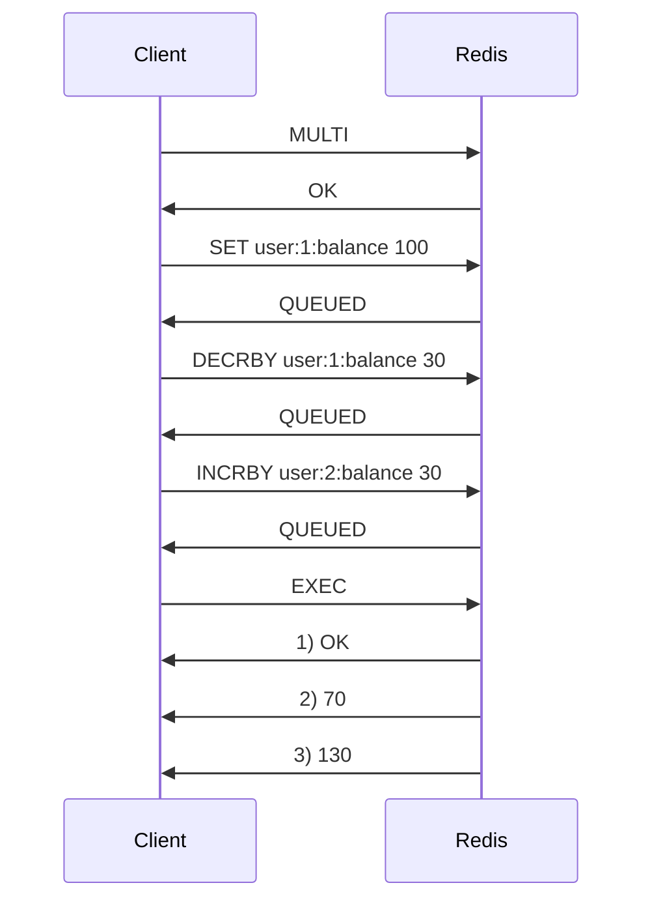

# How to Use MULTI and EXEC in Redis for Transactions

Author: [nawazdhandala](https://www.github.com/nawazdhandala)

Tags: Redis, MULTI, EXEC, Transaction, Atomic

Description: Learn how to use MULTI and EXEC in Redis to queue multiple commands into an atomic transaction block that executes without interruption from other clients.

---

## How MULTI and EXEC Work

MULTI marks the beginning of a transaction block. All commands issued after MULTI are queued rather than executed immediately. EXEC then executes all queued commands atomically - no other client can execute commands between them. The server returns all responses as an array in the same order the commands were queued.

Redis transactions are atomic in the sense that no other client can interleave commands during EXEC. However, if a command fails during execution (e.g., INCR on a string value), other commands in the transaction still run. Redis does not roll back on command-level errors.



## Syntax

```redis
MULTI
<command1>
<command2>
...
EXEC
```

To abort a transaction before EXEC, use DISCARD.

## Examples

### Basic transaction - transfer balance

```redis
SET account:alice 500
SET account:bob 200

MULTI
DECRBY account:alice 100
INCRBY account:bob 100
EXEC
```

```text
1) (integer) 400
2) (integer) 300
```

Both operations ran atomically. Alice now has 400, Bob has 300.

### Transaction with multiple data types

```redis
MULTI
SET session:user:42 "active"
EXPIRE session:user:42 3600
HSET user:42 last_login "2026-03-31"
LPUSH user:42:activity "login"
EXEC
```

```text
1) OK
2) (integer) 1
3) (integer) 1
4) (integer) 1
```

All four operations queued and executed atomically.

### Commands are QUEUED, not executed immediately

```redis
MULTI
SET counter 10
INCR counter
GET counter
EXEC
```

After MULTI, each command replies with QUEUED:

```text
QUEUED
QUEUED
QUEUED
```

After EXEC:

```text
1) OK
2) (integer) 11
3) "11"
```

### Syntax error before EXEC causes the whole transaction to be discarded

```redis
MULTI
SET valid:key "ok"
NOTACOMMAND arg1
EXEC
```

```text
(error) EXECABORT Transaction discarded because of previous errors.
```

A command that fails syntax validation during queueing causes the entire transaction to be aborted on EXEC.

### Runtime error does not abort the transaction

```redis
SET mystring "hello"

MULTI
INCR mystring
SET new:key "value"
EXEC
```

```text
1) (error) ERR value is not an integer or out of range
2) OK
```

`INCR mystring` fails at runtime (wrong type), but `SET new:key` still succeeds. Redis does not roll back on runtime errors.

## Using Pipelining with Transactions

Combine pipelining and transactions to send all commands in one network round trip:

```bash
redis-cli --pipe <<'EOF'
MULTI
SET key1 "val1"
SET key2 "val2"
EXEC
EOF
```

## Use Cases

**Balance transfers** - Atomically debit one account and credit another without another client seeing an intermediate state.

**Compound state updates** - Update multiple related keys (e.g., user profile fields, session data, activity log) in one atomic operation.

**Inventory management** - Atomically decrement stock and record the sale without a race condition between the check and the write.

**Cache invalidation** - Delete a cache key and set a rebuild-in-progress flag atomically to prevent stampedes.

## Limitations

- Redis transactions do not support rollback on runtime errors. If atomicity with rollback is required, use Lua scripts (EVAL).
- Transactions cannot read the results of queued commands to make branching decisions. Use WATCH for conditional transactions.
- Transactions do not span cluster slots - all keys must hash to the same slot or use hash tags.

## Summary

MULTI and EXEC provide atomic execution of a batch of Redis commands. Commands queued between MULTI and EXEC are executed in order without interruption from other clients. Syntax errors before EXEC abort the whole transaction; runtime errors during EXEC only fail the individual command and do not affect others. For conditional transactions based on key state, combine MULTI/EXEC with WATCH. For transactional logic with rollback, use Lua scripts instead.
