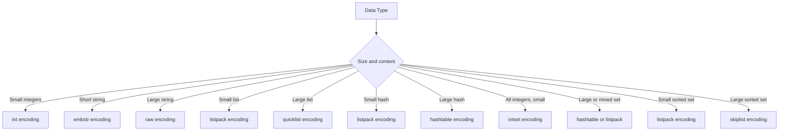

# How to Use OBJECT ENCODING in Redis to Check Internal Encoding

Author: [nawazdhandala](https://www.github.com/nawazdhandala)

Tags: Redis, OBJECT ENCODING, Memory Optimization, Internals, Performance

Description: Learn how to use OBJECT ENCODING in Redis to inspect the internal memory representation of a key's value and understand how encodings affect memory and performance.

---

## How OBJECT ENCODING Works

Redis uses different internal encodings to represent data types depending on the size and content of the data. OBJECT ENCODING returns the name of the internal encoding used to store a key's value. This is essential for memory optimization because compact encodings (like listpack or intset) use far less memory than their general-purpose counterparts.

Understanding encodings helps you tune Redis configuration thresholds to keep data in compact form for as long as possible.



## Syntax

```redis
OBJECT ENCODING key
```

## Examples

### String encodings

```redis
SET counter 42
OBJECT ENCODING counter
```

```text
"int"
```

Integers up to 2^63-1 are stored as `int`, which is very memory-efficient.

```redis
SET short:str "hello"
OBJECT ENCODING short:str
```

```text
"embstr"
```

Short strings (up to 44 bytes in Redis 7) use `embstr`, an embedded string in the Redis object.

```redis
SET long:str "this is a longer string that exceeds the embstr threshold of 44 bytes in length"
OBJECT ENCODING long:str
```

```text
"raw"
```

Longer strings use `raw` (a heap-allocated string).

### List encodings

```redis
RPUSH small:list a b c
OBJECT ENCODING small:list
```

```text
"listpack"
```

Small lists use the compact `listpack` encoding.

Once the list exceeds the threshold (128 elements or 64-byte values by default):

```redis
OBJECT ENCODING large:list
```

```text
"quicklist"
```

### Hash encodings

```redis
HSET small:hash f1 v1 f2 v2
OBJECT ENCODING small:hash
```

```text
"listpack"
```

```redis
OBJECT ENCODING large:hash
```

```text
"hashtable"
```

### Set encodings

```redis
SADD int:set 1 2 3 4 5
OBJECT ENCODING int:set
```

```text
"intset"
```

All-integer sets use the highly compact `intset` encoding.

```redis
SADD mixed:set "a" "b" "c"
OBJECT ENCODING mixed:set
```

```text
"listpack"
```

Small string sets use `listpack`.

```redis
OBJECT ENCODING large:set
```

```text
"hashtable"
```

### Sorted set encodings

```redis
ZADD small:zset 1.0 "a" 2.0 "b"
OBJECT ENCODING small:zset
```

```text
"listpack"
```

```redis
OBJECT ENCODING large:zset
```

```text
"skiplist"
```

## Encoding Thresholds

You can control when Redis upgrades from compact to general encodings in `redis.conf`:

```text
hash-max-listpack-entries 128
hash-max-listpack-value 64
list-max-listpack-size -2
zset-max-listpack-entries 128
zset-max-listpack-value 64
set-max-intset-entries 512
set-max-listpack-entries 128
set-max-listpack-value 64
```

## Use Cases

**Memory optimization** - Verify that your data structures are using compact encodings. If a hash is using `hashtable` when you expected `listpack`, your values may exceed the threshold.

**Capacity planning** - Measure the actual memory cost of each encoding to predict memory usage as data grows.

**Performance tuning** - Listpack encodings have O(N) access but excellent cache locality. Hashtable/skiplist encodings have O(1) or O(log N) access but higher memory overhead. Choose thresholds to balance the trade-offs.

**Debugging unexpected memory usage** - A set that should be `intset` but is `hashtable` indicates it received a non-integer value at some point.

## Summary

OBJECT ENCODING reveals the internal memory representation Redis uses for a key's value. Compact encodings like `listpack`, `intset`, and `embstr` use significantly less memory than their general-purpose counterparts. Use OBJECT ENCODING to verify that your data structures are staying in compact form, and tune the max-listpack-entries and similar configuration thresholds to keep them compact as long as the performance trade-off is acceptable.
