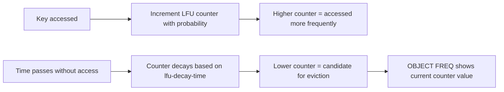

# How to Use OBJECT FREQ in Redis with LFU Eviction Policy

Author: [nawazdhandala](https://www.github.com/nawazdhandala)

Tags: Redis, OBJECT FREQ, LFU, Eviction, Memory Management

Description: Learn how to use OBJECT FREQ in Redis to inspect the LFU access frequency counter of a key, and how it influences which keys are evicted under LFU eviction policies.

---

## How OBJECT FREQ Works

OBJECT FREQ returns the logarithmic access frequency counter of a key, which Redis uses for LFU (Least Frequently Used) eviction. This counter is only maintained and meaningful when the Redis instance is configured with an LFU-based maxmemory policy such as `allkeys-lfu` or `volatile-lfu`.

The frequency counter is not a raw access count. Redis uses a logarithmic approximation that increments on access with decreasing probability as the count grows, and decays over time based on the `lfu-decay-time` configuration.



## Requirements

OBJECT FREQ only works when `maxmemory-policy` is set to `allkeys-lfu` or `volatile-lfu`. Without an LFU policy enabled, it returns an error.

Configure LFU eviction in `redis.conf`:

```text
maxmemory 256mb
maxmemory-policy allkeys-lfu
lfu-decay-time 1
lfu-log-factor 10
```

## Syntax

```redis
OBJECT FREQ key
```

Returns an integer representing the logarithmic LFU frequency counter (0-255).

## Examples

### Check frequency of a frequently accessed key

```redis
SET popular:page "home-content"

# Access it many times
GET popular:page
GET popular:page
GET popular:page
GET popular:page
GET popular:page

OBJECT FREQ popular:page
```

```text
(integer) 5
```

### Compare a hot key vs a cold key

```redis
SET hot:key "data"
SET cold:key "data"

# Access hot:key many times
GET hot:key   # repeat 100+ times in a loop

OBJECT FREQ hot:key
```

```text
(integer) 12
```

```redis
OBJECT FREQ cold:key
```

```text
(integer) 0
```

The cold key has frequency 0 and will be evicted before the hot key.

### OBJECT FREQ without LFU policy enabled

```redis
OBJECT FREQ some:key
```

```text
(error) ERR object freq is not allowed when maxmemory-policy is not set to an LFU policy.
```

### Initial frequency of a new key

A newly created key starts with a small non-zero frequency to prevent it from being immediately evicted:

```redis
SET brand:new:key "value"
OBJECT FREQ brand:new:key
```

```text
(integer) 5
```

The initial value is configurable via `lfu-log-factor`.

## LFU Counter Mechanics

The LFU counter is a logarithmic approximation, not a raw hit count:

- The counter increments by 1 with probability `1 / (counter * lfu_log_factor + 1)`. This means the counter grows slower as it gets higher.
- The counter decays over time based on `lfu-decay-time` (minutes between decrement ticks).

The maximum counter value is 255. With `lfu-log-factor 10` (default), the counter reaches ~255 after approximately 1 million accesses.

| lfu-log-factor | Approximate hits to reach counter 255 |
|----------------|---------------------------------------|
| 0 | ~18,000 |
| 1 | ~90,000 |
| 10 | ~1,000,000 |
| 100 | ~10,000,000 |

## Use Cases

**Identify hot keys** - Use OBJECT FREQ to find the most frequently accessed keys in your dataset, useful for capacity planning and cache tier decisions.

**Debug LFU eviction behavior** - If a key you expect to be retained is being evicted, use OBJECT FREQ to see if its counter is unexpectedly low.

**Tune lfu-log-factor** - Use OBJECT FREQ across a sample of keys to determine if the counter range is well-distributed for your access patterns.

**Warm-up validation** - After a cache warm-up, verify that warmed keys have sufficiently high frequency counters to survive under eviction pressure.

## Summary

OBJECT FREQ returns the LFU frequency counter for a key, which Redis uses to determine eviction priority under `allkeys-lfu` or `volatile-lfu` policies. Keys with lower frequency counters are evicted first. The counter is a logarithmic approximation that increments probabilistically on access and decays over time. Use OBJECT FREQ to inspect hot vs cold keys, debug unexpected evictions, and tune your LFU configuration for optimal cache retention.
