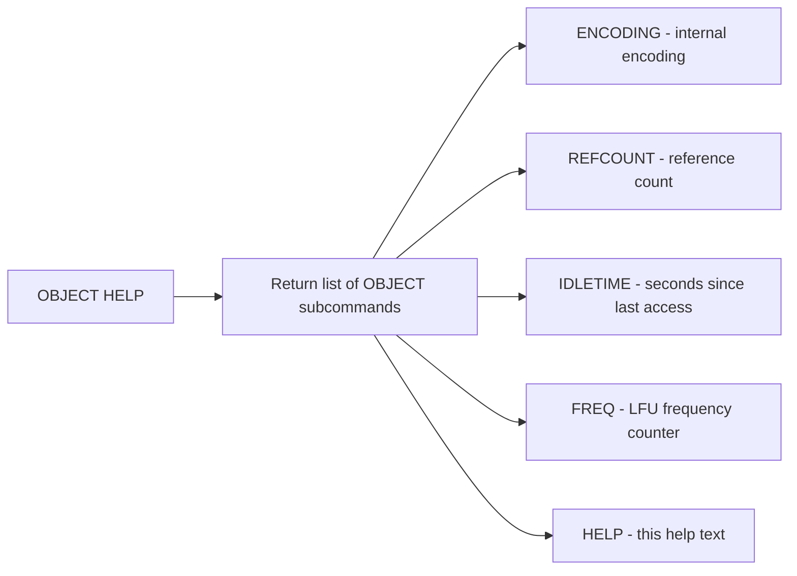

# How to Use OBJECT HELP in Redis

Author: [nawazdhandala](https://www.github.com/nawazdhandala)

Tags: Redis, OBJECT HELP, Internal, CLI, Documentation

Description: Learn how to use OBJECT HELP in Redis to list all available OBJECT subcommands directly from the Redis CLI, with an overview of each subcommand's purpose.

---

## How OBJECT HELP Works

OBJECT HELP is a meta-subcommand of the OBJECT command family that returns a list of all available OBJECT subcommands along with a brief description of each. It is a built-in quick reference for the OBJECT command group, useful when working directly in the Redis CLI.

The OBJECT command family provides introspection into Redis key internals, including memory encoding, reference counting, idle time, access frequency, and a help summary.



## Syntax

```redis
OBJECT HELP
```

No arguments required.

## Example

Run OBJECT HELP in the Redis CLI:

```redis
OBJECT HELP
```

```text
1) "OBJECT <subcommand> [<arg> [value] [opt] ...]. Subcommands are:"
2) "ENCODING <key>"
3) "    Return the kind of internal representation the Redis object stored at <key> is using."
4) "FREQ <key>"
5) "    Return the access frequency index of the key <key>."
6) "HELP"
7) "    Return subcommand help summary."
8) "IDLETIME <key>"
9) "    Return the idle time of the key <key>."
10) "REFCOUNT <key>"
11) "    Return the reference count of the object stored at <key>."
```

The exact output may vary slightly between Redis versions but always lists the available subcommands.

## OBJECT Subcommands Summary

### OBJECT ENCODING

Returns the internal memory representation used for a key's value. Useful for memory optimization.

```redis
SET mykey "hello"
OBJECT ENCODING mykey
```

```text
"embstr"
```

### OBJECT REFCOUNT

Returns the reference count of the value object. Shared integers (0-9999) have very high refcounts.

```redis
SET counter 5
OBJECT REFCOUNT counter
```

```text
(integer) 2147483647
```

### OBJECT IDLETIME

Returns the number of seconds since the key was last read or written. Only accurate with LRU eviction policies.

```redis
OBJECT IDLETIME mykey
```

```text
(integer) 15
```

### OBJECT FREQ

Returns the LFU frequency counter. Only meaningful when an LFU eviction policy is active.

```redis
OBJECT FREQ mykey
```

```text
(integer) 4
```

## Use Cases

**Quick reference during CLI sessions** - When you cannot remember the exact syntax for an OBJECT subcommand, run OBJECT HELP to get an instant list without leaving the Redis CLI.

**Discovery in unfamiliar environments** - On an unfamiliar Redis server where documentation is not readily available, OBJECT HELP confirms which subcommands are supported.

**Scripting and tooling** - Programmatic tools can call OBJECT HELP to dynamically discover available introspection capabilities.

**Version awareness** - Different Redis versions may expose different subcommands. OBJECT HELP shows exactly what is available on the current instance.

## Other HELP Subcommands in Redis

Many Redis command families support a HELP subcommand following the same pattern:

```redis
CLIENT HELP
COMMAND HELP
DEBUG HELP
FUNCTION HELP
LATENCY HELP
MEMORY HELP
MODULE HELP
SLOWLOG HELP
XADD HELP
```

## Summary

OBJECT HELP is a simple utility subcommand that prints a formatted list of all available OBJECT subcommands directly in the Redis CLI. It is a quick self-documenting reference for the OBJECT command family. The OBJECT family provides five key introspection tools: ENCODING (internal representation), REFCOUNT (reference count), IDLETIME (seconds idle), FREQ (LFU counter), and HELP (this listing). Use OBJECT HELP whenever you need a fast reminder of what OBJECT subcommands are available without consulting external documentation.
