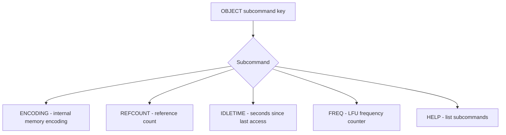

# How to Use OBJECT in Redis to Inspect Key Internals

Author: [nawazdhandala](https://www.github.com/nawazdhandala)

Tags: Redis, OBJECT, Internals, Memory, Debugging

Description: Learn how to use the Redis OBJECT command family to inspect key internals including encoding, reference count, idle time, and LFU frequency for memory optimization and debugging.

---

## How the OBJECT Command Works

The OBJECT command is a family of subcommands for inspecting the internal representation of Redis keys. It provides visibility into how Redis stores values in memory, how long keys have been idle, how often they are accessed, and how many references point to their value objects.

This introspection is essential for memory optimization, debugging eviction behavior, and understanding Redis's internal data structures.



## Available Subcommands

| Subcommand | Description | Useful For |
|---|---|---|
| OBJECT ENCODING key | Internal representation | Memory optimization |
| OBJECT REFCOUNT key | Reference count | Object sharing analysis |
| OBJECT IDLETIME key | Seconds since last access | LRU eviction debugging |
| OBJECT FREQ key | LFU frequency counter | LFU eviction debugging |
| OBJECT HELP | List subcommands | Quick reference |

## OBJECT ENCODING

Returns the internal encoding used to store the value. Different encodings have different memory footprints and performance characteristics.

```redis
SET small:int 42
OBJECT ENCODING small:int
```

```text
"int"
```

```redis
RPUSH small:list a b c
OBJECT ENCODING small:list
```

```text
"listpack"
```

```redis
ZADD large:zset 1.0 alpha 2.0 beta
OBJECT ENCODING large:zset
```

```text
"listpack"
```

Once the sorted set grows beyond the listpack threshold:

```redis
OBJECT ENCODING very:large:zset
```

```text
"skiplist"
```

## OBJECT REFCOUNT

Returns how many internal references point to the value object.

```redis
SET shared:int 100
OBJECT REFCOUNT shared:int
```

```text
(integer) 2147483647
```

Small integers (0-9999) are pre-allocated shared objects in Redis, so their refcount is the maximum integer value. This is a memory optimization - all keys with the value 100 share the same object.

```redis
SET unique:str "hello world"
OBJECT REFCOUNT unique:str
```

```text
(integer) 1
```

Non-shared strings have a refcount of 1.

## OBJECT IDLETIME

Returns the number of seconds since the key was last read or written. Relevant when using LRU eviction policies.

```redis
SET accessed:recently "data"
GET accessed:recently
OBJECT IDLETIME accessed:recently
```

```text
(integer) 0
```

```redis
OBJECT IDLETIME cold:key
```

```text
(integer) 3600
```

A key idle for 3600 seconds (1 hour) is a candidate for LRU eviction.

## OBJECT FREQ

Returns the LFU frequency counter. Only meaningful with `allkeys-lfu` or `volatile-lfu` eviction policies.

```redis
OBJECT FREQ popular:key
```

```text
(integer) 9
```

Higher values mean more frequent access and lower eviction priority.

## Comprehensive Inspection Example

Inspect a sorted set from multiple angles:

```redis
ZADD product:prices 19.99 "widget" 49.99 "gadget" 9.99 "doohickey"

TYPE product:prices
```

```text
zset
```

```redis
OBJECT ENCODING product:prices
```

```text
"listpack"
```

```redis
OBJECT REFCOUNT product:prices
```

```text
(integer) 1
```

```redis
OBJECT IDLETIME product:prices
```

```text
(integer) 0
```

## Use Cases

**Memory profiling** - Use OBJECT ENCODING across a sample of keys to verify compact encodings are being used. If hashes are showing `hashtable` when you expect `listpack`, values may exceed thresholds.

**Eviction tuning** - Combine OBJECT IDLETIME with SCAN to find cold keys before Redis begins evicting under memory pressure.

**Object sharing analysis** - Use OBJECT REFCOUNT to confirm that integer-heavy datasets benefit from Redis's shared integer pool.

**Debugging unexpected behavior** - A key with an unexpected encoding may indicate data was inserted differently than expected (e.g., a non-integer in an intset).

**LFU counter validation** - After a warm-up period, use OBJECT FREQ to confirm that hot keys have high counters and will be retained under LFU eviction.

## Summary

The OBJECT command family gives you a window into Redis's internal key mechanics. ENCODING shows how values are stored in memory, REFCOUNT shows object sharing, IDLETIME shows cache freshness under LRU eviction, and FREQ shows access frequency under LFU eviction. Use these subcommands together to optimize memory usage, tune eviction policies, and debug unexpected Redis behavior. For a quick reference on the available subcommands, always use OBJECT HELP.
