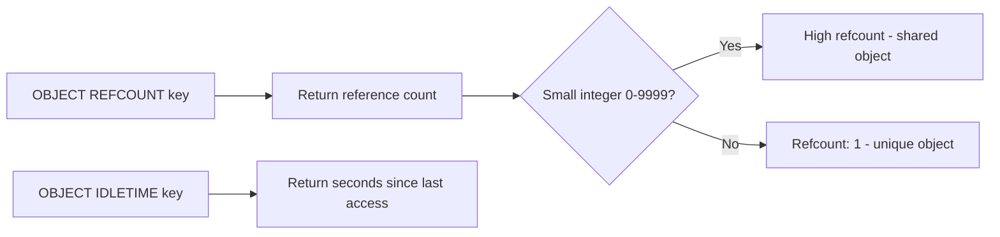

# How to Use OBJECT REFCOUNT and OBJECT IDLETIME in Redis

Author: [nawazdhandala](https://www.github.com/nawazdhandala)

Tags: Redis, OBJECT REFCOUNT, OBJECT IDLETIME, Internals, Memory, Eviction

Description: Learn how to use OBJECT REFCOUNT and OBJECT IDLETIME in Redis to inspect key reference counts and last access time for memory debugging and LRU eviction insights.

---

## How OBJECT REFCOUNT and OBJECT IDLETIME Work

The OBJECT command in Redis has several subcommands for inspecting key internals.

OBJECT REFCOUNT returns the number of references to the value object of a key. Redis uses reference counting for object sharing. For small integers (0-9999), Redis pre-creates shared objects that multiple keys can reference, so their refcount is very high. For other values, the refcount is typically 1.

OBJECT IDLETIME returns the number of seconds since the key was last accessed (read or written). This reflects the key's position in Redis's LRU approximation, and is useful for identifying cold keys. Note that OBJECT IDLETIME itself does not update the idle time.



## Syntax

```redis
OBJECT REFCOUNT key
OBJECT IDLETIME key
```

Both return -2 if the key does not exist.

## Examples

### OBJECT REFCOUNT for a regular string

```redis
SET username "alice"
OBJECT REFCOUNT username
```

```text
(integer) 1
```

Regular string values have a refcount of 1 since they are not shared.

### OBJECT REFCOUNT for a shared integer

Redis pre-allocates objects for integers 0-9999:

```redis
SET counter 100
OBJECT REFCOUNT counter
```

```text
(integer) 2147483647
```

The extremely high number indicates this is a shared integer object referenced by the internal pool.

### OBJECT IDLETIME - check when a key was last used

```redis
SET active:key "data"
GET active:key
OBJECT IDLETIME active:key
```

```text
(integer) 0
```

The key was just accessed, so idle time is 0 seconds.

Wait 30 seconds without touching the key:

```redis
OBJECT IDLETIME active:key
```

```text
(integer) 30
```

### OBJECT IDLETIME on a cold key

```redis
SET old:key "value"
```

Wait a few minutes:

```redis
OBJECT IDLETIME old:key
```

```text
(integer) 180
```

This key has not been accessed for 3 minutes.

### OBJECT IDLETIME returns 0 for keys accessed via LFU policy

When `maxmemory-policy` is set to an LFU variant, OBJECT IDLETIME will always return 0 because Redis tracks access frequency instead of last-access time. Use OBJECT FREQ instead.

### Non-existent key

```redis
OBJECT REFCOUNT missing:key
```

```text
(error) ERR no such key
```

## OBJECT IDLETIME and LRU Eviction

Redis uses an approximation of LRU eviction. When `maxmemory-policy` is set to `allkeys-lru` or `volatile-lru`, Redis uses the idle time tracked internally (the same time reported by OBJECT IDLETIME) to select eviction candidates. Keys with the highest idle time are evicted first.

You can use OBJECT IDLETIME to manually identify keys that have not been accessed recently and may be good candidates for preemptive deletion before Redis starts evicting under memory pressure.

```bash
# Find keys idle for more than 1 hour (3600 seconds)
redis-cli --scan --pattern "*" | while read key; do
  idle=$(redis-cli OBJECT IDLETIME "$key")
  if [ "$idle" -gt 3600 ]; then
    echo "Cold key: $key ($idle seconds idle)"
  fi
done
```

## Use Cases

**LRU debugging** - Use OBJECT IDLETIME to understand which keys are cold and likely to be evicted soon under memory pressure.

**Cold key cleanup** - Identify and delete keys that have not been accessed in a configurable time window as part of proactive cache management.

**Shared object insight** - Use OBJECT REFCOUNT to confirm that integer-heavy datasets are benefiting from Redis's shared integer pool.

**Memory audit** - Check refcounts to understand object sharing behavior and optimize memory for duplicate values.

## Summary

OBJECT REFCOUNT shows how many internal references point to a key's value object. For shared integers (0-9999), this is very high; for other values, it is typically 1. OBJECT IDLETIME shows how long a key has been idle, which is directly related to LRU eviction priority. Both commands are primarily useful for performance tuning, memory debugging, and understanding Redis's internal object model. When using LFU eviction policies, use OBJECT FREQ instead of OBJECT IDLETIME.
