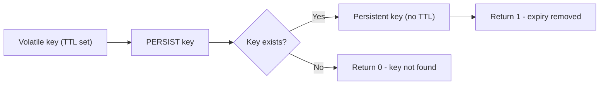

# How to Use PERSIST in Redis to Remove Key Expiration

Author: [nawazdhandala](https://www.github.com/nawazdhandala)

Tags: Redis, PERSIST, TTL, Key Expiration, Persistence

Description: Learn how to use the PERSIST command in Redis to remove the expiration from a key, making it permanent, with practical examples and use cases.

---

## How PERSIST Works

PERSIST removes the expiration from a key, converting it from a volatile key (one with a TTL) to a persistent key (one that never expires). After calling PERSIST, the key lives indefinitely until explicitly deleted.

This is the inverse of EXPIRE and PEXPIRE. It is useful when a temporary item needs to be promoted to a permanent one based on user action or business logic.



## Syntax

```redis
PERSIST key
```

Returns:
- `1` - the expiration was removed successfully
- `0` - the key does not exist, or the key has no expiration

## Examples

### Basic usage - remove TTL from a key

```redis
SET session:user123 "active"
EXPIRE session:user123 3600
TTL session:user123
```

```text
(integer) 3597
```

Now remove the expiration:

```redis
PERSIST session:user123
```

```text
(integer) 1
```

Verify it has no TTL:

```redis
TTL session:user123
```

```text
(integer) -1
```

Returns -1 confirming the key now has no expiration.

### PERSIST on a key with no expiration

```redis
SET permanent:flag "enabled"
PERSIST permanent:flag
```

```text
(integer) 0
```

Returns 0 because the key already has no expiration, so there is nothing to remove.

### PERSIST on a non-existent key

```redis
PERSIST missing:key
```

```text
(integer) 0
```

Returns 0 because the key does not exist.

### Promote a temporary item to permanent

A common pattern is to create a temporary draft, then persist it when the user saves:

```redis
# Create a draft with a 1-hour auto-discard TTL
SET draft:post:789 "{\"title\":\"My Blog Post\",\"body\":\"...\"}"
EXPIRE draft:post:789 3600

# User clicks "Publish" - promote to permanent
PERSIST draft:post:789
TTL draft:post:789
```

```text
(integer) -1
```

### Reset TTL and then persist

```redis
SET lock:resource "worker-1"
EXPIRE lock:resource 30

# Extend the task, then decide to hold the lock indefinitely
PERSIST lock:resource
TTL lock:resource
```

```text
(integer) -1
```

## Use Cases

**Draft to published promotion** - Documents or posts start as volatile drafts with a TTL for auto-cleanup. When the user publishes, PERSIST makes them permanent.

**Grace period extension** - A user's trial expires after 30 days. When they upgrade, PERSIST removes the expiry from their account key.

**Lock extension** - A distributed lock was acquired with a safety TTL. If the worker needs to hold it longer than planned, PERSIST (or a longer EXPIRE) prevents the lock from disappearing mid-task.

**Configuration override** - A temporary feature flag was set to expire. Business decides to keep it enabled permanently, so PERSIST makes it stick.

## Relationship with Other Expiry Commands

| Command | Effect |
|---------|--------|
| EXPIRE | Set TTL in seconds |
| PEXPIRE | Set TTL in milliseconds |
| EXPIREAT | Set TTL at Unix timestamp (seconds) |
| PEXPIREAT | Set TTL at Unix timestamp (milliseconds) |
| PERSIST | Remove TTL entirely |
| TTL | Read remaining TTL in seconds |
| PTTL | Read remaining TTL in milliseconds |

## Summary

PERSIST is a simple but important command that converts a volatile key into a permanent one by removing its expiration. It returns 1 on success and 0 if the key doesn't exist or has no TTL. Use PERSIST when business logic requires promoting a temporary record to a permanent one, such as when a user confirms an action, completes a checkout, or publishes a draft. It pairs naturally with EXPIRE, TTL, and PTTL to give you full lifecycle control over key persistence.
