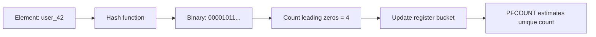

# How to Use PFADD in Redis HyperLogLog to Add Elements

Author: [nawazdhandala](https://www.github.com/nawazdhandala)

Tags: Redis, HyperLogLog, PFADD, Cardinality, Analytics

Description: Learn how to use PFADD to add elements to a Redis HyperLogLog data structure for memory-efficient approximate unique counting.

---

Redis HyperLogLog is a probabilistic data structure that estimates the number of unique elements in a set using only about 12 KB of memory - regardless of how many millions of elements you add. `PFADD` is the command to add elements to a HyperLogLog.

## How HyperLogLog Works

HyperLogLog does not store individual elements. Instead, it processes each element through a hash function and updates internal registers based on the longest run of leading zeros in the hash. This statistical trick allows it to estimate cardinality with about 0.81% standard error using only 12 KB of memory.



## Syntax

```redis
PFADD key element [element ...]
```

- `key` - HyperLogLog key
- `element` - one or more elements to add

Returns `1` if the internal representation was modified (the estimate changed), `0` if it was not modified.

## Examples

### Add a Single Element

```redis
PFADD unique-visitors user:1001
```

Returns `1` - the HyperLogLog was updated.

### Add Multiple Elements at Once

```redis
PFADD unique-visitors user:1001 user:1002 user:1003 user:1004
```

### Add Elements to a Daily Counter

Track unique page views per day:

```redis
PFADD pageviews:2026-03-31 user:1001 user:1002 user:1003
PFADD pageviews:2026-03-31 user:1001   # duplicate - still returns 0 or 1 based on internal state
PFADD pageviews:2026-03-31 user:1004 user:1005
```

### Batch Loading

Add many elements efficiently:

```bash
# Load 10,000 user IDs into a HyperLogLog
for i in $(seq 1 10000); do
  redis-cli PFADD unique-users "user:$i"
done
```

Or pipeline for better performance:

```bash
(for i in $(seq 1 10000); do echo "PFADD unique-users user:$i"; done) | redis-cli --pipe
```

### Check Count After Adding

```redis
PFADD unique-visitors user:1001 user:1002 user:1003
PFCOUNT unique-visitors
# Returns approximately 3
```

## Return Value Behavior

The return value `1` does not mean the element was "new" - it means the internal state changed. A `0` return means the estimate is unchanged, which can happen even for new elements if they hash to an already-seen bucket state.

## Memory Efficiency

```redis
# A HyperLogLog with 1 million unique elements
MEMORY USAGE unique-visitors
# Returns approximately 14392 bytes (~14 KB)

# Compare to a Set with 1 million elements
# Would require ~64 MB
```

## Use Cases

- **Unique visitor counting** - count distinct users per page, day, or campaign
- **A/B test exposure tracking** - track how many unique users saw each variant
- **API rate limiting by unique IPs** - approximate unique IP counts without storing all IPs
- **Real-time analytics dashboards** - aggregate unique counts across dimensions

## Summary

`PFADD` is the write command for Redis HyperLogLog, enabling you to track unique element membership at massive scale with a fixed ~12 KB memory footprint. The ~0.81% error rate is acceptable for analytics use cases like unique visitor counts. Combine with `PFCOUNT` for estimates and `PFMERGE` to union multiple HyperLogLogs together.
