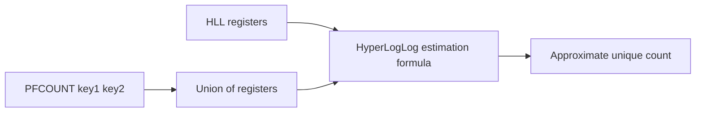

# How to Use PFCOUNT in Redis HyperLogLog to Estimate Cardinality

Author: [nawazdhandala](https://www.github.com/nawazdhandala)

Tags: Redis, HyperLogLog, PFCOUNT, Cardinality, Analytics

Description: Learn how to use PFCOUNT to get an approximate count of unique elements from one or more Redis HyperLogLog structures.

---

`PFCOUNT` returns the approximate number of unique elements tracked in a Redis HyperLogLog. When called with multiple keys, it returns the union cardinality - the estimated count of unique elements across all the HyperLogLogs combined.

## How PFCOUNT Works

`PFCOUNT` reads the HyperLogLog registers and applies the HyperLogLog estimation algorithm to produce a cardinality estimate with up to 0.81% standard error. When multiple keys are provided, Redis internally computes the union of the registers before estimating.



## Syntax

```redis
PFCOUNT key [key ...]
```

- `key` - one or more HyperLogLog keys

Returns a 64-bit integer estimate.

## Examples

### Count Unique Visitors for Today

```redis
PFADD pageviews:2026-03-31 user:1001 user:1002 user:1003 user:1004 user:1005
PFCOUNT pageviews:2026-03-31
```

Output:

```text
(integer) 5
```

### Union Count Across Multiple Keys

Count unique visitors across a 7-day window:

```redis
PFCOUNT pageviews:2026-03-25 pageviews:2026-03-26 pageviews:2026-03-27 pageviews:2026-03-28 pageviews:2026-03-29 pageviews:2026-03-30 pageviews:2026-03-31
```

This returns the number of distinct users who visited on any of those days - users who visited multiple days are counted only once.

### Comparing Single vs Union

```redis
PFADD site-a user:1 user:2 user:3
PFADD site-b user:3 user:4 user:5

# Single key counts
PFCOUNT site-a   # ~3
PFCOUNT site-b   # ~3

# Union count (user:3 appears in both - counted once)
PFCOUNT site-a site-b  # ~5
```

### Large-Scale Accuracy Test

```bash
# Add 100,000 unique elements
for i in $(seq 1 100000); do
  redis-cli PFADD large-hll "element:$i"
done

redis-cli PFCOUNT large-hll
# Returns approximately 100,000 +/- 0.81%
# Typically between 99,190 and 100,810
```

## Error Rate in Practice

| True Count | Typical Estimate Range |
|---|---|
| 100 | 99 - 101 |
| 10,000 | 9,919 - 10,081 |
| 1,000,000 | 991,900 - 1,008,100 |
| 100,000,000 | ~99,190,000 - ~100,810,000 |

The error rate is consistent regardless of cardinality.

## PFCOUNT vs SCARD

| Feature | PFCOUNT | SCARD |
|---|---|---|
| Exact count | No (~0.81% error) | Yes |
| Memory per 1M elements | ~12 KB | ~64 MB |
| Multi-key union | Yes (one call) | No (SUNION needed) |
| Individual element lookup | No | Yes (SISMEMBER) |

## Use Cases

- **Daily active user (DAU) metrics** - count unique users each day
- **Weekly/monthly unique visitors** - union multiple day keys in one call
- **Real-time analytics** - update and read cardinality estimates with sub-millisecond latency
- **Feature adoption tracking** - count unique users who triggered a feature event

## Summary

`PFCOUNT` provides fast, memory-efficient cardinality estimates for single or multiple HyperLogLog structures. Its ~0.81% error is acceptable for analytics use cases, and the ability to union-count across multiple keys in a single call makes it ideal for sliding window or multi-dimension unique counting. Use `SCARD` when you need exact counts and can afford the memory overhead.
