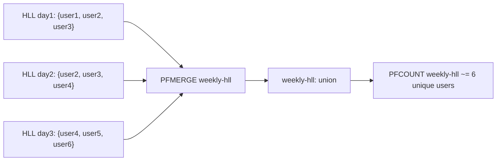

# How to Use PFMERGE in Redis to Merge HyperLogLog Structures

Author: [nawazdhandala](https://www.github.com/nawazdhandala)

Tags: Redis, HyperLogLog, PFMERGE, Cardinality, Analytics

Description: Learn how to use PFMERGE to combine multiple Redis HyperLogLog structures into a single one representing the union of all tracked elements.

---

`PFMERGE` creates a new HyperLogLog that represents the union of multiple source HyperLogLogs. This is useful for aggregating per-day or per-partition counters into weekly or monthly totals without re-processing the original data.

## How PFMERGE Works

`PFMERGE` takes the union of all source HyperLogLog registers using a max operation. The resulting HyperLogLog contains the merged state and can be queried with `PFCOUNT` to get the estimated unique count across all sources.



## Syntax

```redis
PFMERGE destkey sourcekey [sourcekey ...]
```

- `destkey` - destination key where the merged HyperLogLog is stored
- `sourcekey` - one or more source HyperLogLog keys

If `destkey` already exists, it is overwritten. Returns `OK` always.

## Examples

### Merge Daily into Weekly

Build a weekly unique visitor aggregate from seven daily HyperLogLogs:

```redis
PFADD visitors:2026-03-25 user:1 user:2 user:3
PFADD visitors:2026-03-26 user:2 user:4 user:5
PFADD visitors:2026-03-27 user:5 user:6
PFADD visitors:2026-03-28 user:1 user:7
PFADD visitors:2026-03-29 user:3 user:8 user:9
PFADD visitors:2026-03-30 user:9 user:10
PFADD visitors:2026-03-31 user:10 user:11

PFMERGE visitors:week-2026-13 visitors:2026-03-25 visitors:2026-03-26 visitors:2026-03-27 visitors:2026-03-28 visitors:2026-03-29 visitors:2026-03-30 visitors:2026-03-31

PFCOUNT visitors:week-2026-13
# Returns approximately 11 (unique users across the whole week)
```

### Merge Across Regions

Aggregate unique users from multiple regional counters:

```redis
PFADD users:us user:100 user:101 user:102
PFADD users:eu user:200 user:201 user:101
PFADD users:apac user:300 user:100

PFMERGE users:global users:us users:eu users:apac
PFCOUNT users:global
# Returns approximately 7 unique users globally
```

### Incremental Merge

Append a new day's data to an existing weekly aggregate:

```redis
# Start of week
PFMERGE visitors:week-current visitors:2026-03-25 visitors:2026-03-26

# Next day - merge the existing aggregate with the new day
PFADD visitors:2026-03-27 user:5 user:6 user:7
PFMERGE visitors:week-current visitors:week-current visitors:2026-03-27
```

### Check Merged Result

```redis
PFCOUNT visitors:week-2026-13
```

## PFMERGE vs PFCOUNT with Multiple Keys

Both approaches estimate the union cardinality:

```redis
# Option 1: Direct multi-key PFCOUNT (no storage)
PFCOUNT visitors:2026-03-25 visitors:2026-03-26 visitors:2026-03-27

# Option 2: PFMERGE then PFCOUNT (stores the merged HLL)
PFMERGE visitors:3-day visitors:2026-03-25 visitors:2026-03-26 visitors:2026-03-27
PFCOUNT visitors:3-day
```

Use `PFMERGE` when you need to reuse the merged result multiple times, store it with an expiry, or pass it to further merge operations.

## Use Cases

- **Weekly/monthly unique user aggregates** - merge daily HyperLogLogs into period summaries
- **Cross-region analytics** - combine per-datacenter unique counts into a global total
- **Pre-aggregated reports** - merge hourly HLLs into daily summaries during off-peak hours
- **Funnel analysis** - combine user sets from different funnel steps to count total unique participants

## Summary

`PFMERGE` is the aggregation command for Redis HyperLogLog, enabling you to combine multiple counters into a persistent union without re-processing the original data. The merged HyperLogLog has the same ~12 KB size as any other HyperLogLog, making it efficient to store pre-computed aggregates at any time granularity. Set a TTL on merged keys to automate cleanup of old aggregates.
