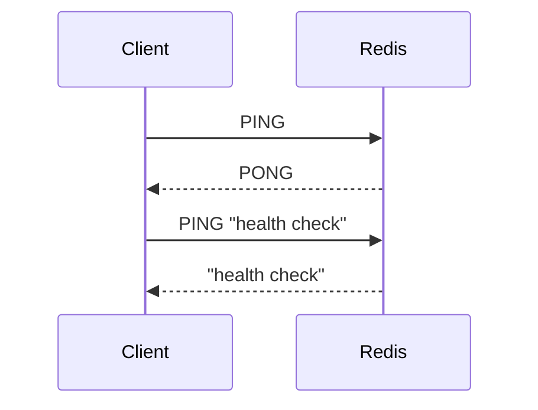

# How to Use PING in Redis to Test Connection

Author: [nawazdhandala](https://www.github.com/nawazdhandala)

Tags: Redis, PING, Connection, Health Check, Monitoring

Description: Learn how to use PING to verify a Redis connection is alive, measure round-trip latency, and use it as a lightweight health check endpoint.

---

`PING` is the simplest Redis command and one of the most useful for infrastructure health checks. It tests that a connection to Redis is functional and measures the round-trip time. It requires no authentication beyond connection establishment and returns a response with minimal server processing.

## How PING Works

`PING` sends a request to the Redis server, which immediately returns `PONG` (or an echo of a custom message). It exercises the full network path, TCP stack, and Redis event loop, making it a reliable indicator of connection health and latency.



## Syntax

```redis
PING [message]
```

- With no argument - returns `PONG`
- With a message - echoes the message back (Redis 2.8+)

## Examples

### Basic Ping

```redis
PING
```

Output:

```text
PONG
```

### Ping with a Custom Message

```redis
PING "hello from app-server-1"
```

Output:

```text
"hello from app-server-1"
```

### Measure Round-Trip Latency

```bash
time redis-cli PING
```

Output:

```text
PONG

real    0m0.003s
```

### Continuous Latency Monitoring

Redis CLI has a built-in latency mode using PING:

```bash
redis-cli --latency
# Prints continuous min/max/avg latency in milliseconds
```

For a fixed number of samples:

```bash
redis-cli --latency-history -i 5
# Shows latency history every 5 seconds
```

### Health Check Script

```bash
#!/bin/bash
result=$(redis-cli -h redis-host -p 6379 PING 2>&1)
if [ "$result" = "PONG" ]; then
  echo "Redis is healthy"
  exit 0
else
  echo "Redis health check failed: $result"
  exit 1
fi
```

### PING in Pub/Sub Mode

In Pub/Sub mode, `PING` returns a special response:

```redis
SUBSCRIBE notifications
PING
```

Response in Pub/Sub mode:

```text
1) "pong"
2) ""
```

Or with a message:

```redis
PING "keepalive"
```

```text
1) "pong"
2) "keepalive"
```

## PING vs Other Health Check Approaches

| Method | Use Case |
|---|---|
| `PING` | Quick connectivity check, minimal overhead |
| `PING message` | Verify message round-trip with unique token |
| `redis-cli --latency` | Continuous latency monitoring |
| `INFO server` | Full server status including memory and replication |
| `DEBUG SLEEP 0` | Test command processing without network overhead |

## Use Cases

- **Load balancer health checks** - include `PING` in health check scripts for Redis backend pools
- **Connection pool validation** - verify connections before returning them to the pool
- **Network latency baselines** - measure Redis response time to detect network issues
- **Keepalive in Pub/Sub** - send periodic `PING` to keep long-lived Pub/Sub connections alive
- **Smoke tests** - confirm Redis is reachable after deployment

## Summary

`PING` is the fundamental Redis connectivity test command. With no arguments it returns `PONG`; with a message argument it echoes the message back. Use it in health check scripts, monitoring systems, and connection validation logic. For sustained latency monitoring, `redis-cli --latency` provides a more detailed view using PING under the hood.
