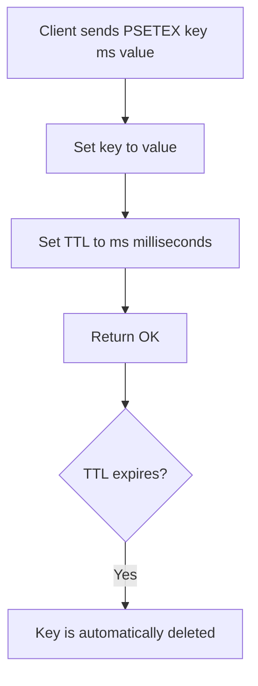

# How to Use PSETEX in Redis for Millisecond Expiration

Author: [nawazdhandala](https://www.github.com/nawazdhandala)

Tags: Redis, PSETEX, Expiration, TTL, Millisecond, String, Command

Description: Learn how to use the Redis PSETEX command to set a key with a millisecond-precision TTL in a single atomic operation for high-resolution expiration use cases.

---

## How PSETEX Works

`PSETEX` sets a key to a value and sets an expiration time in milliseconds - all in one atomic step. It is the millisecond equivalent of `SETEX`, which uses seconds. The key is automatically deleted by Redis once the TTL expires.

Like `SETEX`, `PSETEX` is considered a legacy command in modern Redis. The equivalent - and preferred - command is:

```redis
SET key value PX milliseconds
```

`PSETEX` remains available for backwards compatibility.



## Syntax

```redis
PSETEX key milliseconds value
```

- `key` - the key to set
- `milliseconds` - TTL in milliseconds (must be a positive integer)
- `value` - the string value to store

Returns `OK` on success. Returns an error if `milliseconds` is not a positive integer.

## Examples

### Basic millisecond-precision expiry

Store a value that expires in 500 ms.

```redis
PSETEX rate:ip:192.168.1.1 500 "1"
PTTL rate:ip:192.168.1.1
```

```text
OK
(integer) 499
```

### Short-lived cache entry (2 seconds)

```redis
PSETEX cache:fragment:header 2000 "<header>...</header>"
PTTL cache:fragment:header
```

```text
OK
(integer) 1999
```

### Rate limit window (100 ms)

Mark a slot in a sub-second rate limit window.

```redis
PSETEX rl:user:42:slot 100 "1"
PTTL rl:user:42:slot
```

```text
OK
(integer) 99
```

### Verify expiry behavior

After the TTL elapses, the key is gone.

```redis
PSETEX temp:key 200 "gone_soon"
```

Wait 200+ ms, then:

```redis
GET temp:key
```

```text
(nil)
```

### PSETEX vs SET PX (equivalent commands)

Both of these are identical in behavior:

```redis
PSETEX mykey 5000 "hello"
SET mykey "hello" PX 5000
```

Both set `mykey` to `"hello"` with a 5000 ms TTL. The `SET` form is preferred in new code because it supports additional options (`NX`, `XX`, `GET`, `KEEPTTL`).

### Inspect with PTTL and TTL

`PTTL` returns the remaining TTL in milliseconds; `TTL` returns it in seconds (rounded down).

```redis
PSETEX example 7500 "value"
PTTL example
TTL example
```

```text
OK
(integer) 7499
(integer) 7
```

## PSETEX vs related commands

| Command | TTL unit | Equivalent SET form |
|---------|----------|---------------------|
| `SETEX key seconds value` | Seconds | `SET key value EX seconds` |
| `PSETEX key ms value` | Milliseconds | `SET key value PX ms` |
| `SET key value EX seconds` | Seconds | - (canonical form) |
| `SET key value PX ms` | Milliseconds | - (canonical form) |

## Use Cases

- Sub-second rate limiting windows (e.g., 100 ms, 500 ms buckets)
- High-frequency cache invalidation with precise TTLs
- Short-lived distributed lock tokens with fine-grained expiry
- Real-time leaderboard slot expiration
- Deduplication windows measured in milliseconds

## Summary

`PSETEX` combines a value write with a millisecond-precision TTL in one atomic operation. It is functionally equivalent to `SET key value PX milliseconds` and is best used when you need sub-second expiry control. For new code, prefer the `SET ... PX ...` syntax as it is more flexible. Use `PTTL` to inspect the remaining TTL in milliseconds.
