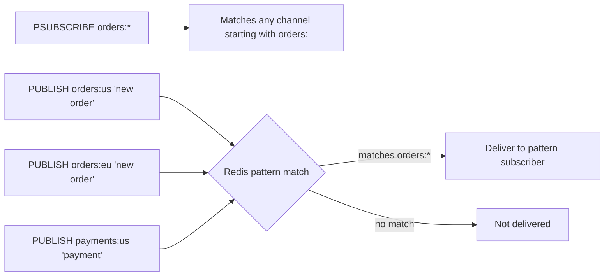

# How to Use PSUBSCRIBE in Redis for Pattern-Based Subscriptions

Author: [nawazdhandala](https://www.github.com/nawazdhandala)

Tags: Redis, Pub/Sub, PSUBSCRIBE, Pattern, Messaging

Description: Learn how to use PSUBSCRIBE to subscribe to multiple Redis Pub/Sub channels at once using glob-style patterns.

---

`PSUBSCRIBE` extends Redis Pub/Sub by letting a single client subscribe to multiple channels using glob-style patterns. Instead of subscribing to `orders:us`, `orders:eu`, and `orders:apac` separately, you can subscribe to `orders:*` and receive all of them.

## How PSUBSCRIBE Works

`PSUBSCRIBE` registers a pattern against a Redis Pub/Sub pattern list. When a message is published to any channel that matches the pattern, all clients subscribed to that pattern receive the message. A client can have both exact channel subscriptions (via `SUBSCRIBE`) and pattern subscriptions (via `PSUBSCRIBE`) active simultaneously.



## Supported Glob Patterns

| Pattern | Matches |
|---|---|
| `h?llo` | `hello`, `hallo`, `hxllo` |
| `h*llo` | `hllo`, `heeeello` |
| `h[ae]llo` | `hello`, `hallo` (not `hillo`) |
| `orders:*` | `orders:us`, `orders:eu`, `orders:apac:north` |

## Syntax

```redis
PSUBSCRIBE pattern [pattern ...]
```

## Examples

### Subscribe to All Order Channels

```redis
PSUBSCRIBE orders:*
```

Confirmation:

```text
1) "psubscribe"
2) "orders:*"
3) (integer) 1
```

### Subscribe to Multiple Patterns

```redis
PSUBSCRIBE orders:* payments:* alerts:*
```

### Message Format for Pattern Subscribers

When a matching message arrives, the subscriber receives:

```text
1) "pmessage"
2) "orders:*"
3) "orders:us"
4) "New order from customer 42"
```

The four parts are: type (`pmessage`), matched pattern, actual channel, and message payload.

### Compare: SUBSCRIBE vs PSUBSCRIBE

```redis
# Exact subscription - only "notifications" channel
SUBSCRIBE notifications

# Pattern subscription - all channels starting with "notifications:"
PSUBSCRIBE notifications:*
```

### Wildcard for All Channels (Use with Caution)

```redis
PSUBSCRIBE *
# Receives ALL messages published to ANY channel
```

This is useful for debugging but creates significant overhead in busy systems.

## Counting Pattern Subscriptions

Check how many pattern subscriptions exist on the server:

```redis
PUBSUB NUMPAT
```

## Use Cases

- **Multi-region event routing** - subscribe to `events:*` to handle events from any region
- **Wildcard monitoring** - subscribe to `__keyevent@*__:expired` to monitor key expiry across all databases
- **Namespace-based filtering** - subscribe to `user:1001:*` to receive all events for a specific user
- **Debug tooling** - subscribe to `*` to log all Pub/Sub traffic during development

## Summary

`PSUBSCRIBE` unlocks the full power of Redis Pub/Sub by supporting glob pattern matching against channel names. A single `PSUBSCRIBE orders:*` replaces dozens of individual `SUBSCRIBE` calls and automatically receives messages from channels created in the future that match the pattern. Messages delivered via pattern subscriptions are marked as `pmessage` type and include both the matched pattern and actual channel name.
