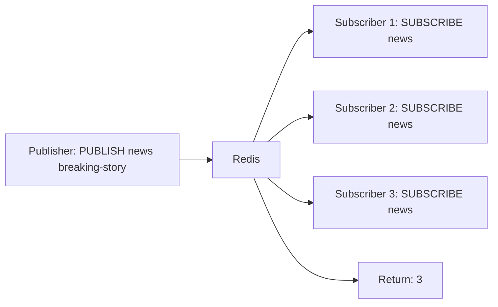
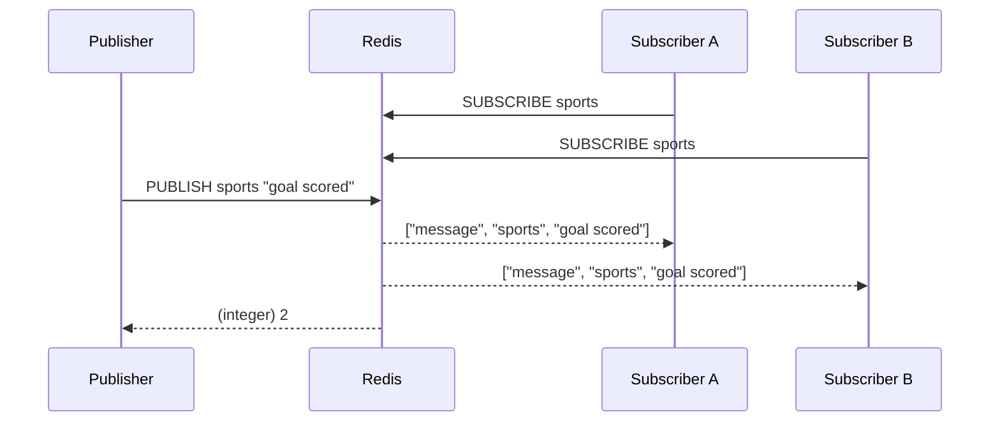

# How to Use PUBLISH in Redis to Send Messages to Channels

Author: [nawazdhandala](https://www.github.com/nawazdhandala)

Tags: Redis, PUBLISH, Pub/Sub, Messaging, Channel

Description: Learn how to use the PUBLISH command in Redis to broadcast messages to named channels and understand how delivery counts and fan-out work.

---

## What is PUBLISH

PUBLISH sends a message to all clients currently subscribed to a named channel. It is the producer side of the Redis Pub/Sub system. PUBLISH returns an integer indicating how many subscribers received the message.

```redis
PUBLISH channel message
```

If no clients are subscribed to the channel at the time PUBLISH is called, the message is silently discarded and the return value is 0.



## Basic Usage

### Publish a simple string message

```redis
PUBLISH notifications "User 42 logged in"
```

Returns the number of subscribers that received the message.

### Publish a JSON payload

```redis
PUBLISH events '{"type":"order","id":1001,"status":"shipped"}'
```

Redis treats the message as an opaque byte string. Any format works as long as publishers and subscribers agree on the schema.

### Publish to a channel with no subscribers

```redis
PUBLISH orphan-channel "hello"
-- Returns: (integer) 0
```

The message is not stored anywhere. There is no way to retrieve it later.

## How Fan-Out Works

Every SUBSCRIBE call registers a client to receive messages on a channel. When PUBLISH runs, Redis iterates the list of subscribed clients and delivers the message to each one. This is synchronous fan-out: all deliveries happen before PUBLISH returns.



## Message Format Received by Subscribers

Subscribers receive a three-element array:

```
1) "message"
2) "<channel-name>"
3) "<message-body>"
```

For pattern subscribers (PSUBSCRIBE), the format adds the matched pattern:

```
1) "pmessage"
2) "<pattern>"
3) "<channel-name>"
4) "<message-body>"
```

## Practical Examples

### Event bus for microservices

```redis
-- Order service publishes an event
PUBLISH order:events '{"event":"created","orderId":5001}'

-- Inventory service, notification service, and billing service
-- are all subscribed to order:events and receive the message
```

### Real-time dashboard updates

```redis
-- Background job publishes metrics every second
PUBLISH dashboard:metrics '{"cpu":42,"mem":67,"rps":1200}'
```

### Chat application

```redis
-- User sends a message in room "lobby"
PUBLISH chat:lobby '{"user":"alice","text":"hello everyone"}'
```

## PUBLISH Limitations

### No persistence

Messages are not stored. If a subscriber is offline when PUBLISH runs, it never receives that message.

### No acknowledgement

PUBLISH does not confirm that subscribers actually processed the message, only that it was delivered to their socket buffers.

### No filtering on the server side

A subscriber receives every message on its subscribed channels. Filtering must happen on the client.

### Cluster routing

In Redis Cluster, PUBLISH broadcasts to all nodes so every subscriber receives the message regardless of which node the publisher connects to. For large clusters with many subscribers, this broadcast cost can be significant. Use SPUBLISH with shard channels to avoid cluster-wide broadcast.

```redis
-- Cluster-aware sharded publish (Redis 7.0+)
SPUBLISH shardchannel "message"
```

## Checking Subscriber Count Before Publishing

Use PUBSUB NUMSUB to inspect how many clients are subscribed before deciding whether to publish:

```redis
PUBSUB NUMSUB notifications events
-- Returns:
-- 1) "notifications"
-- 2) (integer) 3
-- 3) "events"
-- 4) (integer) 1
```

## Summary

PUBLISH broadcasts a message to all clients subscribed to a named channel and returns the count of recipients. Messages are delivered synchronously and are not persisted: if no subscriber is listening, the message is lost. PUBLISH is best suited for real-time fan-out scenarios where at-most-once delivery is acceptable. For durable, replayable messaging, use Redis Streams with XADD instead.
