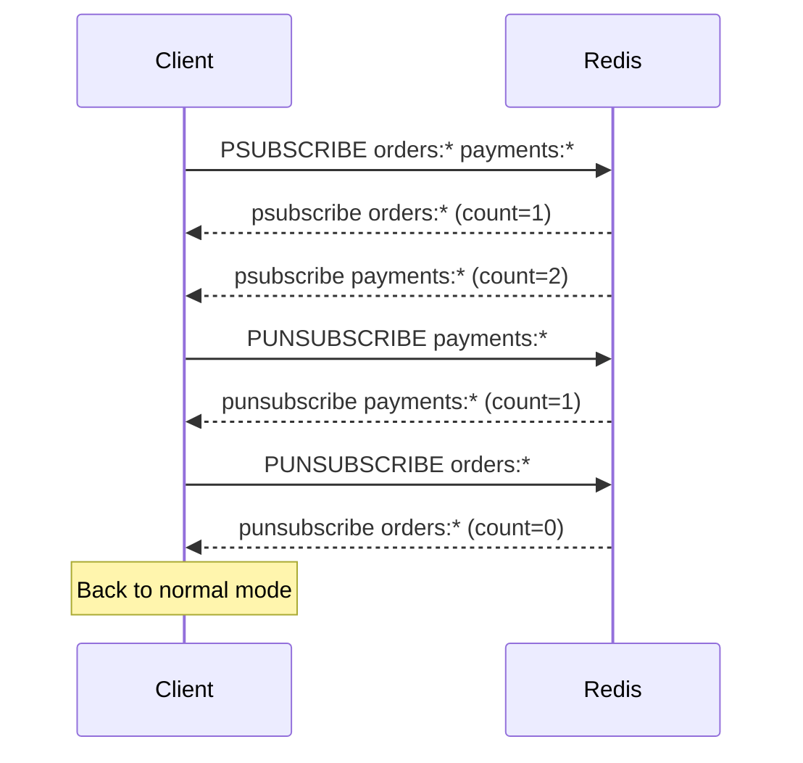

# How to Use PUNSUBSCRIBE in Redis for Pattern Unsubscription

Author: [nawazdhandala](https://www.github.com/nawazdhandala)

Tags: Redis, Pub/Sub, PUNSUBSCRIBE, Pattern, Messaging

Description: Learn how to use PUNSUBSCRIBE to remove one or more glob pattern subscriptions from a Redis Pub/Sub client connection.

---

`PUNSUBSCRIBE` is the counterpart to `PSUBSCRIBE`. It removes pattern-based channel subscriptions from the current client. When a client unsubscribes from its last pattern and has no remaining exact-channel subscriptions either, the connection exits Pub/Sub mode.

## How PUNSUBSCRIBE Works

`PUNSUBSCRIBE` removes the specified glob patterns from the client's pattern subscription list. For each pattern removed, Redis sends a confirmation message with the updated total subscription count (pattern subscriptions + exact subscriptions combined).



## Syntax

```redis
PUNSUBSCRIBE [pattern [pattern ...]]
```

- With patterns - unsubscribes from those specific patterns
- With no arguments - unsubscribes from all active pattern subscriptions

## Examples

### Unsubscribe from a Specific Pattern

```redis
PUNSUBSCRIBE orders:*
```

Response:

```text
1) "punsubscribe"
2) "orders:*"
3) (integer) 1
```

The three fields are: type (`punsubscribe`), the pattern removed, and the remaining total subscription count.

### Unsubscribe from Multiple Patterns

```redis
PUNSUBSCRIBE orders:* payments:* alerts:*
```

### Unsubscribe from All Patterns

```redis
PUNSUBSCRIBE
```

Redis sends one confirmation per currently active pattern subscription.

### Mixed Subscriptions

When a client has both exact and pattern subscriptions, the count reflects all subscriptions:

```redis
SUBSCRIBE news         # exact subscription, count=1
PSUBSCRIBE orders:*   # pattern subscription, count=2
PUNSUBSCRIBE orders:* # removes pattern, count=1 (news still active)
UNSUBSCRIBE news       # removes exact, count=0 - exits Pub/Sub mode
```

### PUNSUBSCRIBE for a Non-Active Pattern

Calling `PUNSUBSCRIBE` with a pattern you are not subscribed to is harmless:

```redis
PUNSUBSCRIBE nonexistent:*
```

Redis sends a `punsubscribe` response with the pattern and current count unchanged.

## Connection Mode Behavior

The client remains in Pub/Sub mode until both:
1. All exact `SUBSCRIBE` subscriptions are removed via `UNSUBSCRIBE`
2. All pattern `PSUBSCRIBE` subscriptions are removed via `PUNSUBSCRIBE`

Then the connection returns to normal command mode.

## Use Cases

- **Dynamic pattern management** - add and remove patterns based on application context
- **Service shutdown** - cleanly remove all pattern subscriptions during graceful shutdown
- **Topic rotation** - unsubscribe from old namespace patterns and subscribe to new ones during deployments
- **Subscription lifecycle management** - reduce noise by removing patterns no longer needed

## Summary

`PUNSUBSCRIBE` cleanly removes one or more glob pattern subscriptions from a Redis Pub/Sub client. With no arguments, it removes all active patterns in a single call. Combine with `UNSUBSCRIBE` to fully exit Pub/Sub mode, or use `RESET` (Redis 6.2+) for an immediate unconditional exit regardless of how many subscriptions are active.
