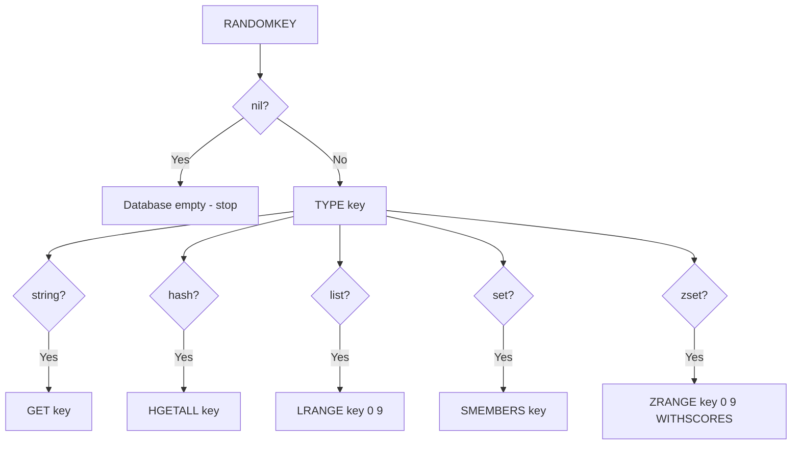

# How to Use RANDOMKEY in Redis to Get a Random Key

Author: [nawazdhandala](https://www.github.com/nawazdhandala)

Tags: Redis, Randomkey, Key, Sampling, Administration

Description: Learn how to use the RANDOMKEY command to retrieve a random key from the current Redis database, including sampling patterns and practical use cases.

---

## Introduction

`RANDOMKEY` returns a random key from the currently selected Redis database. It is useful for sampling, debugging, and building probabilistic algorithms. If the database is empty, it returns a nil bulk string.

## Basic Syntax

```redis
RANDOMKEY
```

Returns a random key string, or nil if the database is empty.

## Examples

### Get a random key

```redis
SET user:1 "Alice"
SET user:2 "Bob"
SET product:100 "Widget"
SET session:xyz "token"

RANDOMKEY
# "product:100"   (result varies each call)

RANDOMKEY
# "user:1"

RANDOMKEY
# "session:xyz"
```

### Empty database

```redis
FLUSHDB
RANDOMKEY
# (nil)
```

### Inspect a random key's type and value

```redis
SET user:42 "Charlie"
HSET profile:42 name "Charlie" age "30"
LPUSH queue:jobs "job1" "job2"

RANDOMKEY
# "profile:42"

TYPE profile:42
# hash

HGETALL profile:42
# 1) "name"
# 2) "Charlie"
# 3) "age"
# 4) "30"
```

## Sampling Pattern

`RANDOMKEY` can be combined with `TYPE` and data retrieval commands to build a sampling pipeline:



## Shell-Based Sampling Script

```bash
#!/bin/bash
# Sample 10 random keys and show their type and size
for i in $(seq 1 10); do
  KEY=$(redis-cli RANDOMKEY)
  if [ -z "$KEY" ]; then
    echo "Database is empty"
    break
  fi
  TYPE=$(redis-cli TYPE "$KEY")
  echo "Key: $KEY | Type: $TYPE"
done
```

## Use Cases

- **Debugging**: Inspect arbitrary keys to understand your data distribution
- **Cache warm-up validation**: Randomly verify that cached objects are structured correctly
- **Sampling-based analysis**: Estimate average key sizes or TTL distributions without scanning all keys
- **Probabilistic eviction testing**: Simulate random access patterns in benchmarks

## Behavior with Expired Keys

`RANDOMKEY` may return a key that has just expired but has not yet been evicted. If you receive a key and then call `GET` on it, you may get `(nil)` if the expiry happened between the two commands. Always handle nil responses defensively.

```redis
SET temp "value" PX 1
RANDOMKEY
# "temp"    (may return this key)

GET temp
# (nil)     (already expired by the time GET ran)
```

## Performance Notes

`RANDOMKEY` has O(1) average complexity, but in databases with many expired keys it may internally retry several times before finding a valid key. In extreme cases of a nearly-empty database with many stale expired keys this can be slower.

## Summary

`RANDOMKEY` returns a random key from the current database, or nil if the database is empty. It is ideal for sampling, debugging, and building test utilities. Always guard against nil responses and expired keys between command calls.
