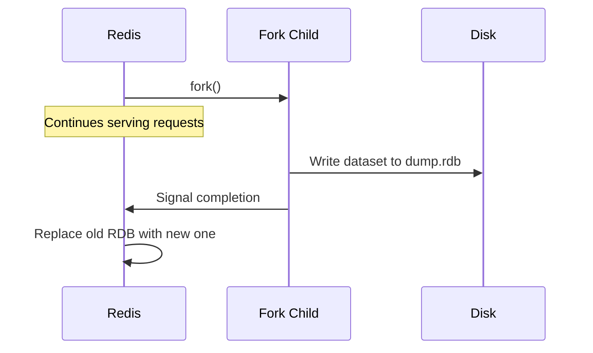
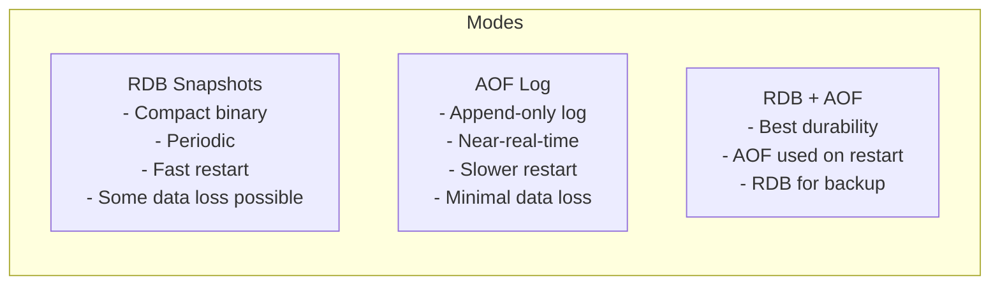

# How to Configure Redis Persistence with RDB Snapshots

Author: [nawazdhandala](https://www.github.com/nawazdhandala)

Tags: Redis, RDB, Persistence, Snapshot, Configuration

Description: Learn how to configure Redis RDB snapshot persistence, including save intervals, compression, file locations, and how to trigger manual snapshots safely.

---

## Introduction

RDB (Redis Database) persistence creates point-in-time snapshots of the dataset and saves them to disk as a compact binary file. It is the default persistence mode in Redis and is well-suited for use cases where some data loss is acceptable in exchange for fast restart times and minimal I/O overhead.

## How RDB Works



Redis forks a child process to write the snapshot. The parent continues serving clients using copy-on-write semantics, so the snapshot reflects the dataset at the moment of the fork.

## Configuring Save Intervals

In `redis.conf`, the `save` directive defines when to trigger an automatic background save:

```redis
# Save if at least 1 key changed in the last 3600 seconds (1 hour)
save 3600 1

# Save if at least 100 keys changed in the last 300 seconds (5 minutes)
save 300 100

# Save if at least 10000 keys changed in the last 60 seconds
save 60 10000
```

Multiple `save` rules are evaluated as OR conditions. Any matching rule triggers a `BGSAVE`.

### Disable automatic RDB saves

```redis
save ""
```

Or in `redis.conf`:

```redis
save ""
```

## RDB File Configuration

```redis
# File name
dbfilename dump.rdb

# Directory where the file is saved
dir /var/lib/redis

# Enable compression (lzf) - reduces file size, small CPU cost
rdbcompression yes

# Enable checksum for data integrity (small performance cost)
rdbchecksum yes
```

## Triggering a Manual Save

### Background save (non-blocking)

```redis
BGSAVE
# Background saving started
```

### Synchronous save (blocks all clients)

```redis
SAVE
# OK
```

Use `BGSAVE` in production. `SAVE` blocks the event loop and should only be used in emergencies or during maintenance windows.

## Checking Last Save Time

```redis
LASTSAVE
# (integer) 1711900200   (Unix timestamp)
```

## Persistence Modes Comparison



## Enabling RDB-Only Persistence (Disabling AOF)

```redis
save 900 1
save 300 10
save 60 10000
appendonly no
```

## RDB on Restart

On startup, if `appendonly` is `no`, Redis loads the `dump.rdb` file from the configured `dir`. If the file is corrupt, Redis exits with an error. You can force Redis to ignore a corrupt RDB:

```redis
redis-server --rdb-del-sync-files no
```

## Monitoring RDB Save Status

```redis
INFO persistence
# rdb_changes_since_last_save:25
# rdb_bgsave_in_progress:0
# rdb_last_save_time:1711900200
# rdb_last_bgsave_status:ok
# rdb_last_bgsave_time_sec:2
# rdb_current_bgsave_time_sec:-1
# rdb_saves:45
# rdb_last_cow_size:1048576
```

## Production Best Practices

- Set `dir` to a dedicated volume with sufficient free space
- Monitor `rdb_last_bgsave_status` for `err` values
- Enable `rdbchecksum yes` to detect corruption
- Keep the last few RDB files as backups before overwriting
- Use `save ""` on cache-only instances where persistence is not needed

## Summary

Redis RDB persistence periodically forks a child process to save a compact binary snapshot of the dataset. Configure save intervals with the `save` directive, tune the file path with `dir` and `dbfilename`, and use `BGSAVE` for non-blocking manual snapshots. Monitor save health via `INFO persistence`. RDB is ideal for backup and fast-restart scenarios where a small window of data loss is acceptable.
