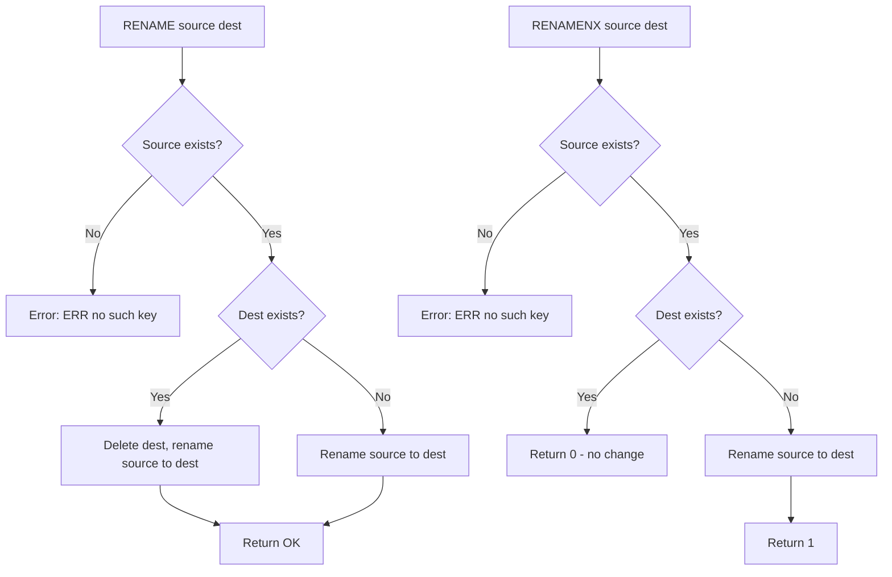

# How to Use RENAME and RENAMENX in Redis

Author: [nawazdhandala](https://www.github.com/nawazdhandala)

Tags: Redis, RENAME, RENAMENX, Key Management

Description: Learn how to use RENAME and RENAMENX in Redis to rename keys atomically, understand their behavior when the destination key already exists, and apply them to practical patterns.

---

## How RENAME and RENAMENX Work

RENAME renames a key to a new name. If the destination key already exists, it is overwritten and deleted. The operation is atomic.

RENAMENX renames a key only if the destination does not already exist. It returns 1 on success and 0 if the destination key already exists.



## Syntax

```redis
RENAME source destination
RENAMENX source destination
```

- `source` - the existing key to rename
- `destination` - the new key name

## Examples

### Basic RENAME

```redis
SET old:key "important-data"
RENAME old:key new:key
```

```text
OK
```

```redis
GET new:key
```

```text
"important-data"
```

```redis
EXISTS old:key
```

```text
(integer) 0
```

The source key no longer exists after renaming.

### RENAME overwrites the destination

```redis
SET source:key "new-value"
SET dest:key "old-value"

RENAME source:key dest:key
GET dest:key
```

```text
"new-value"
```

The previous value at `dest:key` is gone. This is the same behavior as atomic delete-and-rename.

### RENAME preserves the TTL

```redis
SET temp:key "data"
EXPIRE temp:key 300
TTL temp:key
```

```text
(integer) 298
```

```redis
RENAME temp:key new:name
TTL new:name
```

```text
(integer) 296
```

The TTL is preserved on the renamed key.

### RENAME on a non-existent key

```redis
RENAME missing:key dest:key
```

```text
(error) ERR no such key
```

### RENAMENX - only rename if destination does not exist

```redis
SET candidate:key "value"
SET reserved:name "already-taken"

RENAMENX candidate:key reserved:name
```

```text
(integer) 0
```

Returns 0 because `reserved:name` already exists. The source key is unchanged.

### RENAMENX success

```redis
SET draft:post "content..."
RENAMENX draft:post published:post
```

```text
(integer) 1
```

Returns 1 on success. The key is now at `published:post`.

### RENAME with a hash key

RENAME works with any data type:

```redis
HSET user:temp id 42 name "alice"
RENAME user:temp user:42
HGETALL user:42
```

```text
1) "id"
2) "42"
3) "name"
4) "alice"
```

## Use Cases

**Atomic swap** - Rename two keys to swap their roles. This is common for hot-reload patterns where you build a new dataset under a staging key and then atomically rename it to the production key.

**Publish a draft** - Use RENAMENX to promote a draft key to a published key only if the published key does not already exist, preventing accidental overwrites.

**Key migration** - Rename keys to a new naming convention as part of a data migration, one key at a time.

**Versioned replacement** - Build a new version of cached data (e.g., `cache:v2`) and rename it to `cache:current` when ready, ensuring clients always see a complete dataset.

## Atomic Swap Pattern

To swap two keys atomically, use Lua or GETDEL in combination with RENAME:

```redis
# Build new data under staging key
HSET config:staging theme "dark" version "2"

# Atomically replace production with staging
RENAME config:staging config:production
```

Any client reading `config:production` will either see the old or the new version entirely - never a partial state.

## Summary

RENAME atomically renames a key, overwriting the destination if it already exists and preserving TTL. RENAMENX adds a safety check, only renaming if the destination does not exist. Both return an error if the source key is missing. Use RENAME for hot-swap deployments and cache replacement patterns; use RENAMENX when you want to protect against accidentally overwriting an existing key.
