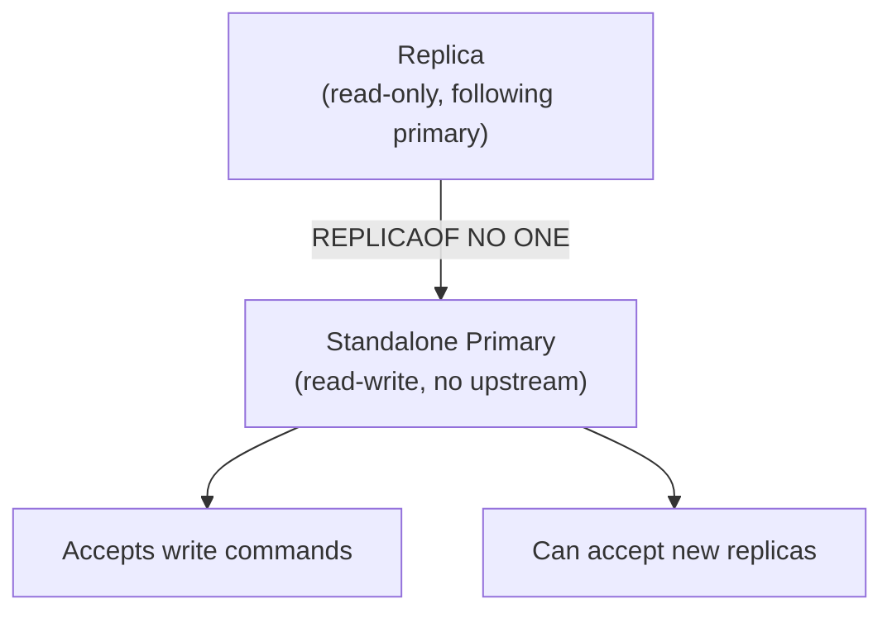
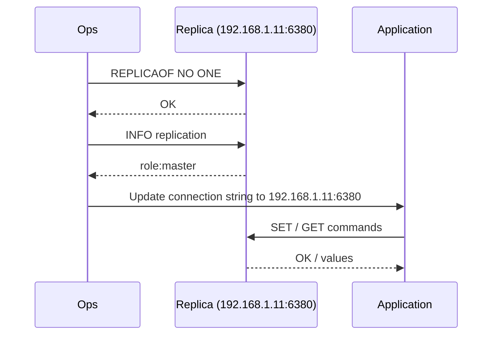

# How to Use REPLICAOF NO ONE in Redis to Promote a Replica

Author: [nawazdhandala](https://www.github.com/nawazdhandala)

Tags: Redis, Replication, Failover, Promotion, High Availability

Description: Learn how to use REPLICAOF NO ONE to detach a Redis replica from its primary and promote it to a standalone primary for manual failover procedures.

---

## Introduction

`REPLICAOF NO ONE` detaches a Redis replica from its primary, stops replication, and promotes the instance to an independent primary that accepts writes. It is the manual mechanism for promoting a replica during a failover when the primary is unavailable, or when you need to reconfigure your topology.

## Basic Syntax

```redis
REPLICAOF NO ONE
```

Returns `OK`. The instance immediately stops receiving replication data and becomes a writable primary.

## Promotion Flow



## Manual Failover Procedure

### Scenario: Primary is down, promote a replica



### Step-by-step commands

```redis
# On the replica (192.168.1.11:6380)
INFO replication
# role:slave
# master_host:192.168.1.10
# master_port:6379
# master_link_status:down

REPLICAOF NO ONE
# OK

INFO replication
# role:master
# connected_slaves:0
```

## Verifying the Promoted Instance Accepts Writes

```redis
# After REPLICAOF NO ONE
SET counter 1
# OK

INCR counter
# (integer) 2

GET counter
# "2"
```

## Re-attaching Other Replicas to the New Primary

After promotion, point other replicas (or new ones) at the newly promoted primary:

```redis
# On remaining replica (192.168.1.12:6381)
REPLICAOF 192.168.1.11 6380
# OK
```

Verify:

```redis
INFO replication
# role:slave
# master_host:192.168.1.11
# master_port:6380
# master_link_status:up
```

## Returning the Old Primary as a Replica

When the original primary comes back online, re-add it as a replica of the new primary to avoid split-brain:

```redis
# On recovered old primary (192.168.1.10:6379)
REPLICAOF 192.168.1.11 6380
# OK
```

## Important Considerations

- After `REPLICAOF NO ONE`, the replica retains all data it had at the time of promotion. Any writes that occurred on the old primary after the replica fell behind are lost.
- Always check `master_repl_offset` and `slave_repl_offset` via `INFO replication` to assess how much data may be missing before promoting.
- Redis Sentinel and Redis Cluster automate this process. Use `REPLICAOF NO ONE` only for manual failover or topology reconfiguration.

## Data Loss Assessment Before Promotion

```redis
# On primary (if reachable)
INFO replication
# master_repl_offset: 100500

# On replica
INFO replication
# slave_repl_offset: 100480
# Lag = 100500 - 100480 = 20 bytes potentially lost
```

## Summary

`REPLICAOF NO ONE` promotes a Redis replica to a standalone primary by detaching it from its upstream server. Use it during manual failover when the primary is unavailable. After promotion, reconnect other replicas to the new primary and re-add the recovered old primary as a replica. For automated failover, use Redis Sentinel or Redis Cluster instead.
