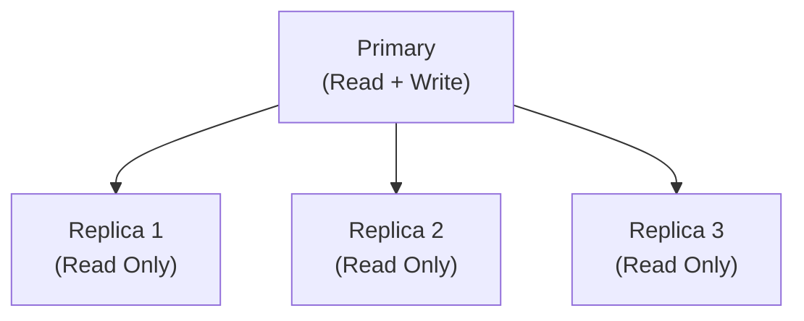
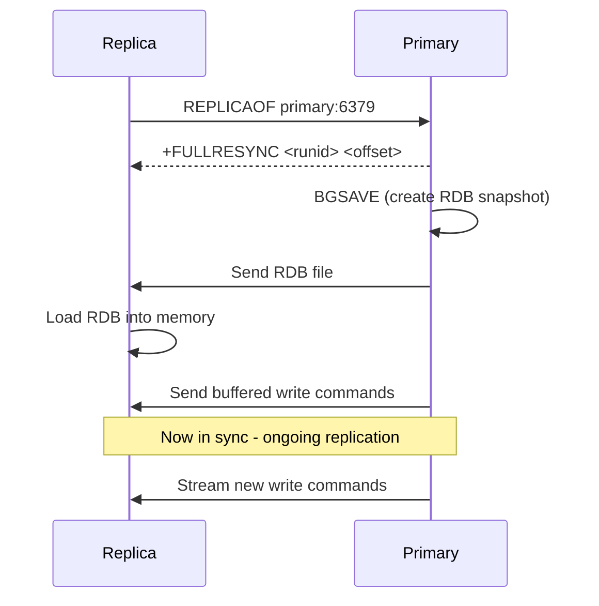
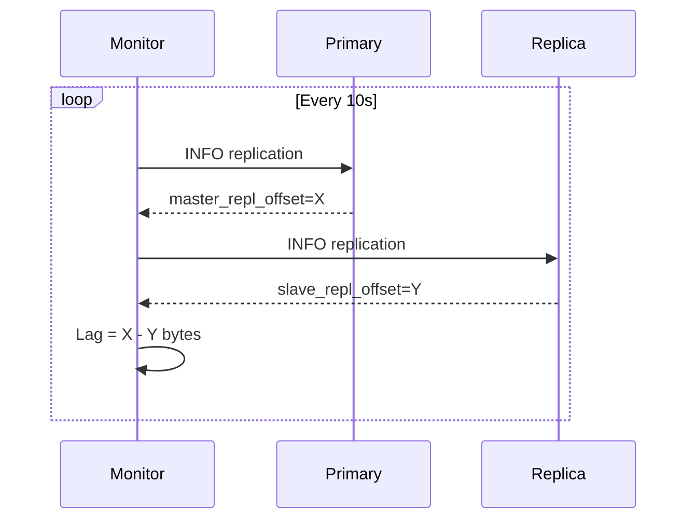

# How to Set Up Redis Replication with REPLICAOF

Author: [nawazdhandala](https://www.github.com/nawazdhandala)

Tags: Redis, Replication, Replicaof, High availability, Administration

Description: Learn how to configure Redis primary-replica replication using REPLICAOF, including initial sync, ongoing replication, and common configuration options.

---

## Introduction

Redis replication allows one or more replica instances to maintain copies of a primary instance's data. Replicas can serve read traffic, provide redundancy, and act as failover candidates. The `REPLICAOF` command (called `SLAVEOF` in Redis versions before 5.0) instructs a Redis instance to become a replica of a specified primary.

## Replication Architecture



## Basic Syntax

```redis
REPLICAOF host port
```

- `host` - the hostname or IP address of the primary
- `port` - the port of the primary

To stop replication and promote to primary:

```redis
REPLICAOF NO ONE
```

## Setting Up Replication via Command

### Step 1: Start the primary

```redis
# On primary (127.0.0.1:6379), no special config needed
SET greeting "hello from primary"
```

### Step 2: Configure the replica

```redis
# On replica (127.0.0.1:6380)
REPLICAOF 127.0.0.1 6379
# OK
```

### Step 3: Verify replication on the replica

```redis
# On replica
GET greeting
# "hello from primary"
```

## Setting Up Replication via redis.conf

Persistent replication configuration in `redis.conf` on the replica:

```redis
replicaof 192.168.1.10 6379
```

If the primary requires authentication:

```redis
replicaof 192.168.1.10 6379
masterauth your_primary_password
```

## Initial Sync Process



## Ongoing Replication and Partial Resync

After the initial full sync, the primary streams write commands to replicas in real time. If a replica temporarily disconnects, Redis attempts a partial resync using the replication backlog buffer.

```redis
# Check backlog size on primary
CONFIG GET repl-backlog-size
# 1) "repl-backlog-size"
# 2) "1048576"   (1 MB default)

# Increase backlog for high-write workloads
CONFIG SET repl-backlog-size 10485760
```

## Key Configuration Options

```redis
# On replica: make it read-only (default)
CONFIG SET replica-read-only yes

# On primary: require ACK from replicas before responding
CONFIG SET min-replicas-to-write 1
CONFIG SET min-replicas-max-lag 10

# Disable read-only to allow writes on replica (not recommended)
CONFIG SET replica-read-only no
```

## Checking Replication Status

```redis
# On primary
INFO replication
# role:master
# connected_slaves:2
# slave0:ip=192.168.1.11,port=6380,state=online,offset=12345,lag=0
# slave1:ip=192.168.1.12,port=6381,state=online,offset=12345,lag=1
```

## Replication Lag Monitoring



## Security: Authenticating Replicas

If the primary has a password (`requirepass`), configure replicas to authenticate:

```redis
# In redis.conf on replica
masterauth "your_secure_password"
```

Or at runtime:

```redis
CONFIG SET masterauth "your_secure_password"
```

## Summary

`REPLICAOF host port` configures a Redis instance as a replica of the specified primary. After an initial full sync (RDB transfer), the primary streams write commands in real time. Use `replica-read-only yes`, `min-replicas-to-write`, and the replication backlog to tune durability and availability. Monitor replication health with `INFO replication`.
