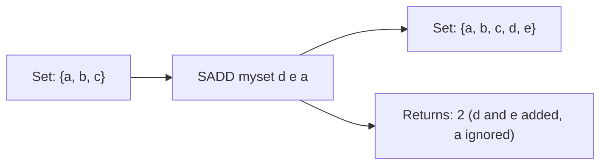

# How to Use SADD in Redis to Add Members to a Set

Author: [nawazdhandala](https://www.github.com/nawazdhandala)

Tags: Redis, Set, SADD, Command

Description: Learn how to use the Redis SADD command to add one or more members to a set, with examples covering deduplication, tagging, and membership tracking.

---

## How SADD Works

`SADD` adds one or more members to a Redis set. A set is an unordered collection of unique strings - duplicate values are silently ignored. SADD returns the count of members actually added (not already present), not the total set size.

Sets are backed by a hash table, so membership tests, insertions, and deletions are all O(1) on average. When a set has few members and all members are small integers or short strings, Redis uses a more memory-efficient encoding (listpack) before switching to the hash table representation.



## Syntax

```redis
SADD key member [member ...]
```

- `key` - the set key; created automatically if it does not exist
- `member [member ...]` - one or more values to add

Returns the number of new members added (excluding duplicates already in the set).

## Examples

### Add a Single Member

```redis
SADD myset "apple"
```

```text
(integer) 1
```

### Add Multiple Members at Once

```redis
SADD myset "banana" "cherry" "date"
```

```text
(integer) 3
```

### Duplicate Members Are Ignored

```redis
SADD myset "apple" "elderberry"
```

```text
(integer) 1
```

Only "elderberry" was new; "apple" already existed so the return value is 1, not 2.

### Verify the Set Contents

```redis
SMEMBERS myset
```

```text
1) "apple"
2) "banana"
3) "cherry"
4) "date"
5) "elderberry"
```

### Creating a New Set Implicitly

SADD creates the key if it does not exist.

```redis
DEL tags
SADD tags "redis" "database" "caching"
SCARD tags
```

```text
(integer) 3
```

## Use Cases

### User Tag System

Track which tags are associated with a user or article.

```redis
SADD user:42:interests "technology" "gaming" "music"
SADD user:42:interests "gaming"
SCARD user:42:interests
```

```text
(integer) 3
```

"gaming" was not added a second time - the set enforces uniqueness automatically.

### Online User Tracking

Track which users are currently online.

```redis
SADD online:users "user:101" "user:202" "user:303"
SISMEMBER online:users "user:202"
```

```text
(integer) 1
```

### Unique Visitor Counting

Record unique page visitors.

```redis
SADD visitors:2026-03-31:/home "ip:1.2.3.4" "ip:5.6.7.8" "ip:1.2.3.4"
SCARD visitors:2026-03-31:/home
```

```text
(integer) 2
```

Duplicate IPs are automatically deduplicated.

### Permission and Role Management

Assign permissions to a role.

```redis
SADD role:admin "read" "write" "delete" "admin"
SADD role:viewer "read"
SISMEMBER role:admin "delete"
```

```text
(integer) 1
```

### Blacklist / Allowlist

Build an IP blocklist.

```redis
SADD blocklist "192.168.1.100" "10.0.0.5"
SISMEMBER blocklist "10.0.0.5"
```

```text
(integer) 1
```

## Return Value Details

The return value reflects only newly added members:

```redis
DEL demo
SADD demo "a" "b" "c"
```

```text
(integer) 3
```

```redis
SADD demo "a" "b" "d"
```

```text
(integer) 1
```

Only "d" was new even though 3 values were provided.

## Performance Considerations

- Each SADD call is O(N) where N is the number of members being added.
- For a single member, SADD is effectively O(1).
- Redis auto-converts between listpack (memory-efficient) and hashtable encoding based on `set-max-listpack-entries` and `set-max-listpack-value` config settings.

## Summary

`SADD` is the primary way to populate a Redis set, automatically enforcing uniqueness on every insert. It supports bulk inserts in a single call, creates the key if needed, and returns a count of only new additions. Its O(1) average-case performance makes it ideal for tracking unique items, managing memberships, and implementing deduplication at scale.
