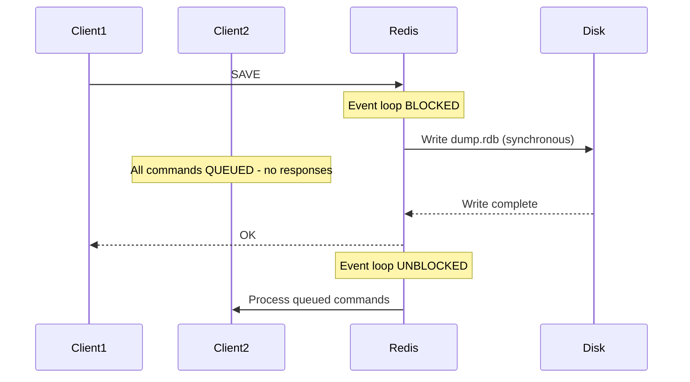

# How to Use SAVE in Redis to Force a Synchronous Save

Author: [nawazdhandala](https://www.github.com/nawazdhandala)

Tags: Redis, Save, RDB, Persistence, Administration

Description: Learn how to use the SAVE command to perform a synchronous Redis RDB snapshot that blocks all clients, when to use it versus BGSAVE, and its production implications.

---

## Introduction

`SAVE` instructs Redis to perform a synchronous, blocking RDB snapshot. Unlike `BGSAVE`, which forks a child process and lets the server keep running, `SAVE` blocks the entire Redis event loop until the snapshot is written to disk. No other clients can be served during this time.

## Basic Syntax

```redis
SAVE
```

Returns `OK` when the snapshot completes.

## How SAVE Blocks the Server



## Examples

### Force a synchronous save

```redis
SAVE
# OK
```

### Confirm the snapshot was taken

```redis
LASTSAVE
# (integer) 1711901000

INFO persistence
# rdb_last_bgsave_status:ok
# rdb_last_save_time:1711901000
# rdb_bgsave_in_progress:0
```

## SAVE vs BGSAVE

| Feature | SAVE | BGSAVE |
|---|---|---|
| Blocking | Yes - blocks all clients | No - forks a child |
| Impact on clients | All requests queued | None |
| Use case | Emergency / shutdown | Production / scheduled |
| Speed | Immediate (no fork overhead) | Slightly delayed (fork) |
| Copy-on-write | Not used | Yes |

## When to Use SAVE

`SAVE` is appropriate in a limited set of scenarios:

1. **Graceful shutdown scripts** - where the instance is going down and you need a final consistent snapshot before stopping
2. **Controlled maintenance** - when clients are already disconnected and you want the fastest possible persistence
3. **Debugging** - when verifying that persistence writes are working and you do not care about blocking

For all other cases, use `BGSAVE`.

## Automated Use in Shutdown

Redis calls `SAVE` internally during `SHUTDOWN SAVE` to ensure data is persisted before the process exits:

```redis
SHUTDOWN SAVE
```

Or configure `shutdown-save-on-empty-config yes` in `redis.conf` (default) to always save on shutdown even if no `save` rules are configured.

## Production Warning

Running `SAVE` on a large Redis dataset in production can cause:
- Seconds to minutes of complete unavailability
- Timeouts in all connected clients
- Cascading failures in services depending on Redis

Monitor with `redis-cli --latency` if you suspect a blocking save is occurring unexpectedly.

## Detecting a Blocking SAVE in Logs

```json
[1234] 31 Mar 2026 12:30:00.000 * DB saved on disk
```

If this message appears and clients reported timeouts, a `SAVE` was likely called.

## Summary

`SAVE` performs a synchronous, blocking RDB snapshot. It blocks the Redis event loop until the write completes, making it unsuitable for production use under load. Reserve it for controlled maintenance windows, graceful shutdown procedures, or debugging. For all production snapshot needs, use `BGSAVE` instead.
