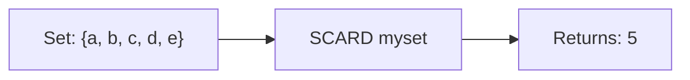

# How to Use SCARD in Redis to Count Set Members

Author: [nawazdhandala](https://www.github.com/nawazdhandala)

Tags: Redis, Set, SCARD, Command

Description: Learn how to use the Redis SCARD command to get the number of members in a set, with examples for counters, capacity checks, and cardinality tracking.

---

## How SCARD Works

`SCARD` returns the number of members (cardinality) in a Redis set. It is a constant-time O(1) operation because Redis maintains the count internally - it does not scan the set to count members.

SCARD is the set equivalent of LLEN for lists and HLEN for hashes. It is commonly used for capacity checks, displaying counts in UIs, and enforcing membership limits.



## Syntax

```redis
SCARD key
```

- `key` - the set key

Returns the number of members in the set, or 0 if the key does not exist.

## Examples

### Count Members in a Set

```redis
SADD fruits "apple" "banana" "cherry" "date"
SCARD fruits
```

```text
(integer) 4
```

### Empty Set or Non-Existent Key Returns 0

```redis
DEL ghost
SCARD ghost
```

```text
(integer) 0
```

### Count After Adding

```redis
SADD tags "redis" "nosql"
SCARD tags
```

```text
(integer) 2
```

```redis
SADD tags "caching" "database"
SCARD tags
```

```text
(integer) 4
```

### Count After Removing

```redis
SADD online "u1" "u2" "u3"
SCARD online
```

```text
(integer) 3
```

```redis
SREM online "u2"
SCARD online
```

```text
(integer) 2
```

### Duplicate Inserts Do Not Increase Count

```redis
SADD unique "a" "b" "c"
SADD unique "a" "b"
SCARD unique
```

```text
(integer) 3
```

## Use Cases

### Limit Group Size Before Adding

Check capacity before allowing a new member to join.

```redis
SCARD group:42:members
-- If less than 50, allow join:
SADD group:42:members "user:99"
```

### Display Online User Count

```redis
SADD online:users "u1" "u2" "u3" "u4"
SCARD online:users
```

```text
(integer) 4
```

### Counting Unique Visitors

```redis
SADD visitors:2026-03-31 "ip:1.2.3.4" "ip:5.6.7.8" "ip:1.2.3.4"
SCARD visitors:2026-03-31
```

```text
(integer) 2
```

### Tag Count for an Article

```redis
SADD post:101:tags "redis" "tutorial" "beginner"
SCARD post:101:tags
```

```text
(integer) 3
```

### Enforcing a Maximum Set Size

Before inserting, check the count and reject if at capacity.

```redis
SCARD waitlist:event:5
-- Returns 100
-- Maximum is 100, so reject new additions
```

### Comparing Set Sizes

Use SCARD to compare two sets without loading their full contents.

```redis
SCARD followers:user1
SCARD followers:user2
```

## Combining SCARD with Other Commands

### Check If Set Is Empty

```redis
-- Rather than SMEMBERS and checking length, use SCARD
SCARD myset
-- 0 means empty
```

### Get Count After Set Operations

```redis
SUNIONSTORE result setA setB
SCARD result
```

This gives the size of the union without loading all elements.

```redis
SINTERSTORE result setA setB
SCARD result
```

This gives the size of the intersection.

## Performance Considerations

- SCARD is O(1) - constant time regardless of set size.
- It is safe to call on very large sets without performance concerns.
- For estimating the cardinality of extremely large unique datasets (e.g., billions of IPs), consider HyperLogLog (PFADD / PFCOUNT) which uses far less memory with a small margin of error.

## Summary

`SCARD` provides an instant O(1) count of the members in a Redis set. It returns 0 for non-existent keys, handles any set size equally fast, and is the go-to command whenever you need to know how many unique items are tracked in a set - whether that is online users, tags, permissions, or unique visitors.
