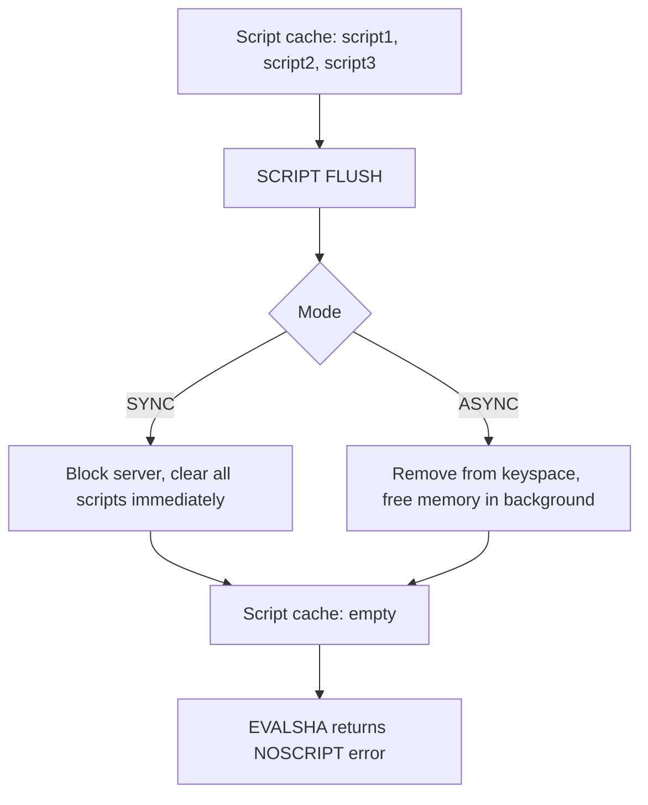

# How to Use SCRIPT FLUSH in Redis to Clear Script Cache

Author: [nawazdhandala](https://www.github.com/nawazdhandala)

Tags: Redis, SCRIPT FLUSH, Lua, Script Cache, Maintenance

Description: Learn how to use SCRIPT FLUSH in Redis to clear the Lua script cache, when to use synchronous versus asynchronous flushing, and how to handle cache reloads in applications.

---

## How SCRIPT FLUSH Works

SCRIPT FLUSH removes all Lua scripts from Redis's server-side script cache. After flushing, any attempt to call a script with EVALSHA will return a NOSCRIPT error until the scripts are reloaded via SCRIPT LOAD or EVAL.

SCRIPT FLUSH supports two modes:
- **SYNC** - blocks the server until all scripts are deleted (default in Redis 6.2 and earlier)
- **ASYNC** - removes scripts from the keyspace immediately and reclaims memory in a background thread (available in Redis 6.2+)



## Syntax

```redis
SCRIPT FLUSH [ASYNC | SYNC]
```

Returns `OK` when the flush is complete (or queued in ASYNC mode).

## Examples

### Basic SCRIPT FLUSH

```redis
SCRIPT FLUSH
```

```text
OK
```

The script cache is now empty.

### Flush and verify

Load a script, flush, then verify it is gone:

```redis
SCRIPT LOAD "return 'test'"
```

```text
"2067d915024a3e1657c4169c84f809f8ec75b9a7"
```

```redis
SCRIPT EXISTS 2067d915024a3e1657c4169c84f809f8ec75b9a7
```

```text
1) (integer) 1
```

```redis
SCRIPT FLUSH

SCRIPT EXISTS 2067d915024a3e1657c4169c84f809f8ec75b9a7
```

```text
1) (integer) 0
```

### SCRIPT FLUSH ASYNC (Redis 6.2+)

```redis
SCRIPT FLUSH ASYNC
```

```text
OK
```

Returns immediately. Memory is reclaimed in a background thread.

### SCRIPT FLUSH SYNC

```redis
SCRIPT FLUSH SYNC
```

```text
OK
```

Blocks until all scripts are removed and memory is reclaimed.

### EVALSHA after SCRIPT FLUSH returns NOSCRIPT

```redis
SCRIPT LOAD "return 'cached'"
```

```text
"some-sha1-hash"
```

```redis
SCRIPT FLUSH
EVALSHA some-sha1-hash 0
```

```text
(error) NOSCRIPT No matching script. Please use EVAL.
```

### Recover after SCRIPT FLUSH

Applications must handle NOSCRIPT and reload scripts:

```bash
# After SCRIPT FLUSH, reload all application scripts
SCRIPT_1=$(redis-cli SCRIPT LOAD "return redis.call('SET', KEYS[1], ARGV[1])")
SCRIPT_2=$(redis-cli SCRIPT LOAD "return redis.call('GET', KEYS[1])")

echo "Scripts reloaded: $SCRIPT_1, $SCRIPT_2"
```

## When to Use SCRIPT FLUSH

| Scenario | Recommended Mode |
|---|---|
| Development / testing | SYNC - straightforward and immediate |
| Production with large script cache | ASYNC - avoids blocking the event loop |
| After deploying new script versions | Either - depends on urgency and load |
| Debugging NOSCRIPT errors | SYNC before reloading |

## SCRIPT FLUSH vs Server Restart

A Redis server restart also clears the script cache. SCRIPT FLUSH is useful when you need to clear the cache without restarting the server, such as:

- Removing outdated script versions after a deployment
- Troubleshooting scripts that may have a bug and are cached with EVALSHA
- Freeing memory from scripts that are no longer used

## Impact on Applications

After SCRIPT FLUSH, every call to EVALSHA will fail with NOSCRIPT until scripts are reloaded. A well-designed application:

1. Catches NOSCRIPT errors
2. Reloads the script with EVAL or SCRIPT LOAD
3. Retries the operation with the new SHA1

In Redis Cluster environments, scripts must be flushed and reloaded on each node independently.

## Use Cases

**Deployment script updates** - After updating Lua scripts in your application, flush the old versions from the cache and reload new ones to ensure all nodes run the latest code.

**Memory reclamation** - If many old scripts have accumulated in the cache from hot reloads and testing, flush to free memory.

**Testing and CI** - Between test runs, flush the script cache to ensure tests start with a clean state.

**Security incident response** - If a malicious script was somehow loaded, SCRIPT FLUSH combined with ACL restrictions can be used to clear it.

## Summary

SCRIPT FLUSH clears all Lua scripts from Redis's script cache. The ASYNC mode (Redis 6.2+) minimizes latency impact by reclaiming memory in the background; SYNC ensures immediate cleanup but blocks briefly. After flushing, all EVALSHA calls return NOSCRIPT until scripts are reloaded. Always implement NOSCRIPT error handling in production applications to gracefully recover from cache clears caused by restarts, deployments, or explicit SCRIPT FLUSH calls.
