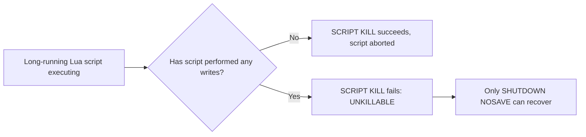
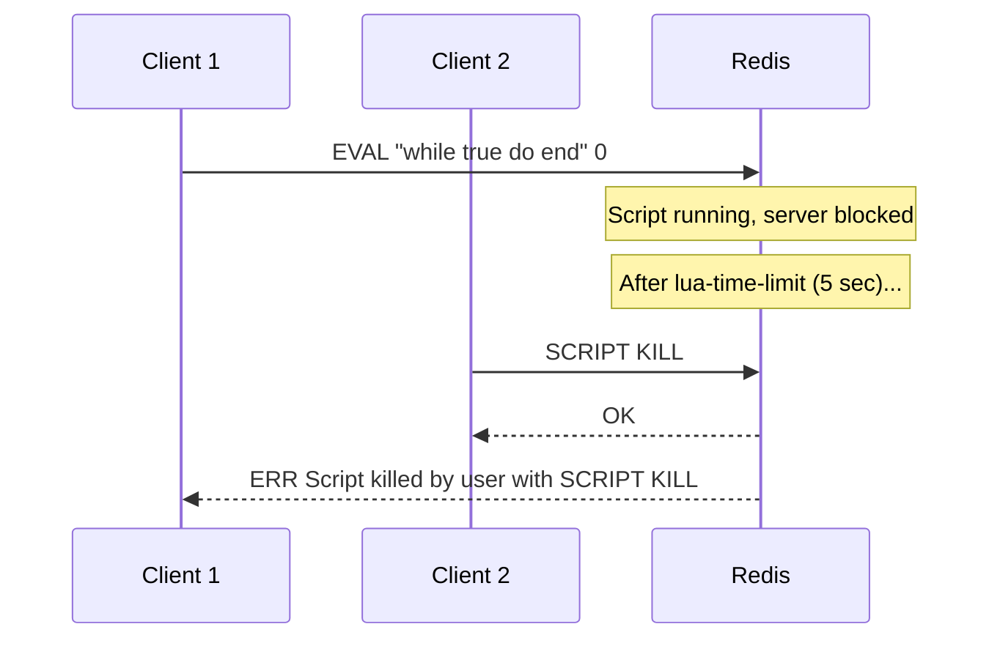

# How to Use SCRIPT KILL in Redis to Stop a Running Script

Author: [nawazdhandala](https://www.github.com/nawazdhandala)

Tags: Redis, SCRIPT KILL, Lua, Script, Administration

Description: Learn how to use SCRIPT KILL in Redis to terminate a long-running Lua script that is blocking the server, and understand when it succeeds or fails.

---

## What is SCRIPT KILL

SCRIPT KILL terminates a currently executing Lua script. Because Redis executes commands in a single thread, a long-running Lua script blocks all other client requests. SCRIPT KILL provides an emergency exit to recover the server without a full restart.

```redis
SCRIPT KILL
```

SCRIPT KILL takes no arguments. It targets whatever script is currently running.



## Why Scripts Get Stuck

Lua scripts in Redis run atomically and block the entire server during execution. A script can get stuck because of:

- An infinite loop in the script logic
- A very large dataset iteration taking longer than expected
- A programming error that causes unbounded execution

Redis has a configurable timeout (`lua-time-limit`, default 5000 ms). After this timeout, Redis starts accepting `SCRIPT KILL` and `SHUTDOWN` commands while the script continues executing in the background.

## Basic Usage

### Kill a running script from another connection

Connection 1 runs a long script:
```redis
EVAL "while true do end" 0
-- This blocks the server
```

Connection 2 (another client) kills it:
```redis
SCRIPT KILL
-- Returns: OK (if the script has not written anything)
```

### Check if a script is running before killing

```redis
-- Use the INFO all output or DEBUG SLEEP to simulate
INFO server
-- Look for: redis_is_loading:0 and blocked_clients count
```



## When SCRIPT KILL Fails: The UNKILLABLE Case

If the script has already executed at least one write command (SET, LPUSH, ZADD, etc.), SCRIPT KILL is refused to protect data integrity. Killing the script after a write would leave the server in a partially modified state with no rollback.

```redis
-- Script has called SET before getting stuck
SCRIPT KILL
-- Returns: UNKILLABLE No scripts in execution right now.
-- Or: ERR UNKILLABLE Sorry the script already executed write commands
--     against the dataset. You can either wait the script to
--     terminate or kill the server in a non-graceful way using
--     the SHUTDOWN NOSAVE command.
```

In this case, the only options are:
- Wait for the script to finish (if it eventually will)
- `SHUTDOWN NOSAVE` to restart without saving, accepting data loss

## lua-time-limit Configuration

The `lua-time-limit` setting (milliseconds) controls how long a script can run before Redis starts accepting SCRIPT KILL:

```redis
CONFIG GET lua-time-limit
-- Returns: 5000 (default)

CONFIG SET lua-time-limit 1000
-- Set to 1 second for stricter timeout
```

Note: `lua-time-limit` does not kill the script automatically. It only enables SCRIPT KILL to be received. The script keeps running until killed or until it finishes.

## Preventing Long-Running Scripts

Rather than relying on SCRIPT KILL, write scripts that complete quickly:

```redis
-- Bad: iterating unlimited keys in a loop
EVAL "
local keys = redis.call('KEYS', '*')
for i, k in ipairs(keys) do
  redis.call('DEL', k)
end
" 0

-- Better: use SCAN incrementally from application code
-- Or pass a limited key list as KEYS arguments
EVAL "
for i, k in ipairs(KEYS) do
  redis.call('DEL', k)
end
" 3 key1 key2 key3
```

## SCRIPT KILL vs SHUTDOWN NOSAVE

| Command | Kills script | Data safety | Server state |
|---|---|---|---|
| `SCRIPT KILL` | Yes (if no writes) | Safe, no data loss | Server continues |
| `SHUTDOWN NOSAVE` | Yes (force) | Unsafe, unsaved data lost | Server stops |

## Summary

SCRIPT KILL terminates a long-running Lua script that is blocking the Redis server. It succeeds only if the script has not yet executed any write commands, preserving data consistency. If the script has written data, SCRIPT KILL is refused and SHUTDOWN NOSAVE becomes the only recovery option. Configure `lua-time-limit` to control when SCRIPT KILL becomes available, and write scripts that complete in bounded time to avoid needing it.
