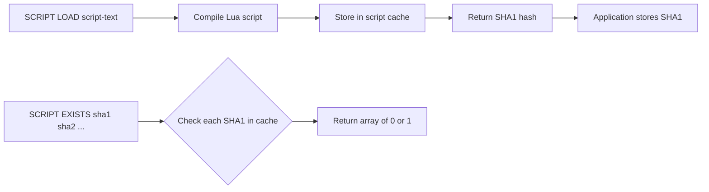

# How to Use SCRIPT LOAD and SCRIPT EXISTS in Redis

Author: [nawazdhandala](https://www.github.com/nawazdhandala)

Tags: Redis, SCRIPT LOAD, SCRIPT EXISTS, Lua, Script Cache

Description: Learn how to use SCRIPT LOAD to preload Lua scripts into Redis's script cache and SCRIPT EXISTS to verify which scripts are available before calling EVALSHA.

---

## How SCRIPT LOAD and SCRIPT EXISTS Work

SCRIPT LOAD compiles a Lua script and stores it in Redis's server-side script cache. It returns the SHA1 hash of the script. Once loaded, the script can be executed efficiently by its hash using EVALSHA without sending the full script text on every call.

SCRIPT EXISTS checks whether one or more script hashes are currently in the script cache. It returns an array of 0s and 1s indicating which scripts are cached. Use it to verify scripts are loaded before calling EVALSHA, or to check if the cache was cleared after a server restart.



## Syntax

```redis
SCRIPT LOAD script

SCRIPT EXISTS sha1 [sha1 ...]
```

## Examples

### SCRIPT LOAD - load a simple script

```redis
SCRIPT LOAD "return 'hello from cache'"
```

```text
"2067d915024a3e1657c4169c84f809f8ec75b9a7"
```

The returned SHA1 is the key to execute this script with EVALSHA.

### SCRIPT LOAD - load a rate limiter

```redis
SCRIPT LOAD "
local key = KEYS[1]
local limit = tonumber(ARGV[1])
local window = tonumber(ARGV[2])
local count = redis.call('INCR', key)
if count == 1 then
  redis.call('EXPIRE', key, window)
end
if count > limit then
  return 0
end
return 1
"
```

```text
"a1b2c3d4e5f6a1b2c3d4e5f6a1b2c3d4e5f6a1b2"
```

Use the returned SHA1 in all subsequent calls via EVALSHA.

### SCRIPT EXISTS - check if a script is in the cache

```redis
SCRIPT EXISTS 2067d915024a3e1657c4169c84f809f8ec75b9a7
```

```text
1) (integer) 1
```

Returns 1 - the script is cached.

### SCRIPT EXISTS - check multiple scripts at once

```redis
SCRIPT EXISTS 2067d915024a3e1657c4169c84f809f8ec75b9a7 0000000000000000000000000000000000000000
```

```text
1) (integer) 1
2) (integer) 0
```

The first script is cached; the second SHA1 is not in the cache.

### SCRIPT EXISTS - after SCRIPT FLUSH

```redis
SCRIPT FLUSH

SCRIPT EXISTS 2067d915024a3e1657c4169c84f809f8ec75b9a7
```

```text
1) (integer) 0
```

After flushing the script cache, all scripts return 0.

### Startup script preloading pattern

A robust pattern for application startup:

```bash
SCRIPT_TEXT="return redis.call('SET', KEYS[1], ARGV[1])"

# Load script and save SHA1
SHA1=$(redis-cli SCRIPT LOAD "$SCRIPT_TEXT")
echo "Script loaded: $SHA1"

# Verify it is in cache
EXISTS=$(redis-cli SCRIPT EXISTS "$SHA1")
echo "Script exists: $EXISTS"
```

### Verify multiple application scripts are ready

```bash
SHA1_RATELIMIT="a1b2c3d4e5f6..."
SHA1_LOCK="f6e5d4c3b2a1..."

redis-cli SCRIPT EXISTS "$SHA1_RATELIMIT" "$SHA1_LOCK"
```

```text
1) (integer) 1
2) (integer) 1
```

Both scripts are ready to be called via EVALSHA.

## Script Cache Behavior

- The script cache is in-memory and per-server instance
- The cache is cleared on server restart and by SCRIPT FLUSH
- Scripts are NOT replicated to replicas - each replica must load scripts independently
- In Redis Cluster, each node has its own cache; scripts must be loaded on each node

## Application Pattern: Load on Startup with Fallback

```bash
# During application startup
SHA1=$(redis-cli SCRIPT LOAD "$RATE_LIMIT_SCRIPT")
export RATE_LIMIT_SHA1="$SHA1"

# During request handling
result=$(redis-cli EVALSHA "$RATE_LIMIT_SHA1" 1 "rate:$USER" 100 60 2>&1)
if echo "$result" | grep -q "NOSCRIPT"; then
  # Reload and retry
  SHA1=$(redis-cli SCRIPT LOAD "$RATE_LIMIT_SCRIPT")
  export RATE_LIMIT_SHA1="$SHA1"
  result=$(redis-cli EVALSHA "$RATE_LIMIT_SHA1" 1 "rate:$USER" 100 60)
fi
```

## Use Cases

**Application startup initialization** - Load all Lua scripts during application startup and store the SHA1 hashes for use throughout the application's lifetime.

**Health checks** - Use SCRIPT EXISTS in health check endpoints to verify all required scripts are loaded before the service is marked as ready.

**Script versioning** - When deploying a new version of a Lua script, load the new version and switch to the new SHA1. The old script remains in cache until SCRIPT FLUSH.

**Cluster script synchronization** - Use SCRIPT LOAD on each cluster node at startup to ensure all nodes have the scripts needed to serve requests.

## Summary

SCRIPT LOAD compiles and caches a Lua script on the Redis server, returning its SHA1 hash. SCRIPT EXISTS checks whether specific SHA1 hashes are present in the script cache. Together they enable the EVALSHA workflow: load scripts at startup, execute by SHA1 for efficiency, and use SCRIPT EXISTS to detect cache misses that require a reload. Remember that the cache is per-server and cleared on restart, so always handle NOSCRIPT errors in production code.
