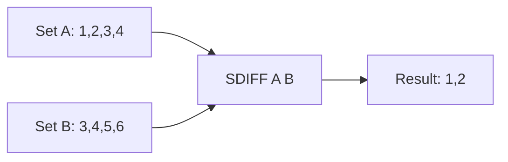

# How to Use SDIFF in Redis to Find Difference Between Sets

Author: [nawazdhandala](https://www.github.com/nawazdhandala)

Tags: Redis, Set, SDIFF, Command

Description: Learn how to use SDIFF in Redis to find members unique to the first set that do not appear in any subsequent sets, with practical examples.

---

## Introduction

`SDIFF` computes the difference between two or more sets. It returns all members that exist in the first set but not in any of the other sets. This is useful for finding new items, unread notifications, or anything that requires exclusion logic.

## Syntax

```redis
SDIFF key [key ...]
```

- The first `key` is the base set.
- All subsequent keys are subtracted from the base.
- Returns the resulting members as an unordered collection.
- The original sets are not modified.

## How It Works



The result contains only elements present in the first set that are absent from all other sets.

## Basic Example

```redis
SADD set:a "apple" "banana" "cherry" "date"
SADD set:b "cherry" "date" "elderberry"

SDIFF set:a set:b
-- 1) "apple"
-- 2) "banana"
```

`cherry` and `date` exist in both sets, so they are excluded from the result.

## Difference with Three Sets

```redis
SADD allowed "r" "w" "x" "d"
SADD revoked "x"
SADD suspended "d"

SDIFF allowed revoked suspended
-- 1) "r"
-- 2) "w"
```

## Real-World Use Cases

### New Follower Detection

Find users who follow account A but not account B:

```redis
SADD followers:alice "u1" "u2" "u3" "u4"
SADD followers:bob   "u3" "u4" "u5"

SDIFF followers:alice followers:bob
-- 1) "u1"
-- 2) "u2"
```

### Unread Notification Filtering

```redis
SADD notifications:all "n:1" "n:2" "n:3" "n:4"
SADD notifications:read "n:2" "n:4"

SDIFF notifications:all notifications:read
-- 1) "n:1"
-- 2) "n:3"
```

### Permission Gap Analysis

```redis
SADD perms:required "read" "write" "delete" "admin"
SADD perms:granted  "read" "write"

SDIFF perms:required perms:granted
-- 1) "delete"
-- 2) "admin"
```

## Order of Keys Matters

`SDIFF` is not commutative. The result depends on which set is listed first:

```redis
SADD x "1" "2" "3"
SADD y "2" "3" "4"

SDIFF x y
-- 1) "1"

SDIFF y x
-- 1) "4"
```

## Empty and Missing Keys

```redis
SADD source "a" "b" "c"

-- Subtract from an empty set
SDIFF source nonexistent
-- 1) "a"
-- 2) "b"
-- 3) "c"

-- Subtract everything
SADD everything "a" "b" "c"
SDIFF source everything
-- (empty array)
```

## Time Complexity

`SDIFF` runs in **O(N)** where N is the total number of elements across all provided sets. For large sets this is still efficient, but consider using `SDIFFSTORE` if you need to reuse the result.

## SDIFF vs SDIFFSTORE

| Command      | Stores result | Returns     |
|--------------|---------------|-------------|
| `SDIFF`      | No            | Members     |
| `SDIFFSTORE` | Yes (to key)  | Count       |

## Summary

`SDIFF` returns the set difference: elements in the first set that do not appear in any subsequent set. It is read-only, efficient, and well-suited for exclusion queries like finding unread items, missing permissions, or unique followers. Use `SDIFFSTORE` when you need to persist or reuse the result.
