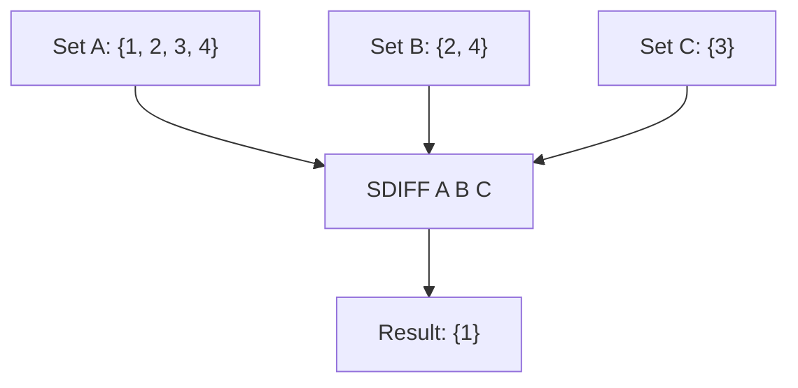

# How to Use SDIFF and SDIFFSTORE in Redis for Set Difference

Author: [nawazdhandala](https://www.github.com/nawazdhandala)

Tags: Redis, Set, SDIFF, SDIFFSTORE, Command

Description: Learn how to use SDIFF and SDIFFSTORE in Redis to find members unique to the first set, with examples for new item detection, unread tracking, and exclusion filtering.

---

## How SDIFF and SDIFFSTORE Work

`SDIFF` returns the members that exist in the first set but not in any of the subsequent sets - the mathematical set difference. The first key is the reference set; all other keys are subtracted from it.

`SDIFFSTORE` performs the same operation but stores the result in a destination key and returns the count.



## Syntax

```redis
SDIFF key [key ...]
SDIFFSTORE destination key [key ...]
```

- First `key` - the reference set
- Additional `key` entries - sets to subtract from the first
- `destination` - key where SDIFFSTORE writes the result

SDIFF returns an array of members. SDIFFSTORE returns the integer count of members in the result.

## Examples

### Basic Two-Set Difference

```redis
SADD setA "a" "b" "c" "d"
SADD setB "b" "c"
SDIFF setA setB
```

```text
1) "a"
2) "d"
```

Members of setA that are not in setB.

### Three-Set Difference

```redis
SADD setC "d"
SDIFF setA setB setC
```

```text
1) "a"
```

"d" is subtracted by setC; only "a" remains unique to setA.

### Order Matters

The first key is always the reference set. Swapping changes the result.

```redis
SDIFF setB setA
```

```text
(empty array)
```

setB has no members not already in setA.

### Non-Existent Key as Reference

```redis
DEL ghost
SDIFF ghost setA
```

```text
(empty array)
```

An empty reference set has nothing to subtract from.

### Non-Existent Key in Subtracted Sets

```redis
DEL ghost
SDIFF setA ghost
```

```text
1) "a"
2) "b"
3) "c"
4) "d"
```

Subtracting an empty set changes nothing.

### SDIFFSTORE

```redis
SDIFFSTORE result setA setB
```

```text
(integer) 2
```

```redis
SMEMBERS result
```

```text
1) "a"
2) "d"
```

## Use Cases

### New Items Since Last Sync

Find items in the current set that were not in the previous snapshot.

```redis
SADD snapshot:yesterday "item:1" "item:2" "item:3"
SADD current "item:1" "item:2" "item:3" "item:4" "item:5"
SDIFF current snapshot:yesterday
```

```text
1) "item:4"
2) "item:5"
```

### Unread Notifications

Find notifications not yet seen by the user.

```redis
SADD notifications:all "n:1" "n:2" "n:3" "n:4"
SADD notifications:read "n:2" "n:4"
SDIFF notifications:all notifications:read
```

```text
1) "n:1"
2) "n:3"
```

### Users Who Have Not Completed Onboarding

```redis
SADD users:all "u1" "u2" "u3" "u4"
SADD users:onboarded "u1" "u3"
SDIFF users:all users:onboarded
```

```text
1) "u2"
2) "u4"
```

### Products Not Purchased by a User

```redis
SADD catalog:all "p1" "p2" "p3" "p4" "p5"
SADD user:42:purchased "p1" "p3"
SDIFF catalog:all user:42:purchased
```

```text
1) "p2"
2) "p4"
3) "p5"
```

### Available Time Slots

Find meeting slots not already taken.

```redis
SADD slots:all "09:00" "10:00" "11:00" "14:00" "15:00"
SADD slots:booked "10:00" "14:00"
SDIFF slots:all slots:booked
```

```text
1) "09:00"
2) "11:00"
3) "15:00"
```

### Caching the Result with SDIFFSTORE

Store the difference for repeated use.

```redis
SDIFFSTORE pending:onboarding users:all users:onboarded
EXPIRE pending:onboarding 600
SMEMBERS pending:onboarding
```

## Performance Considerations

- SDIFF is O(N) where N is the total number of members across all input sets.
- Redis iterates through the first (reference) set and checks each member against all subsequent sets using O(1) lookups.
- SDIFFSTORE adds the cost of writing the result.
- For very large reference sets with many members to exclude, the operation scales with the reference set size.

## Summary

`SDIFF` identifies members exclusive to the first set by subtracting the contents of all subsequent sets. `SDIFFSTORE` saves that result for reuse. This makes them powerful tools for new-item detection, unread tracking, exclusion filtering, and any scenario where you need to know what is unique to one collection compared to others.
